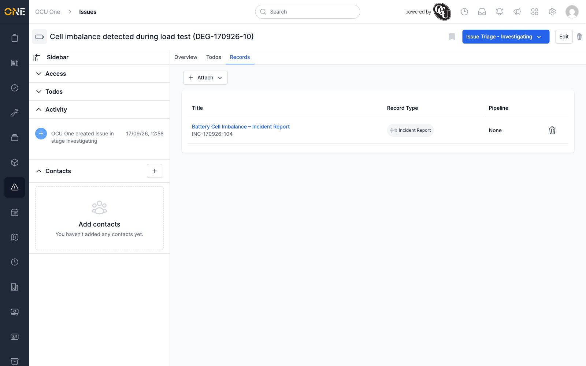
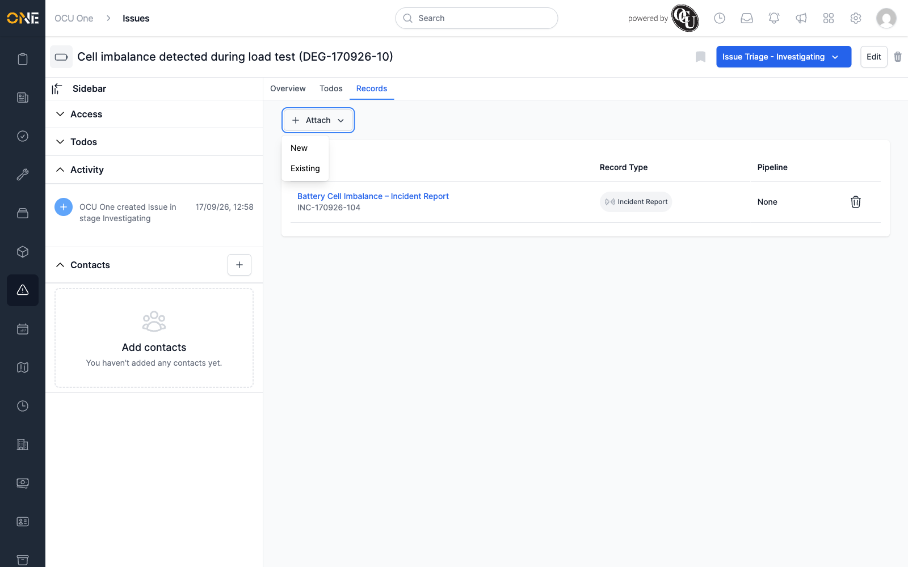

# Viewing an issue's records

An issue's **Records** tab lists any records (like an Incident Report or a
Site Visit Report) that have been attached to it — supporting evidence
or documentation linked from elsewhere in the system.

## The Records tab

Each attached record shows its **Title**, **Record Type**, and
**Pipeline** (if it's tracked through one).

Click a record's title to open it. Click the trash icon on its row to
remove it from this list.

## Attaching a record

Click **Attach** at the top of the tab. A dropdown offers **New** (create
a record from scratch, attached to this issue) or **Existing** (search
for and link a record that's already in the system).

