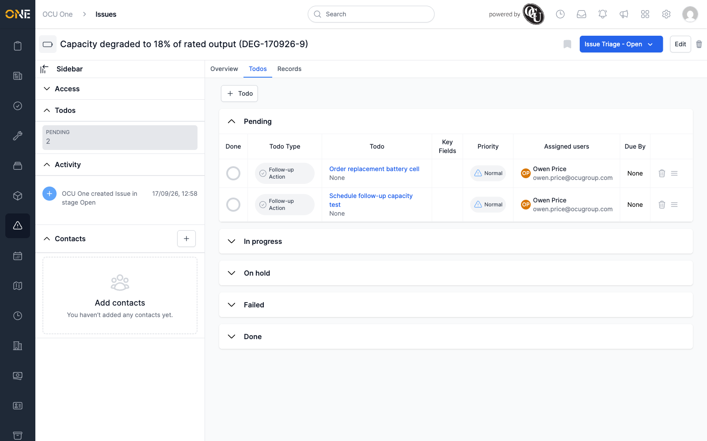
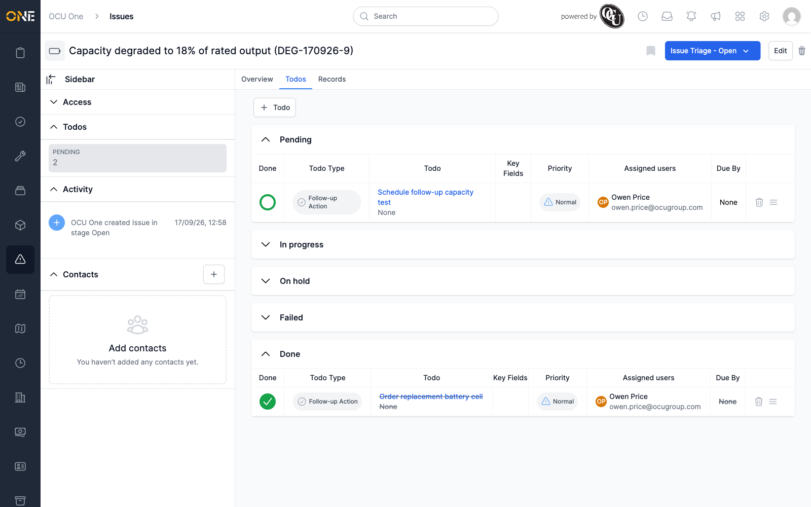
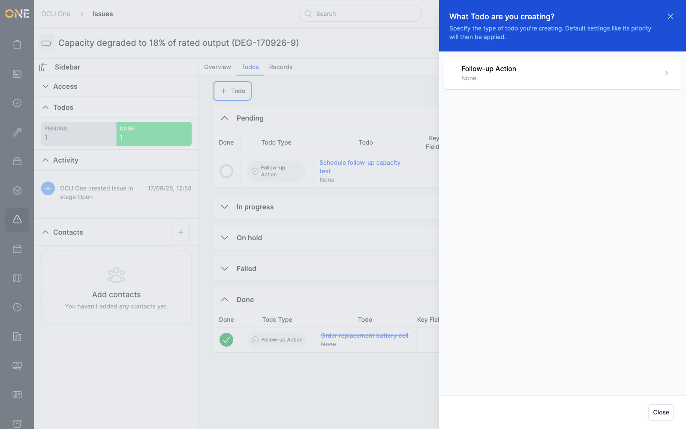

# Viewing an issue's to-dos

An issue's **Todos** tab lists every to-do raised against it — follow-up
actions needed before the issue can be considered fully dealt with.

## The Todos tab

To-dos are grouped by status: **Pending**, **In progress**, **On hold**,
**Failed**, and **Done**. Each group can be expanded or collapsed, and
shows a count of how many to-dos are in it.

Each row shows the to-do's type, its title (click it to open the to-do
itself), any key fields, priority, assigned users, and due date. Click the
circle in the **Done** column to mark a to-do complete without opening
it — it moves straight into the **Done** group with its text struck
through.

## Adding a to-do

Click **Todo** at the top of the tab to raise a new one against this
issue. A panel slides in asking what type of to-do you're creating —
pick one to continue to the full to-do form.

## Elsewhere on the issue

The sidebar's **Todos** section on the
[Overview tab](Viewing%20an%20issue's%20overview%20page.md) shows the same
Pending/Done counts without needing to switch tabs.
