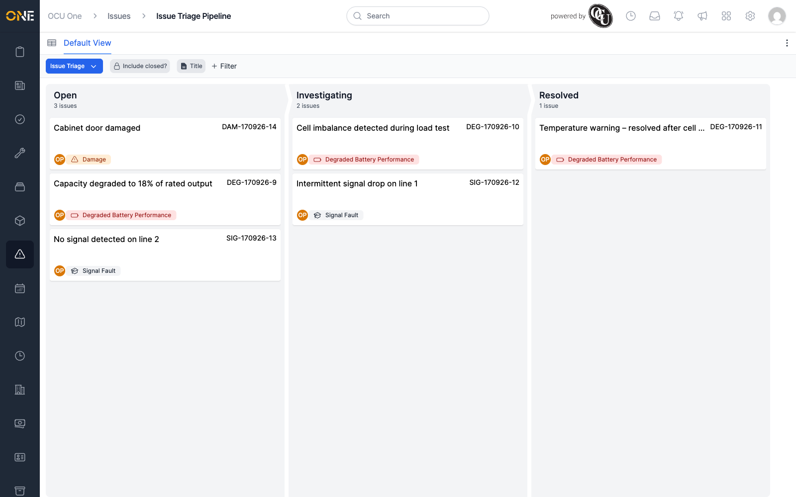

# Viewing the issues board (pipeline)

If issues at your organisation are tracked through a pipeline (for
example, an "Issue Triage" pipeline with Open, Investigating, and Resolved
stages), you can view them as a board instead of a flat list.

## Opening the board

From the [Issues list](Browsing%20issues.md), click the **View as
pipeline** icon at the top-left. Each pipeline stage becomes its own
column, with a running count of issues in it, and each issue appears as a
card showing its title, reference, owner, and issue type.

A dropdown next to the board's title (here, "Issue Triage") lets you
switch to a different pipeline if more than one is set up for issues. A
**View as table** icon takes you back to the flat list. **Include
closed?** and filtering work the same way here as on the list — see
[Browsing issues](Browsing%20issues.md).

## Moving an issue between stages

To move an issue into a different stage, open it and use the stage
selector on its own overview page — see
[Resolving an issue (moving through pipeline stages)](Resolving%20an%20issue%20%28moving%20through%20pipeline%20stages%29.md).
