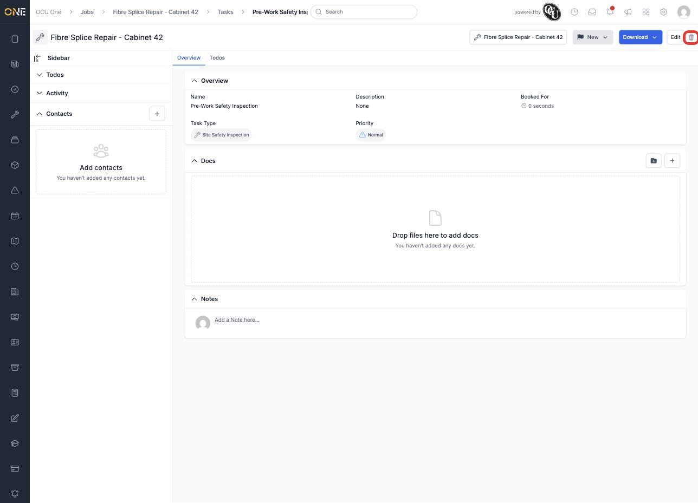
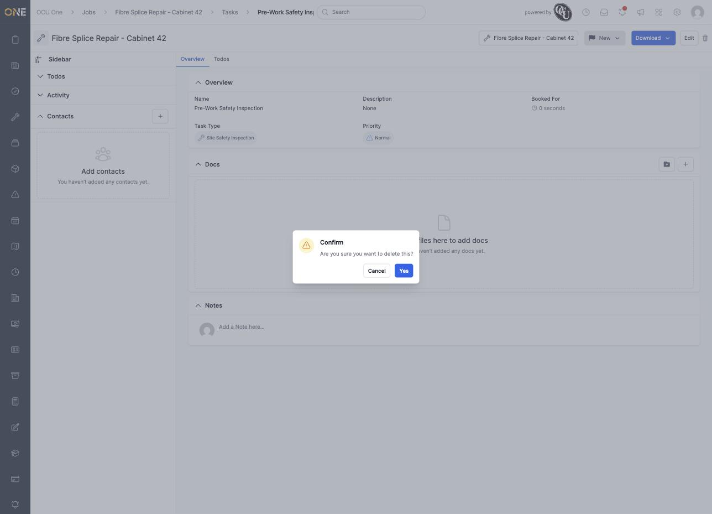
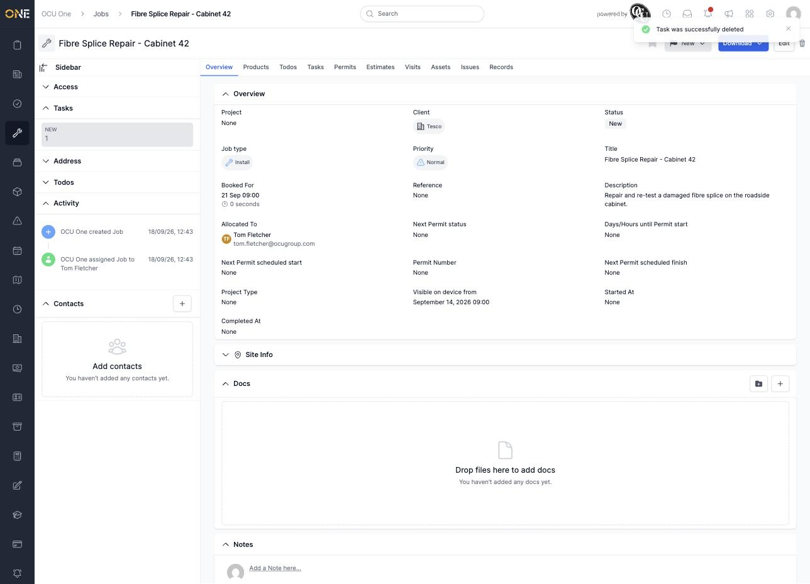

# Deleting a job task

Removing a task from a job doesn't erase it outright — like deleting a job, it archives the task and takes it off the job's Tasks tab while keeping its history intact.

## Deleting a task

Open the task and click the trash icon at the top right of the page.

*"Pre-Work Safety Inspection" — a Site Safety Inspection task with no RAG tracking or records, ready to be removed.*

A confirmation dialog checks you meant to do this.

*Confirming the deletion of "Pre-Work Safety Inspection."*

Click **Yes** to confirm. You're taken back to the job with a "Task was successfully deleted" confirmation, and the job's Tasks count drops accordingly.

*"Fibre Splice Repair - Cabinet 42" now shows 1 task instead of 2.*
