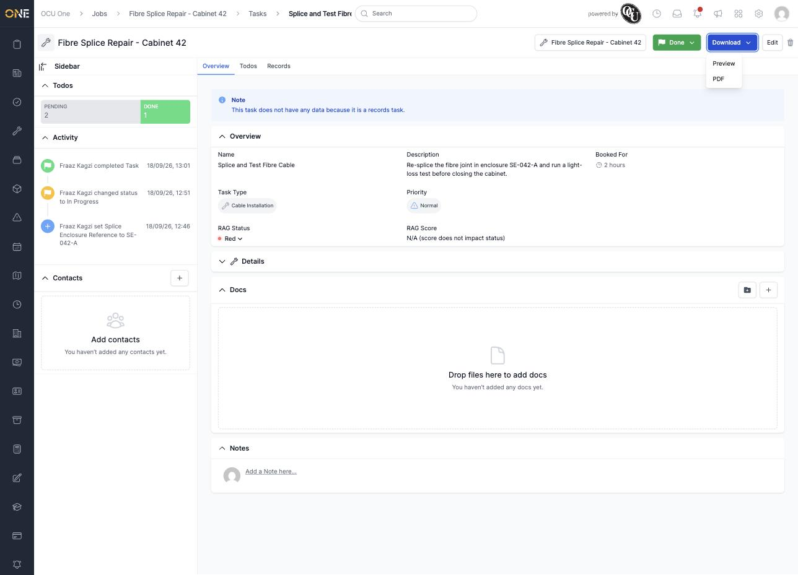
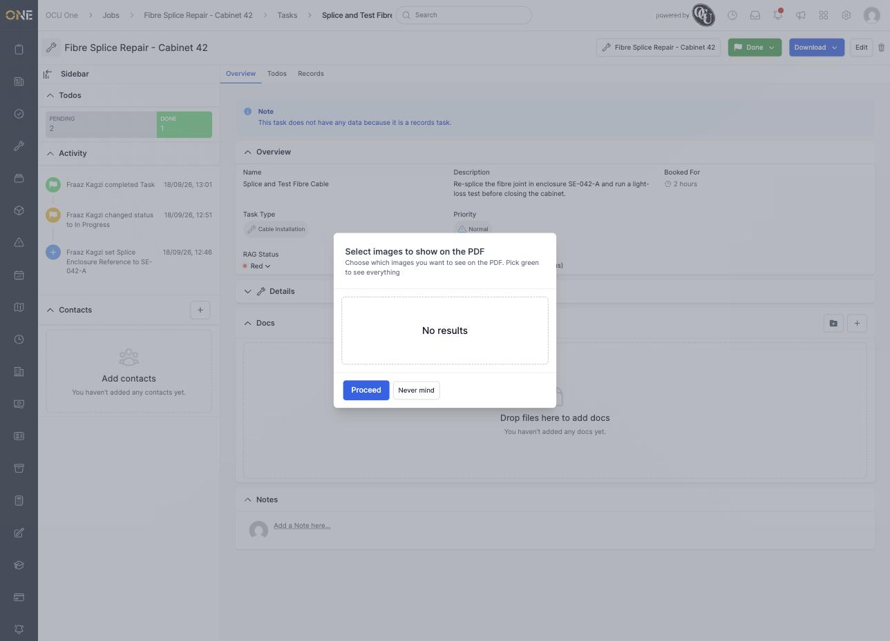
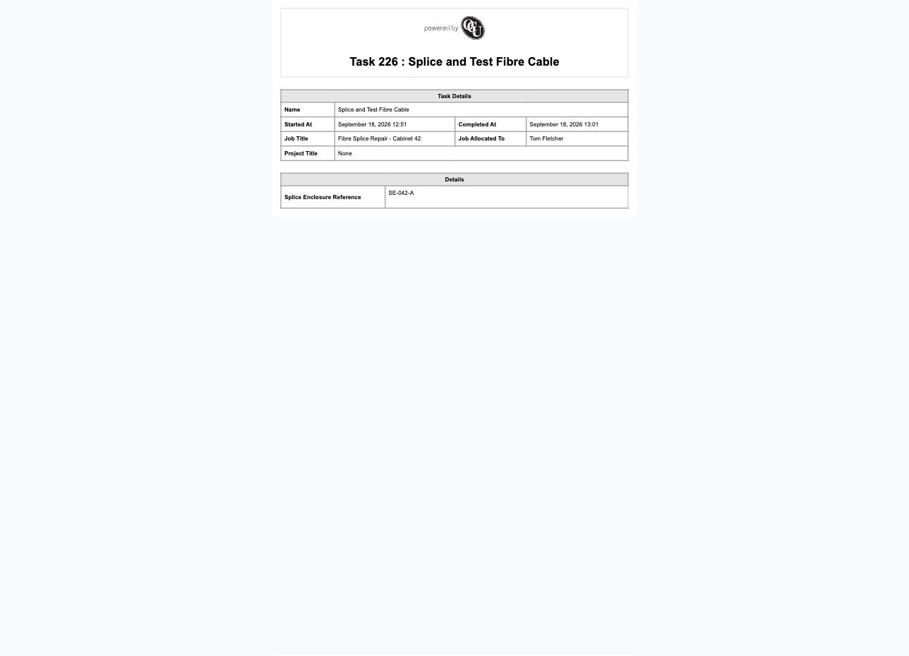

# Downloading or previewing a job task PDF

Like a job, a task can be exported as a PDF summary of its own — useful for paperwork on just that piece of work rather than the whole job.

## Choosing Preview or PDF

Click **Download** at the top of the task, then choose **Preview** (opens in the browser) or **PDF** (downloads the file directly).

*Preview lets you check the document before saving it; PDF downloads it straight away.*

## Choosing which photos to include

If the task has any photos attached, you're asked which ones to include before the document is generated — pick individually, or "Pick green to see everything."

*No photos are attached to this task, so there's nothing to pick from — click Proceed to continue anyway.*

Click **Proceed** to generate the document.

## The generated document

The PDF (or preview) shows the task's name, when it started and was completed, the job it belongs to and who that job is allocated to, and any custom fields configured for the task's type.

*"Splice and Test Fibre Cable" — started and completed timestamps filled in now that the task has been worked through to Done, plus its "Splice Enclosure Reference" custom field.*

The **Started At** and **Completed At** fields only fill in once the task has actually moved through those statuses (see [Updating a job task's status](Updating%20a%20job%20task's%20status.md)) — they're blank on a task that's still New. The task's own **Description** isn't shown on this document.
