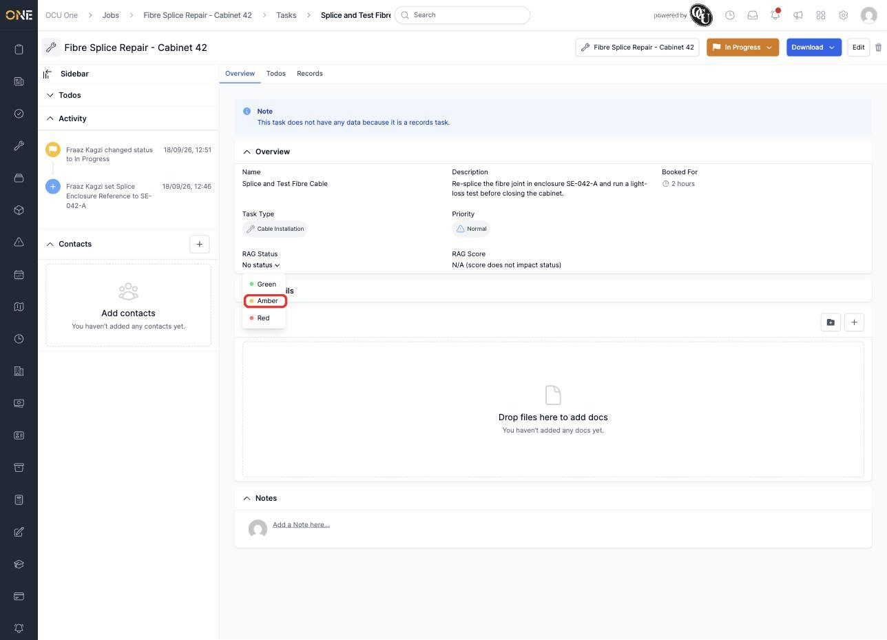
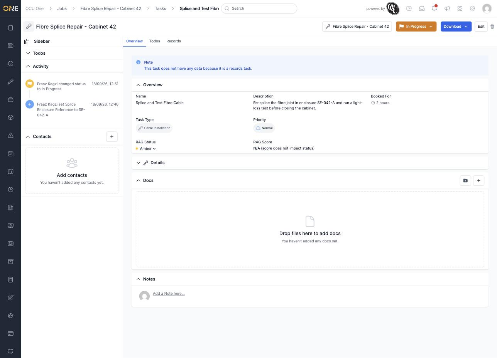

# Tracking a job task's RAG status

Some task types carry their own **RAG Status** — Green, Amber, or Red — as a quick visual health indicator on the task's Overview tab, separate from the job's own RAG status. It only appears for task types set up with RAG tracking turned on.

## Changing it

Click the **RAG Status** dropdown and pick a colour.

*"Splice and Test Fibre Cable" currently has no RAG status set — picking Amber.*

The badge updates straight away.

*RAG Status changed to Amber.*

You can change it again the same way at any time.

*RAG Status changed from Amber to Red.*

**RAG Score** stays "N/A (score does not impact status)" unless the task's type has automatic RAG scoring configured — otherwise, like on a job, it's a manual flag with no bearing on the task's status.
