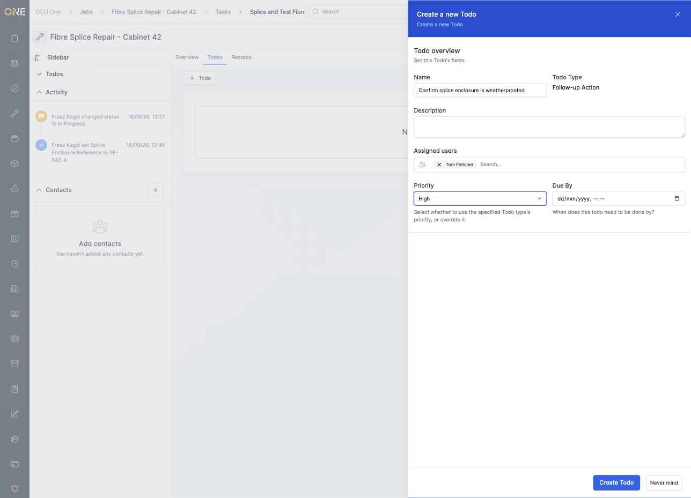
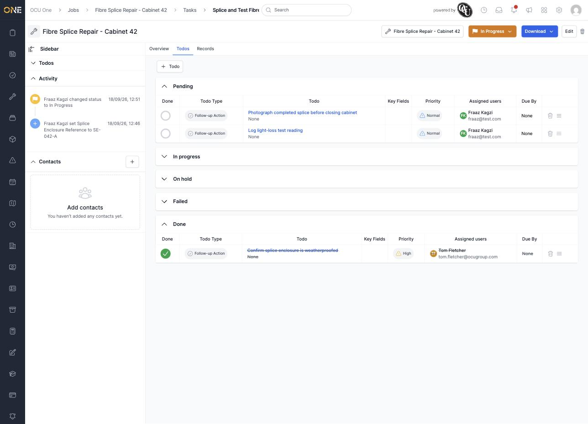
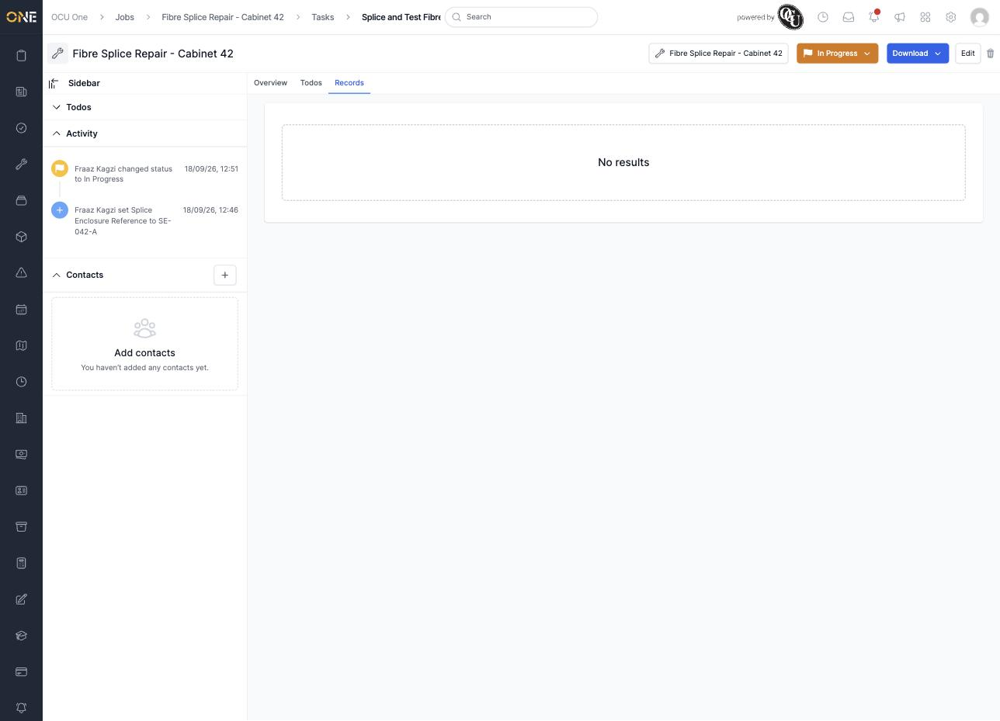
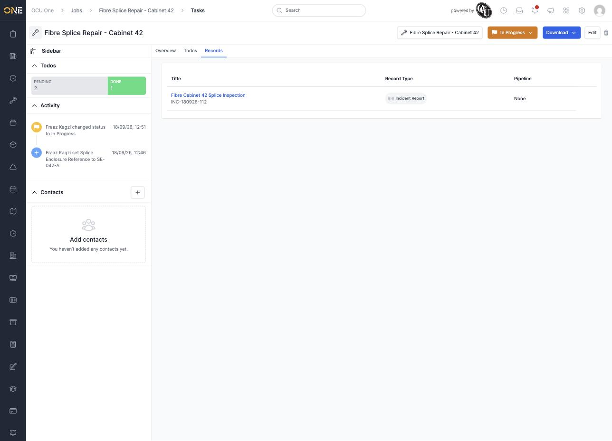

# Tracking todos and records on a job task

Like a job, a task has its own **Todos** tab, and — for task types set up to hold records — a **Records** tab.

## Todos

Click **+ Todo**, pick a todo type, then fill in the **Name**, **Description**, **Assigned users**, **Priority**, and **Due By** date.

*Adding "Confirm splice enclosure is weatherproofed," assigned to Tom Fletcher, High priority.*

Click **Create Todo** to save it — it appears in the **Pending** section. Todos are grouped into **Pending**, **In progress**, **On hold**, **Failed**, and **Done**, the same as on a job.

*Three todos added; "Confirm splice enclosure is weatherproofed" already marked Done (shown with a strikethrough) after clicking the circle in the Done column.*

## Records

If the task's type is set up to hold records, a **Records** tab shows any records of the matching type that have been added to the *job* — it's a filtered view, not a separate place to add records of its own.

*Empty until a matching record exists on the job.*

Add a record of the right type from the job's own **Records** tab, and it shows up here automatically.

*The task type here is only configured for Incident Report records, so only records of that type appear — and there's no way to remove a record from this tab (that's done from the job's Records tab instead).*
