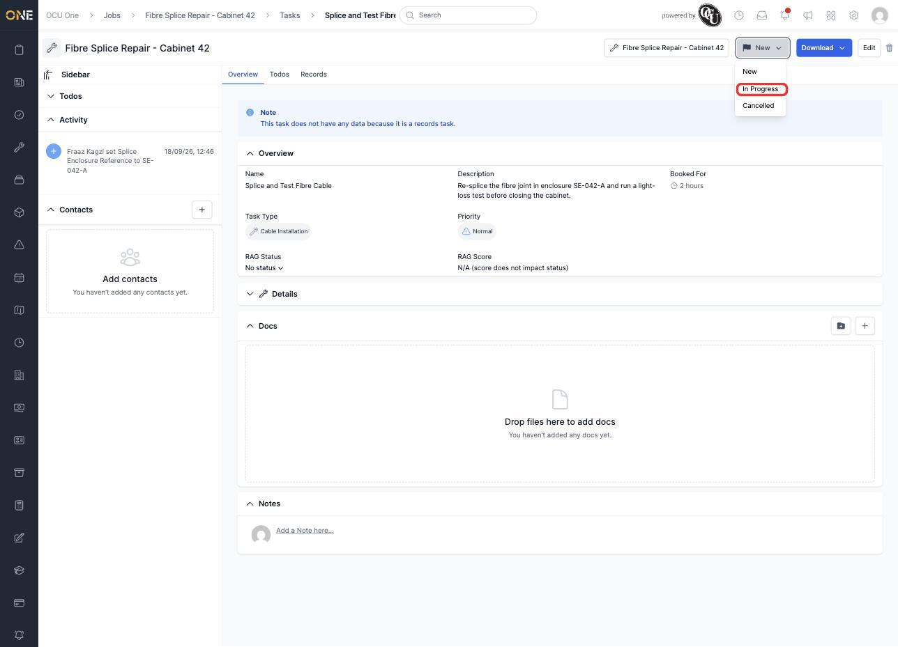
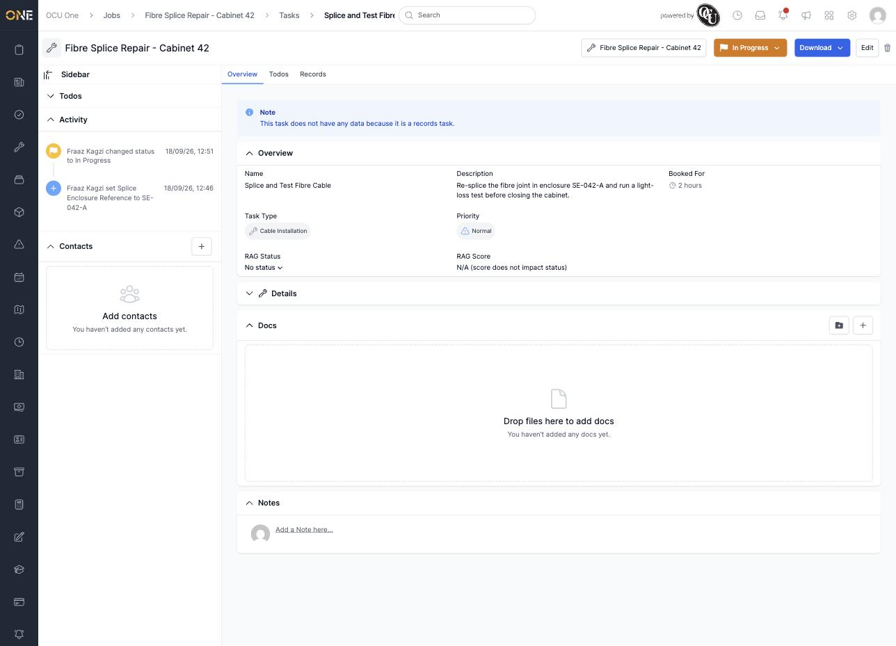

# Updating a job task's status

A task tracks its own status separately from its job. Click the status button at the top of the task (it starts out labelled **New**) to see the statuses you can move it to next.

*A New task can only move to "In Progress" or "Cancelled" — picking "In Progress."*

The button updates immediately, and the change is logged in the **Activity** panel.

*"Splice and Test Fibre Cable" is now In Progress.*

Which statuses you're offered next depends on the task's current one — an In Progress task, for example, offers Failed, Cancelled, and Done instead.
