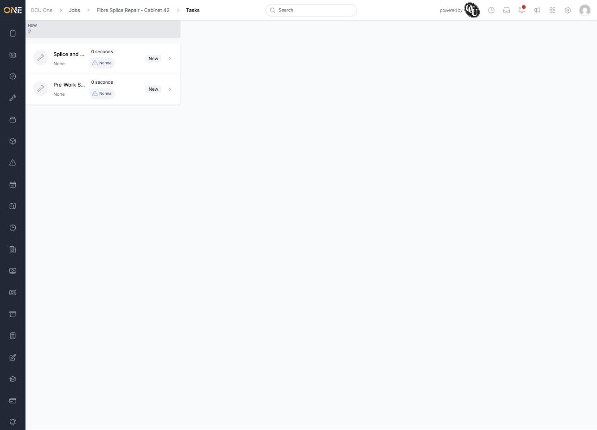
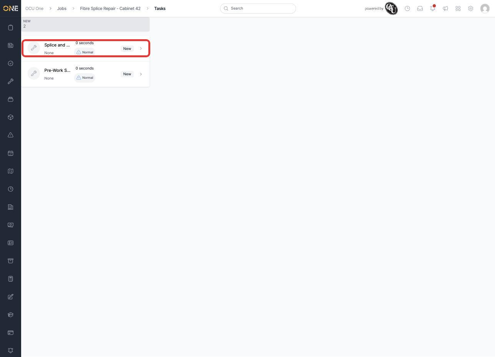
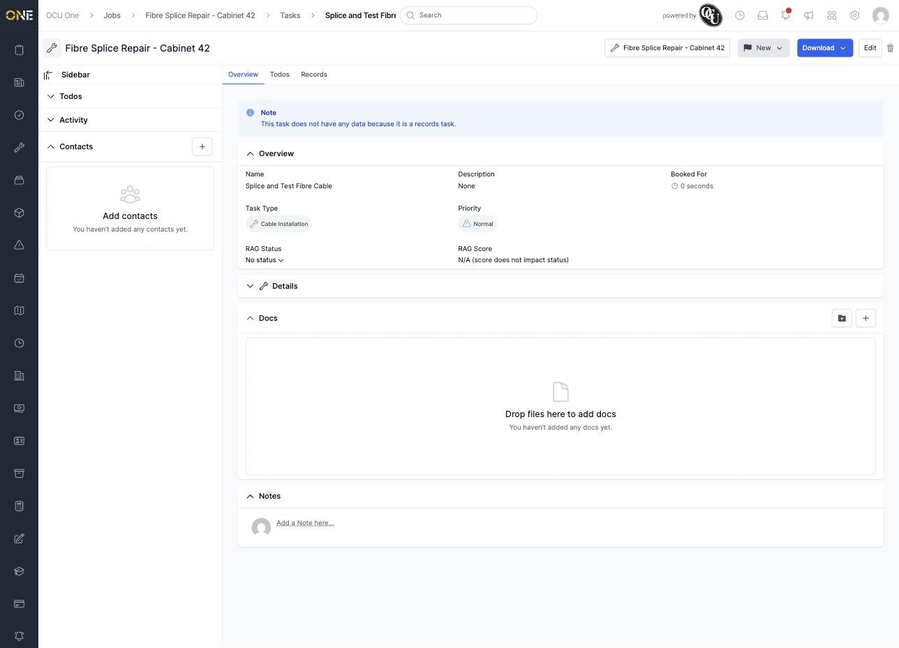
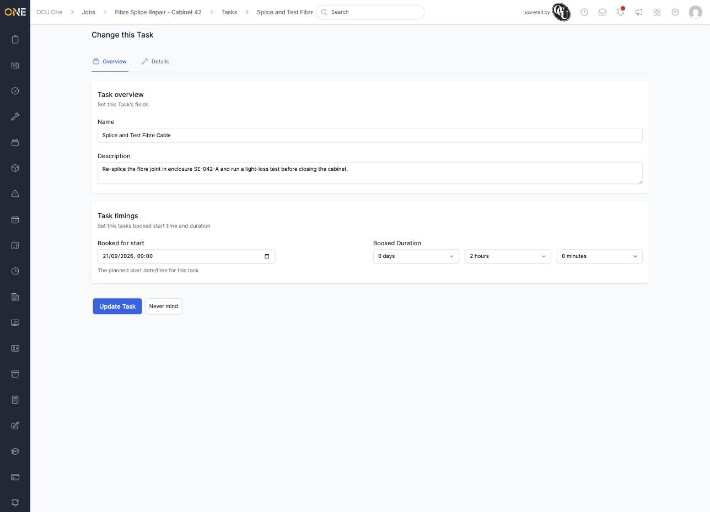
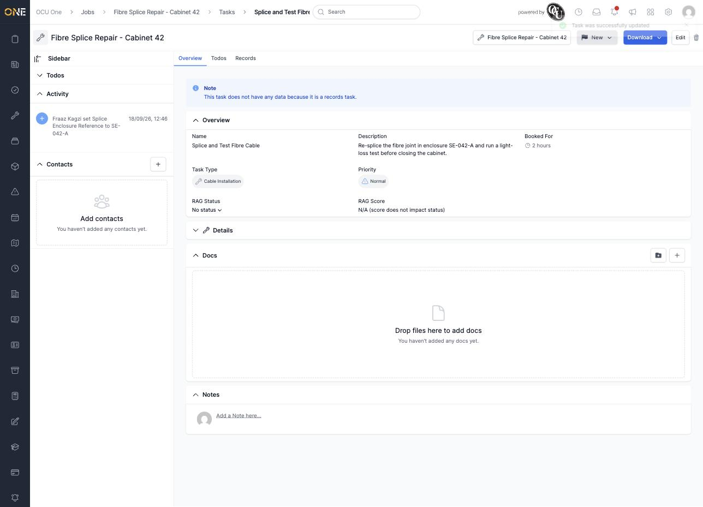

# Viewing and updating a job task

A job can be broken down into one or more **Tasks** — individual pieces of work tracked separately from the job as a whole, each with its own type, priority, and status. You'll find them on the job's **Tasks** tab.

*"Fibre Splice Repair - Cabinet 42" has two tasks: "Splice and Test Fibre Cable" (a Cable Installation task) and "Pre-Work Safety Inspection" — both currently New.*

## Opening a task

Click a task in the list to open it.

*Clicking through to "Splice and Test Fibre Cable."*

## What you'll see

The task's Overview tab shows its **Name**, **Description**, **Task Type**, **Priority**, **Booked For** duration, and — if the task's type has RAG tracking turned on — a **RAG Status** and **RAG Score**. Below that, a **Details** section lists any custom fields configured for that task type, followed by **Docs** and **Notes** sections just like you'd find on a job.

*"Splice and Test Fibre Cable" — a Cable Installation task, Normal priority, no RAG status set yet.*

If a task's type is set up purely to hold records (more on that in [Tracking todos and records on a job task](Tracking%20todos%20and%20records%20on%20a%20job%20task.md)), you'll see a blue note here reminding you the task itself carries no other data.

## Editing a task

Click **Edit** at the top of the task. The edit screen has two tabs:

- **Overview** — the task's **Name**, **Description**, and its **Booked for start** date/time and **Booked Duration** (days, hours, and minutes).
- **Details** — any custom fields configured for the task's type.

*Adding a description and setting "Booked for start" to 21/09/2026 09:00 with a 2 hour duration.*

Switch to the **Details** tab to fill in the task type's custom fields — here, a "Splice Enclosure Reference."

Click **Update Task** to save. You're taken back to the task, which now shows your changes, and the change is recorded in the **Activity** panel on the left.

*"Task was successfully updated" — the description, booked duration, and Splice Enclosure Reference are all saved.*

The task's **Type** can't be changed here — a job's tasks are set up automatically from its job type when the job is created, and there's no button on the Tasks tab to add another one yourself.
