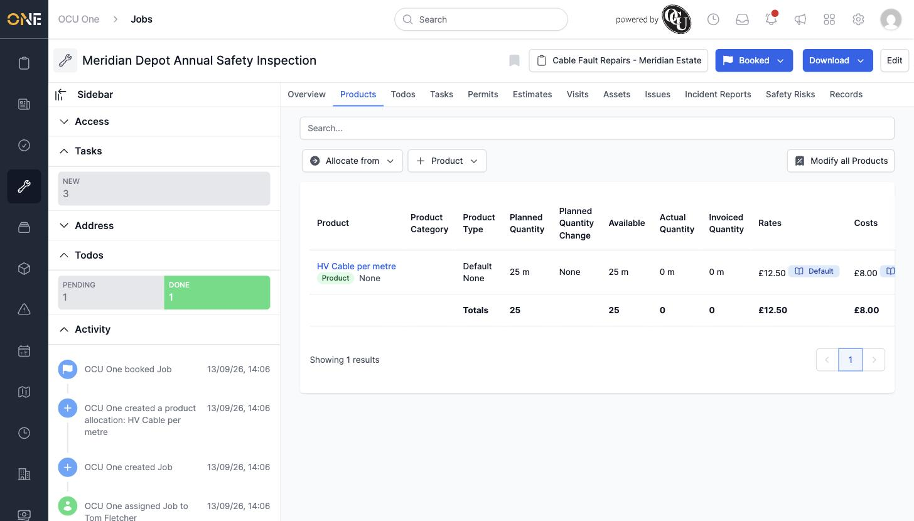

# Allocating products to a job

For job types with product allocations turned on, the **Products** tab tracks materials or products used on the job, alongside their planned quantities and pricing.

## Viewing allocated products

Open the Products tab to see everything already allocated — quantity planned, quantity available, actual quantity recorded, invoiced quantity, and the sell rate and cost rate applied to each line, with totals at the bottom.

*"HV Cable per metre" — 25 m planned, all 25 m still available, at £12.50/m sell rate and £8.00/m cost rate under the job's rate book.*

## Adding a product

Click **+ Product** to allocate a new product to the job, or **Allocate from** to copy allocations across from another record (like an accepted estimate). Search for the product you want and set its planned quantity — the rate is pulled automatically from whichever rate book is set on the job.

Products can only be added to a job before it's live — once a job is Booked or In Progress, its product allocations are locked to what's already there.

## Managing existing allocations

Click **Modify all Products** to edit several allocations at once, or click into an individual product to change its planned quantity, category, or remove it — covered in its own guide.
