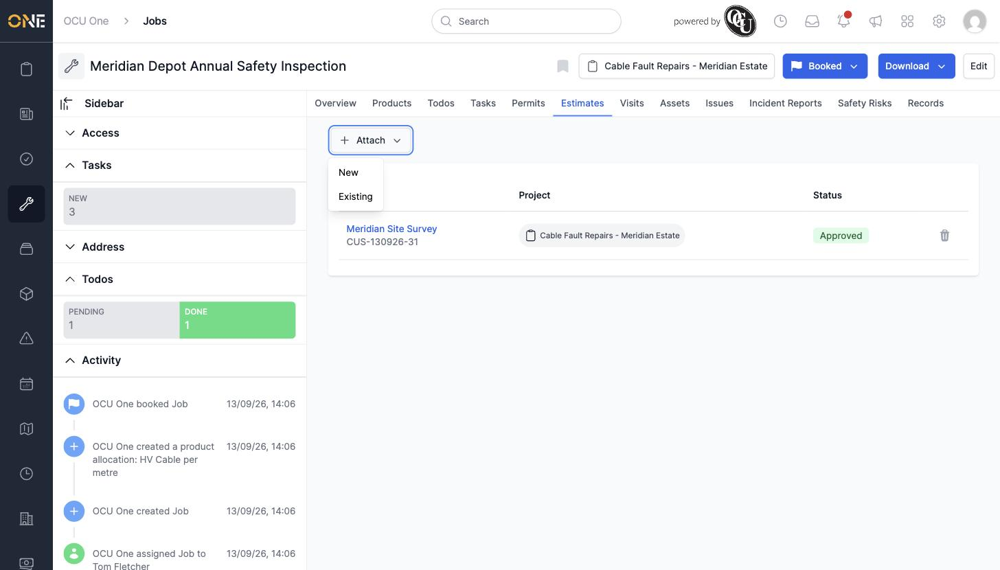
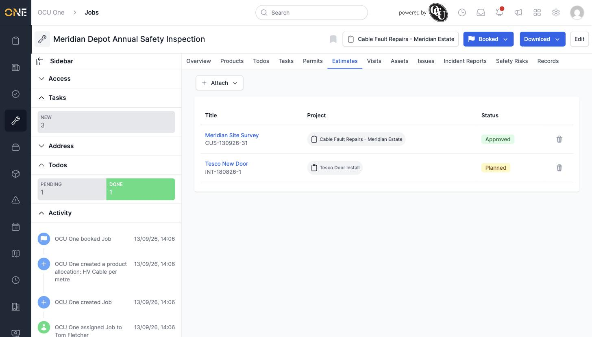
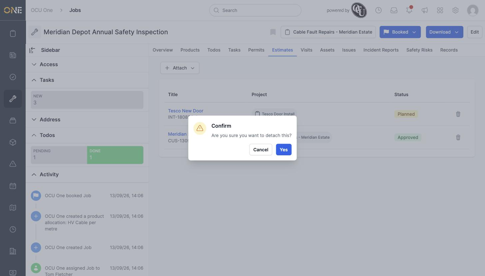
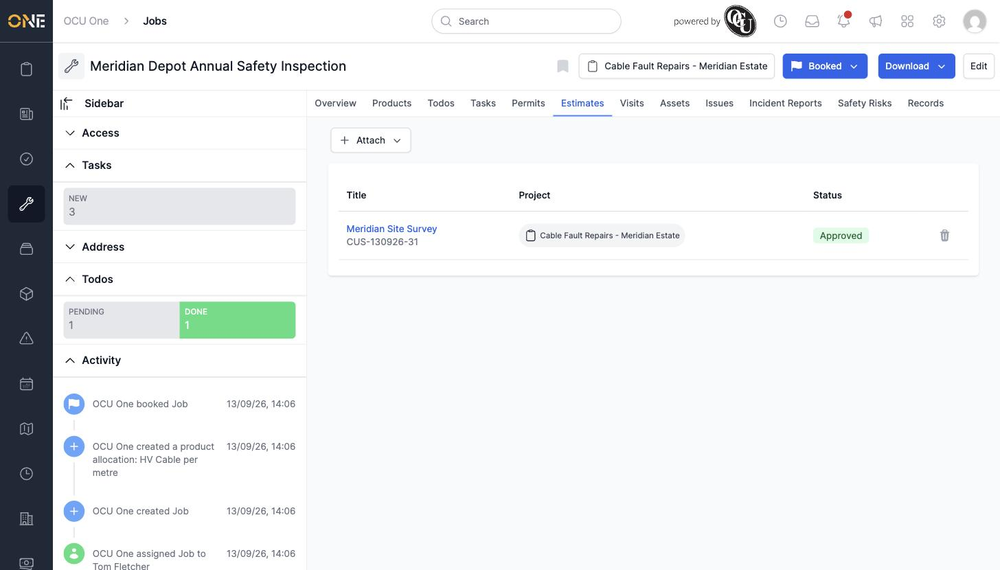

# Attaching or detaching an estimate to a job

A job's **Estimates** tab links it to any quotes or estimates relevant to the work, and a job can have more than one attached at once.

## Attaching an existing estimate

From the job's Estimates tab, click **Attach**, then choose **Existing** (or **New** to create one from scratch).

*"Meridian Site Survey" is already attached to this job.*

Search for and select the estimate, then click the link icon next to the search field to confirm.

*"Tesco New Door" attached alongside the existing "Meridian Site Survey" — a job can have more than one estimate linked at a time.*

## Detaching an estimate

Click the trash icon next to any attached estimate. A confirmation dialog checks you meant to detach it.

Click **Yes** to confirm — the estimate is removed from the job's list (the estimate itself isn't deleted, just unlinked from this job).

*"Tesco New Door" removed; "Meridian Site Survey" remains attached.*

An estimate that's locked (for example, one whose status has moved past a certain point) can't be detached from a job — the trash icon will still show, but the action is refused until the estimate is unlocked.
