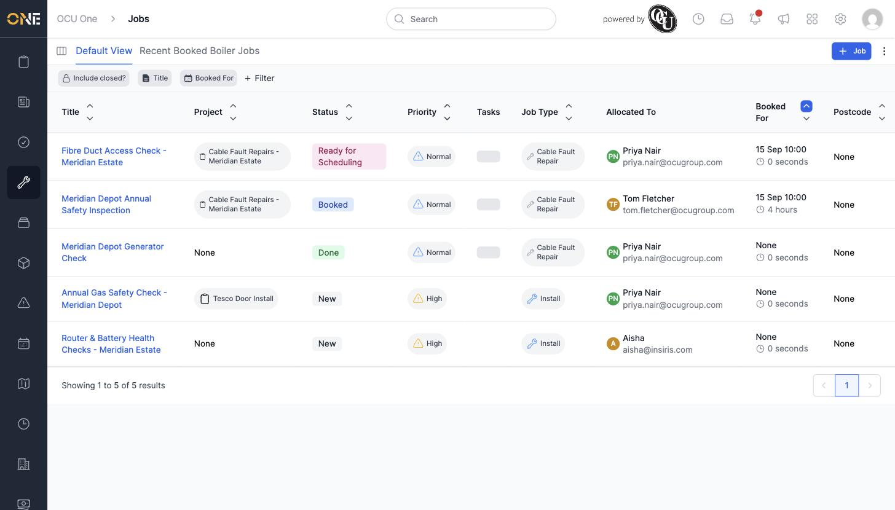

# Browsing and filtering the jobs list

The Jobs list is the main table view of every job you have access to, with columns for Project, Status, Priority, Tasks, Job Type, Allocated To, Booked For, and Postcode.

## Filtering the list

Click any column header's filter chip (or **+ Filter** to add a new one) to narrow the list down. Filtering by **Title** with "contains" and a search term is a quick way to find related jobs.

*Filtered down from over a hundred jobs to 5 — spanning New, Ready for Scheduling, Booked, and Done statuses, and both "Cable Fault Repair" and "Install" job types.*

Multiple filters combine together, so you can narrow by status, job type, or allocated user at the same time as a title search.

## Switching views and saving filters

The tabs above the filter bar (**Default View**, plus any saved views like "Recent Booked Boiler Jobs") let you jump between different saved filter/column combinations. Once you've set up filters and columns you use often, save them as your own view — covered in the Views topic.

## Sorting and columns

Click a column header to sort by that field, or use the small grid icon at the top left to customize which columns are shown.
