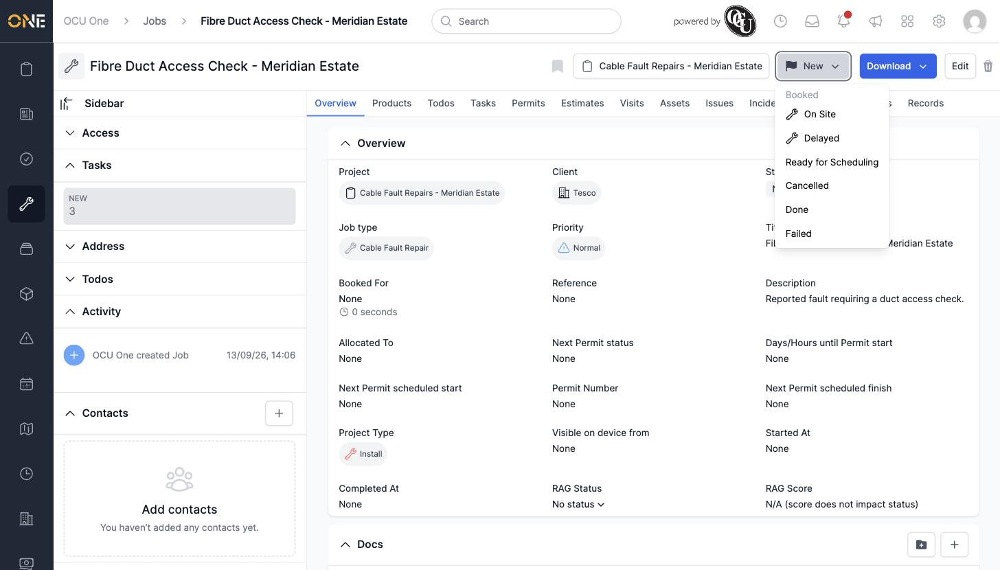
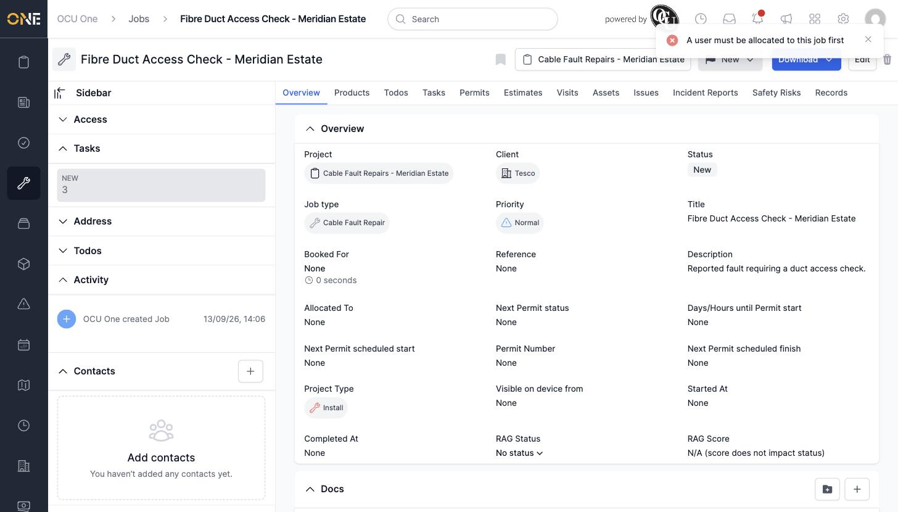
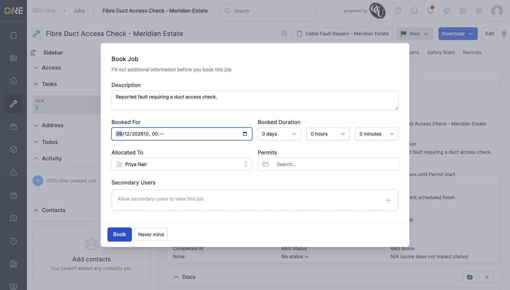
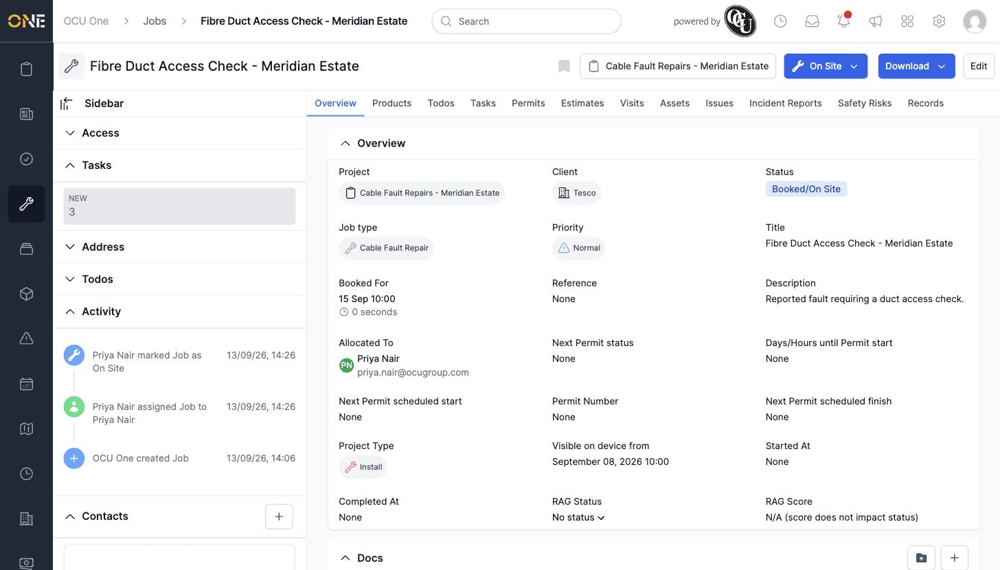

# Changing a job's status

A job's status badge, next to the Download/Edit buttons at the top of its page, is also a dropdown for moving it through its lifecycle.

## The status dropdown

Click the status button (showing the job's current status, e.g. "New") to see what it can move to next. Moving it to **Booked** actually offers a choice of sub-statuses configured for that status — here, "On Site" and "Delayed" — so picking one books the job with that sub-status applied in one step. The other options — **Ready for Scheduling**, **Cancelled**, **Done**, **Failed** — are plain status moves.

*Moving a job into "Booked" status lets you pick a sub-status directly, rather than booking first and setting the sub-status afterward.*

## Booking requires an allocated user

If you try to book a job that has nobody allocated to it yet, the app blocks the move with a warning.

*Booking is refused until someone is allocated — the job's status stays unchanged.*

## The review-and-confirm step

Picking a booked status (with or without a sub-status) doesn't book the job immediately — it opens a **Book Job** confirmation screen first, letting you fill in or adjust the booked date/time, duration, allocated user, and any permits, before the booking actually goes through.

*Fill in when the job is booked for and who it's allocated to, then click Book to confirm.*

Once you've filled in an allocated user and click **Book**, the job moves to its new status.

*Status now shows "Booked/On Site," with the booked date/time and allocated user set, and both changes recorded in the Activity feed.*
