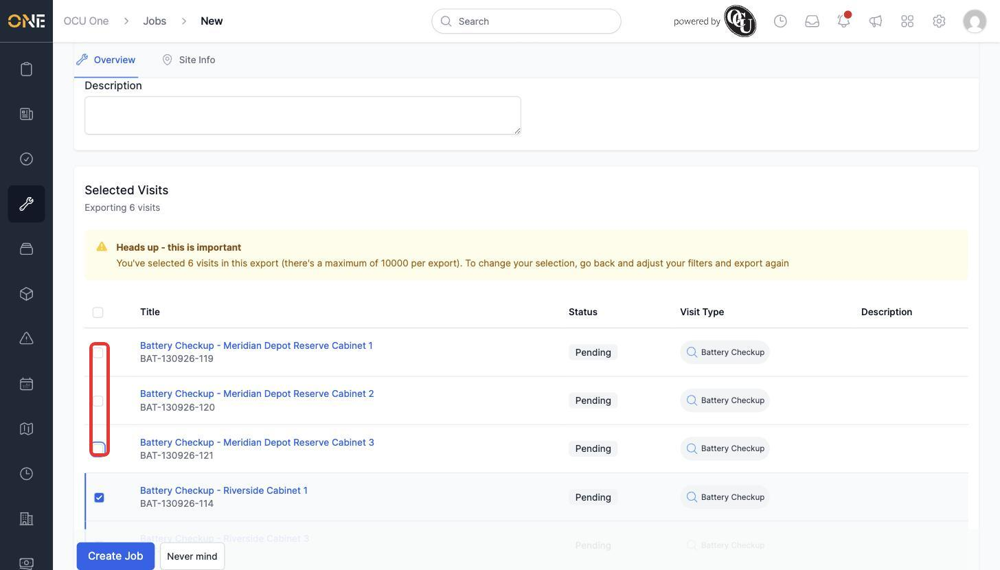
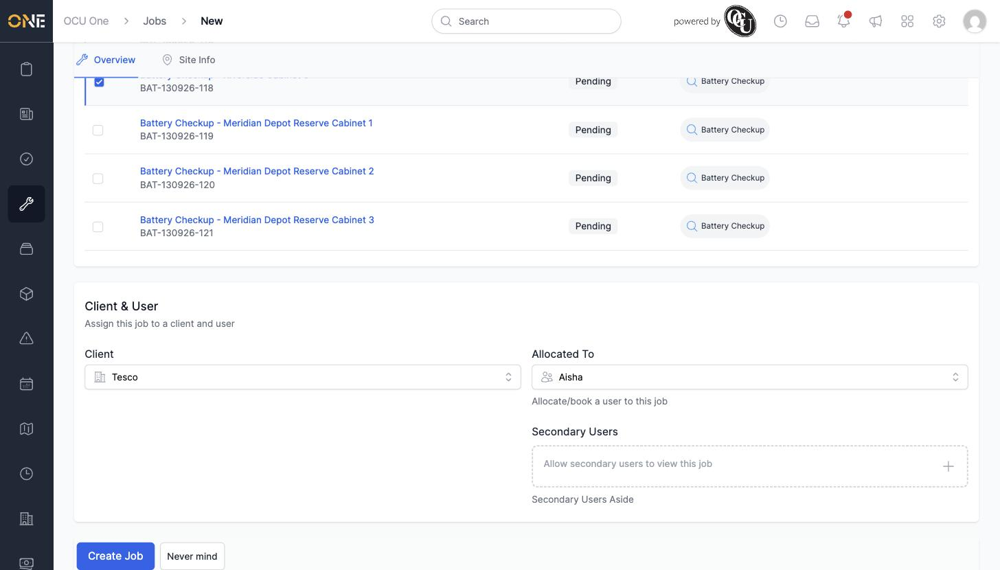
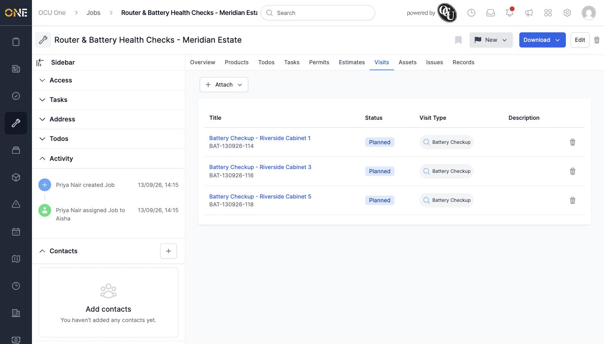

# Creating a job from existing visits

If you've already got pending visits scheduled — perhaps upcoming asset checkups — you can turn a batch of them straight into a single job, rather than creating the job first and attaching each visit afterwards.

## Starting from the Visits list

From the **Visits** list, click **+ Job**. This uses whichever visits are currently shown on your list (filtered by whatever view you're on), and asks you to pick a job type, the same as creating any other job.

## Selecting which visits to include

After picking a type, you land on a job form with all of the list's pending visits pre-selected in a **Selected Visits** table. Untick any you don't want pulled into this job — here, three "Meridian Depot Reserve Cabinet" visits are excluded, leaving three "Riverside Cabinet" visits selected.

*Untick a visit's checkbox to leave it off the job — it stays unattached and pending.*

## Filling in the job details

Give the job a **Title**, then fill in the **Client & User** section below the visits table — the same as any other job, this needs a **Client** and (optionally) who it's **Allocated To**.

*Client and allocated user set. This form doesn't ask for a Project — the job is created standalone.*

## After creating

Click **Create Job**. The job is created and immediately shows the selected visits already attached, under its own **Visits** tab.

*"Router & Battery Health Checks - Meridian Estate" — three visits pulled in from the list, each now showing as "Planned" instead of "Pending".*

Any visits you left unticked stay exactly as they were — still pending and unattached, ready to be picked up individually or included in a future job.
