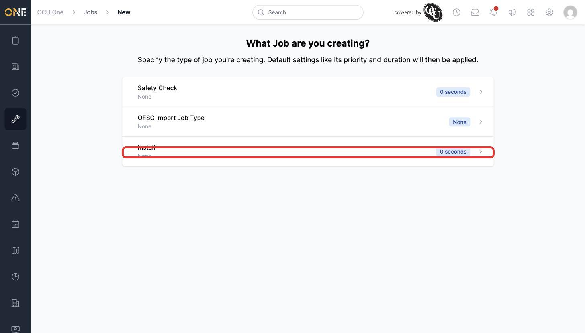
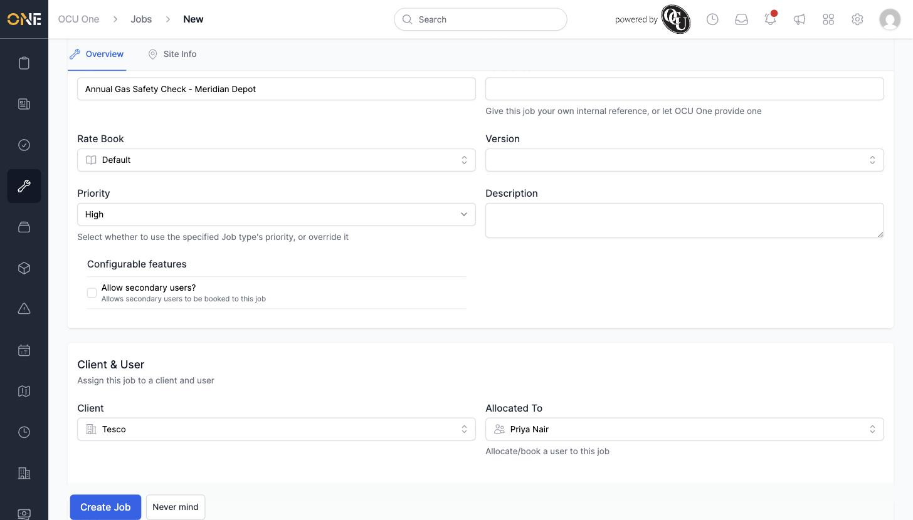
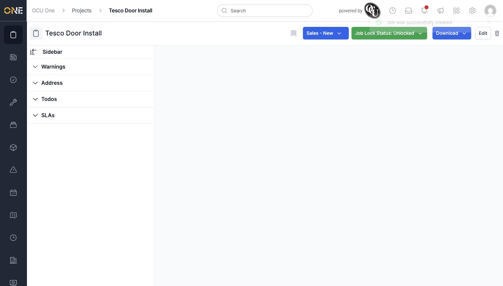
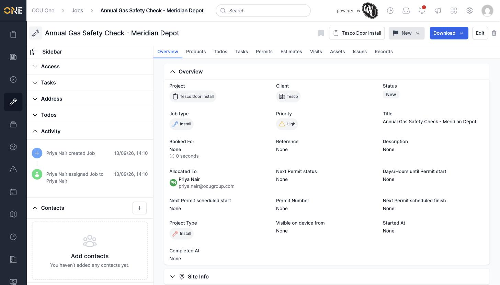

# Creating a job

A **job** is a single piece of scheduled work — a visit, an install, a safety check — that gets booked to a field engineer or office user. You can create one from the Jobs list at any time.

## Choosing a job type

From the Jobs list, click **+ Job**. You're first asked what type of job you're creating.

*Pick the job type that matches the work — here, "Install."*

Each job type comes with its own defaults (priority, duration, which tabs show up later), so the type you pick here shapes the rest of the form.

## Filling in the details

After picking a type, you land on the "Create a new Job" form, split into a **Job overview** section and a **Client & User** section further down the page.

Give the job a clear **Title**, then optionally search for and attach a **Project** it belongs to, and pick a **Rate Book**. Underneath, in **Client & User**, choose the **Client** and who the job should be **Allocated To**.

*Project, rate book, client, and allocated user all filled in. Reference, description, and version are optional.*

Some job types also add their own extra tab (shown alongside "Overview" at the top of the form) for fields specific to that type — fill those in too if the type you picked has any required ones, or the job won't save.

## After creating

Click **Create Job** to save it. If the job belongs to a project, you're taken back to that project's page with a "Job was successfully created" confirmation — otherwise you land straight on the new job.

*Created from within a project, so you land back on "Tesco Door Install" rather than the job itself.*

Opening the job itself shows its own Overview tab, along with Products, Todos, Tasks, Permits, Estimates, Visits, Assets, Issues, and Records tabs — ready for you to build out the rest of the work. An activity entry records that you created it and who it was allocated to.

*"Annual Gas Safety Check - Meridian Depot" — status "New", allocated to Priya Nair, still unbooked.*
