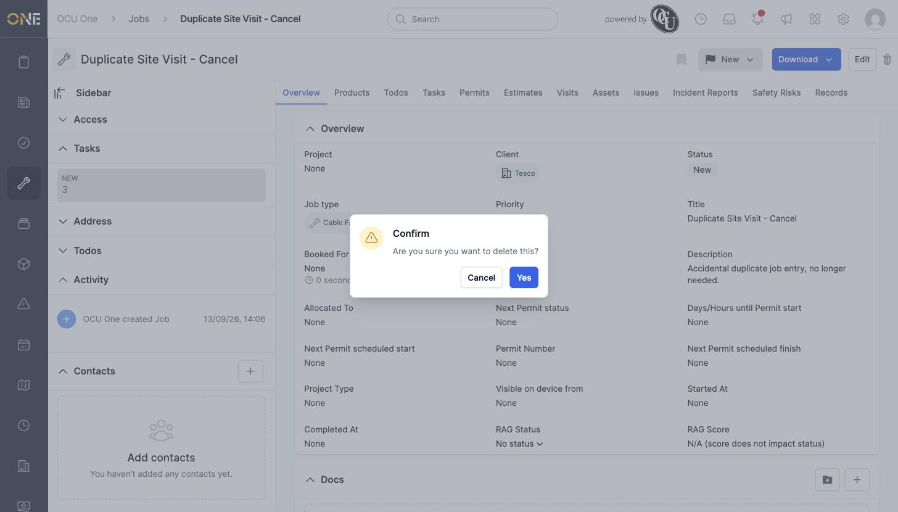
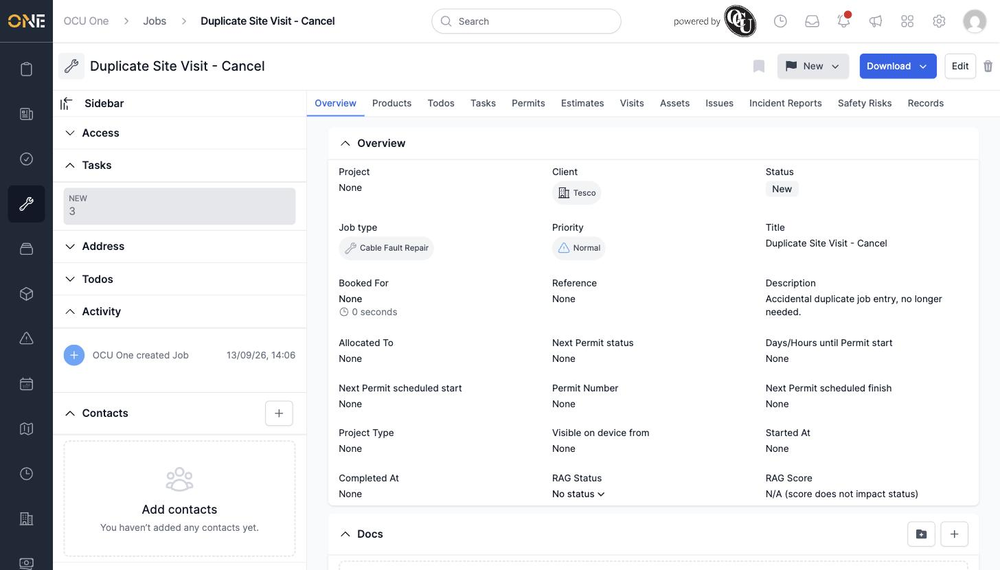

# Deleting (archiving) a job

Removing a job doesn't erase it outright — it archives it, taking it off your active lists while keeping its history intact.

## Deleting a job

Open the job and click the trash icon at the top right of the page. A confirmation dialog checks you meant to do this.

*Confirming the deletion of "Duplicate Site Visit - Cancel," an accidental duplicate job entry.*

Click **Yes** to confirm. The job is archived and you're returned to the Jobs list with a "Job was successfully deleted" confirmation.

*The job no longer appears in the active Jobs list.*

A job attached to a project that's been locked can still be deleted this way — locking a project only prevents scheduling changes to its jobs, not archiving them.
