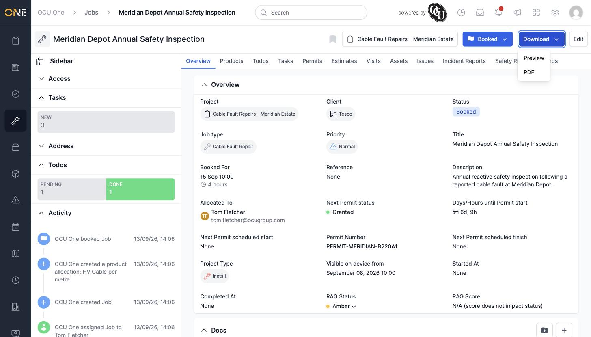
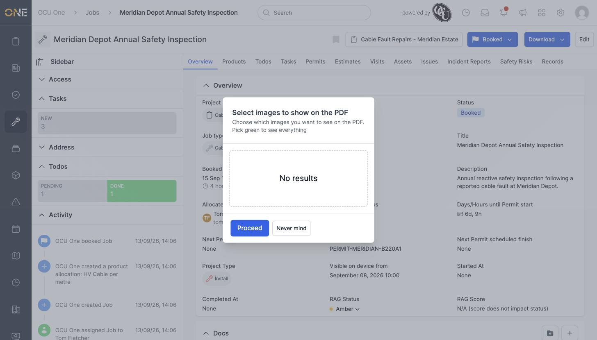
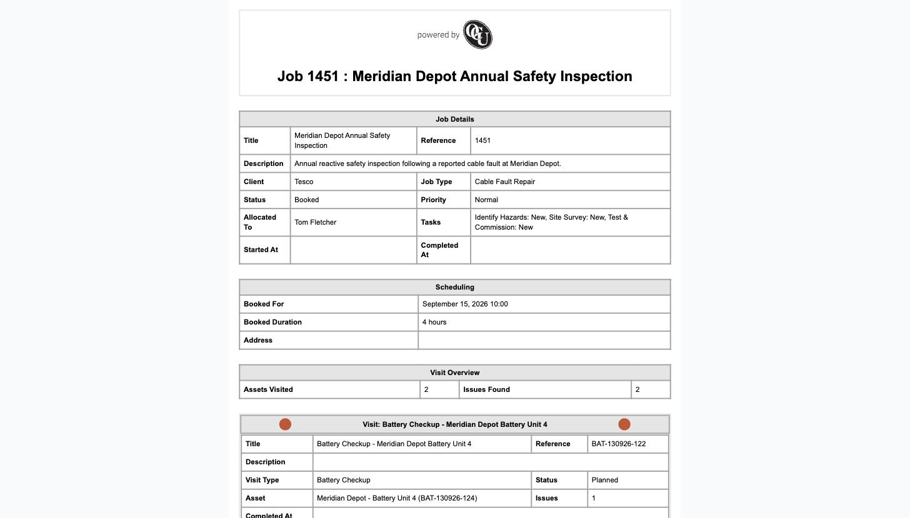

# Downloading or previewing a job PDF

Every job can be exported as a PDF summary — useful for sharing a record of the work with a client or for your own paperwork.

## Choosing Preview or PDF

Click **Download** at the top of the job, then choose **Preview** (opens in the browser) or **PDF** (downloads the file directly).

*Preview lets you check the document before saving it; PDF downloads it straight away.*

## Choosing which photos to include

If the job has any photos attached, you're asked which ones to include before the document is generated — pick individually, or "Pick green to see everything."

*No photos are attached to this job, so there's nothing to pick from — click Proceed to continue anyway.*

Click **Proceed** to generate the document.

## The generated document

The PDF (or preview) lays out the job's details, scheduling information, and a full breakdown of every visit attached to the job — including each visit's asset, status, and any issues raised against it.

*"Meridian Depot Annual Safety Inspection" — 2 assets visited, 2 issues found, with each visit broken out into its own section below.*

If the job type has a custom PDF template configured, that template is used instead of the default layout shown here.
