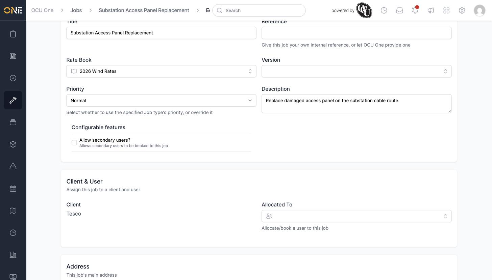
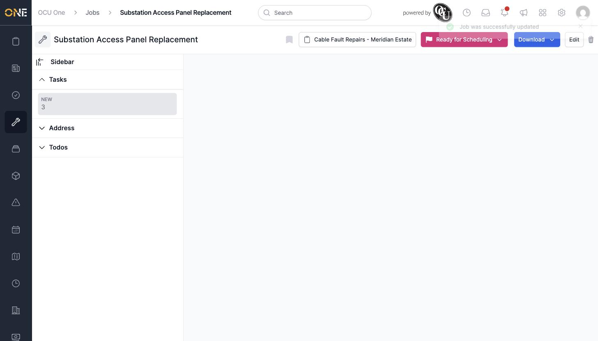

# Editing a job

Open a job and click **Edit** to change its details. Which fields you can change depends on the job's current status.

## Editable fields before a job is live

While a job hasn't yet been booked out to the field (statuses like "Ready for Scheduling"), you can still change things like its **Rate Book**, **Priority**, **Description**, **Project**, **Client**, and who it's **Allocated To** — the same fields you filled in when creating it.

*Rate book switched from "Default" to "2026 Wind Rates" on a job that hasn't been booked yet. Client and allocation are still editable here too.*

Further down the form you can also update the job's **Address** and **Job Timings** (booked start and duration).

Once a job has moved past this early stage — booked or in progress — the app narrows down which fields you're allowed to change (status, timings, description, and a handful of others stay editable, but things like the allocated user, rate book, or client are locked once work has started).

## Saving your changes

Click **Update Job** to save. You're taken back to the job's own page with a "Job was successfully updated" confirmation.

*"Substation Access Panel Replacement" — still shows "Ready for Scheduling," now with its rate book updated.*
