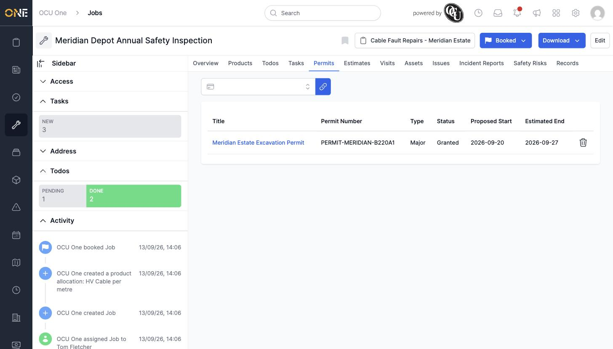
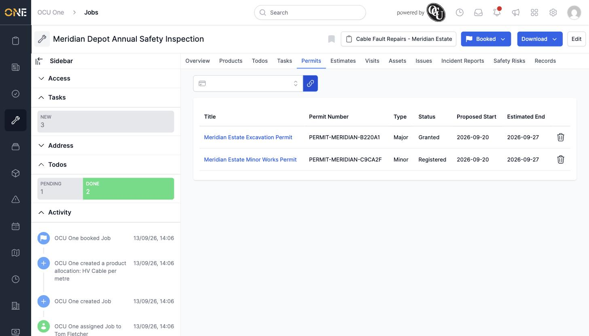
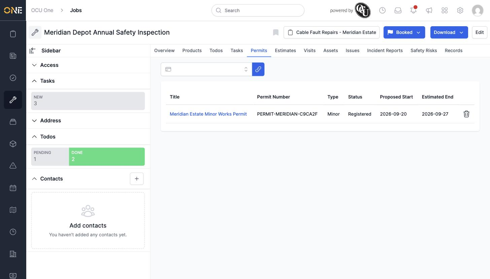

# Linking permits to a job

A job's **Permits** tab links it to any permits on its project — useful for checking what site restrictions or approvals apply to the work.

## Viewing linked permits

Open the Permits tab to see each linked permit's number, type, status, and dates.

*"Meridian Estate Excavation Permit" — Major, Granted, running 20–27 September 2026.*

## Linking another permit

Search for a permit from the job's project in the field at the top, select it, and click the link icon to confirm.

*"Meridian Estate Minor Works Permit" added alongside the existing excavation permit.*

## Unlinking a permit

Click the trash icon next to a permit to remove it from the job — no confirmation step, it's removed immediately.

*The excavation permit removed; the minor works permit remains.*

Only permits belonging to the job's own project can be linked here.
