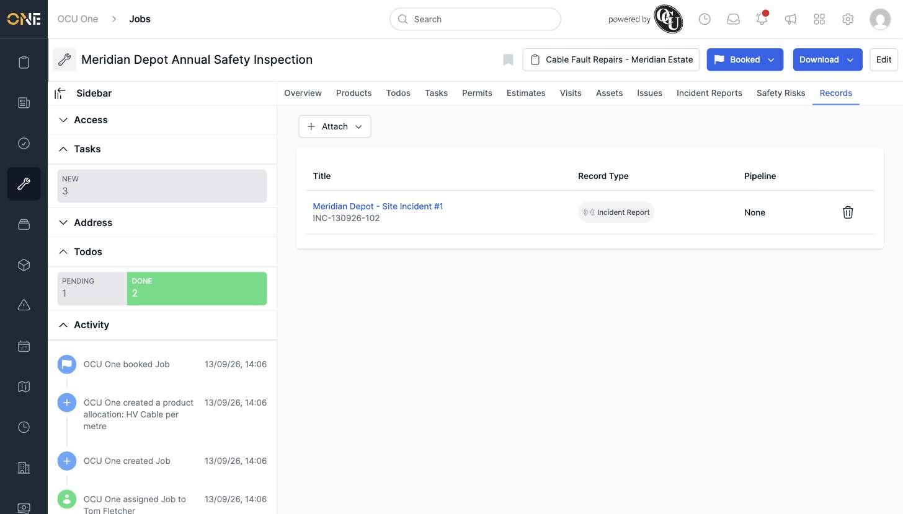

# Managing records on a job

Jobs can have records — like incident reports or safety inspections — attached to them. If the job type has specific record types pinned to it, each gets its own tab alongside a general **Records** tab that shows everything together.

*"Cable Fault Repair" job type has "Incident Reports" and "Safety Risks" pinned — each is its own tab, alongside the general Records tab.*

## Attaching a record

Click **Attach**, then choose **New** to create a record from scratch, or **Existing** to link one that already exists.

## Detaching a record

Click the trash icon next to a record to detach it from the job — this only removes the link, it doesn't delete the record itself.

Clicking a record's title opens its own page, where you can view or edit its full details.
