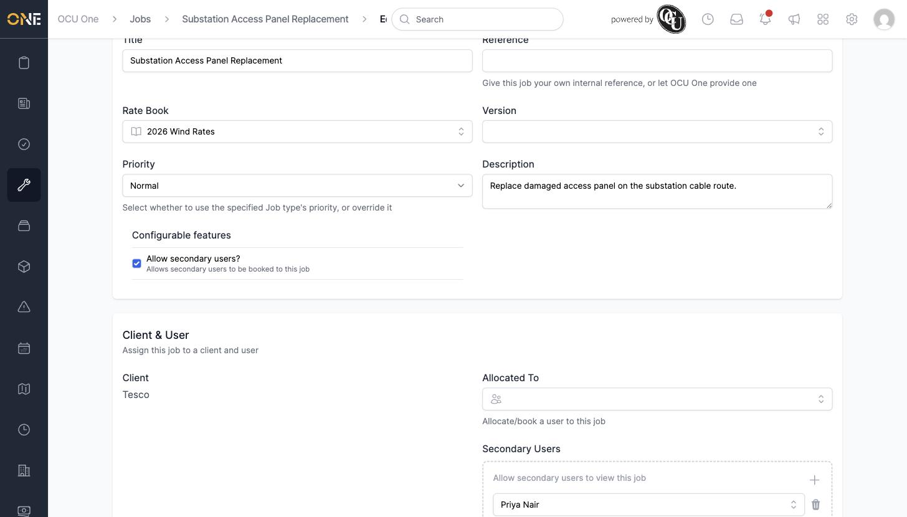
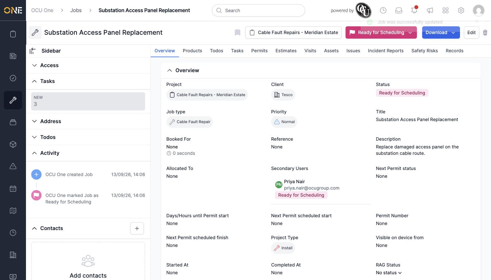

# Managing secondary allocated users on a job

Some job types support **secondary users** — extra crew members allocated alongside the main allocated user, each tracked and booked separately from the primary allocation.

## Turning it on

Not every job has this available. Open the job's **Edit** form — if its job type supports it, you'll see an **Allow secondary users?** checkbox under Configurable features. Tick it to reveal a **Secondary Users** field alongside **Allocated To**.

*"Allow secondary users?" ticked, with Priya Nair added as a secondary user. Click the **+** to add another row, or the trash icon to remove one.*

Click the **+** next to Secondary Users to add a row, then search for and pick a user. You can add more than one.

## After saving

Click **Update Job**. The job's Overview tab now shows a **Secondary Users** section, listing each secondary user alongside their own individual status badge for the job.

*Each secondary user gets their own status — they can be booked, unbooked, or moved through the job independently of the main allocated user.*
