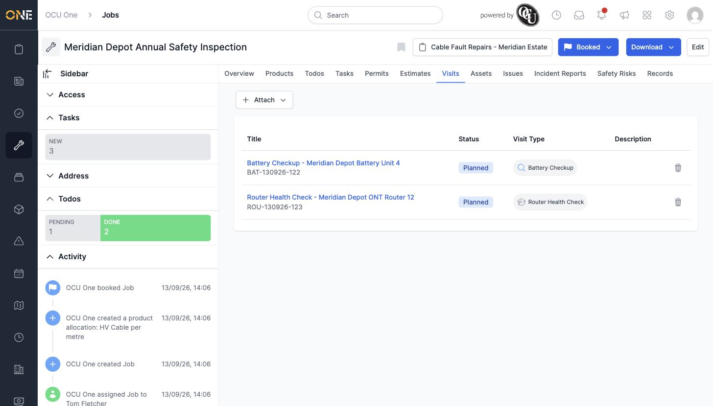
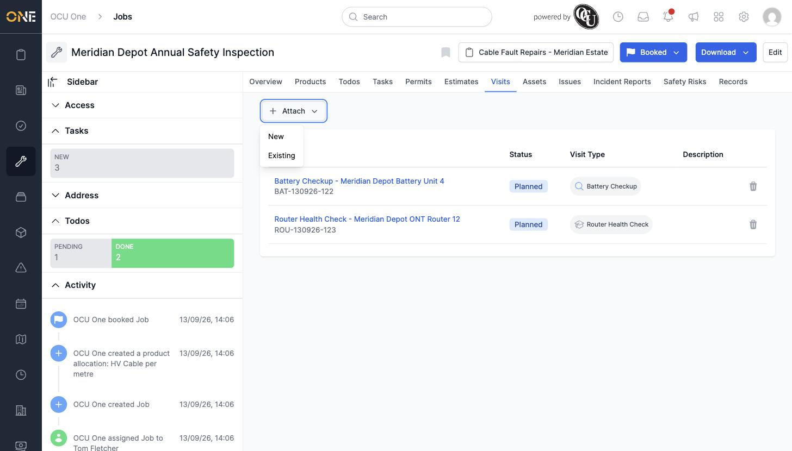
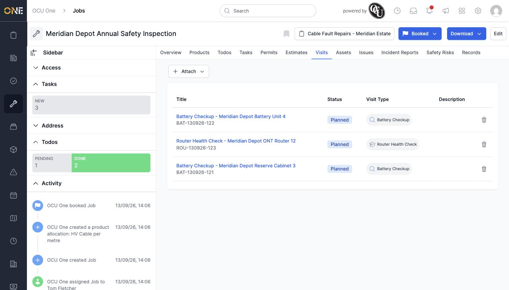

# Managing visits attached to a job

A job's **Visits** tab lists every visit that's part of the work — each one against a specific asset.

## Viewing attached visits

Open the Visits tab to see each attached visit's title, status, visit type, and description.

*"Battery Checkup - Meridian Depot Battery Unit 4" and "Router Health Check - Meridian Depot ONT Router 12," both "Planned."*

## Attaching another visit

Click **Attach**, then **Existing** to pick a pending visit that isn't linked to a job yet (or **New** to create one from scratch).

Search for the visit by title, select it, and click the link icon to confirm.

*"Battery Checkup - Meridian Depot Reserve Cabinet 3" added alongside the other two.*

## Detaching a visit

Click the trash icon next to a visit to remove it from the job. The visit itself isn't deleted — it goes back to being unattached and available to pick up on another job.
