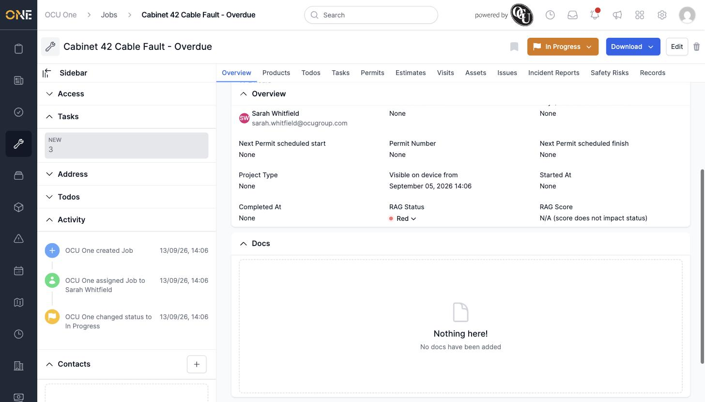
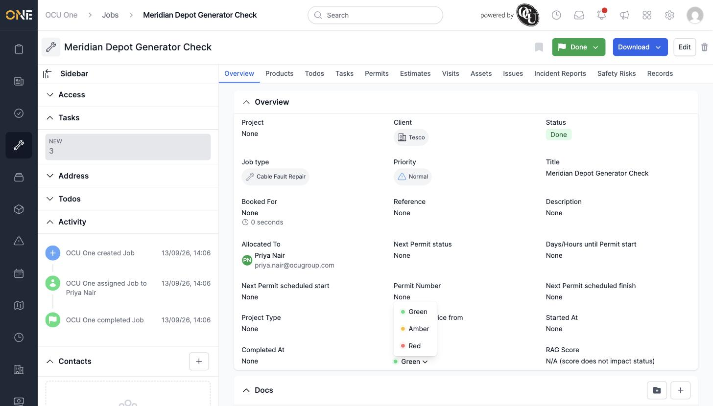
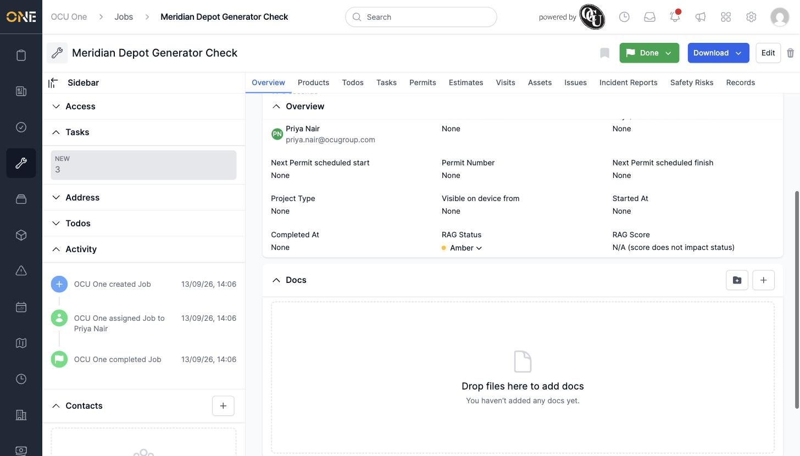

# Tracking a job's RAG health status

Every job carries a **RAG Status** — Green, Amber, or Red — as a quick visual health indicator, shown on its Overview tab.

*"Cabinet 42 Cable Fault - Overdue" flagged Red — allocated to Sarah Whitfield, In Progress.*

## Changing it

Click the **RAG Status** dropdown on the Overview tab and pick a colour.

*Picking a new colour from the dropdown.*

The badge updates straight away.

*"Meridian Depot Generator Check" — RAG changed from Green to Amber, still showing Amber after a page reload.*

RAG Score stays "N/A" unless the job type has automatic RAG scoring configured — otherwise it's a manual flag you set yourself, with no bearing on the job's status.
