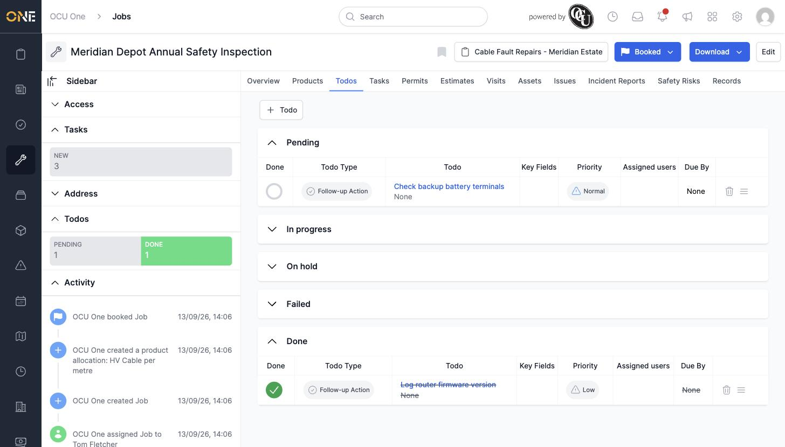
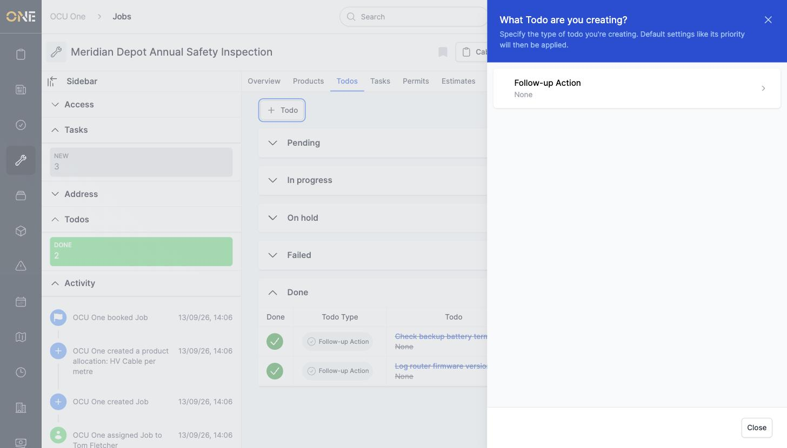
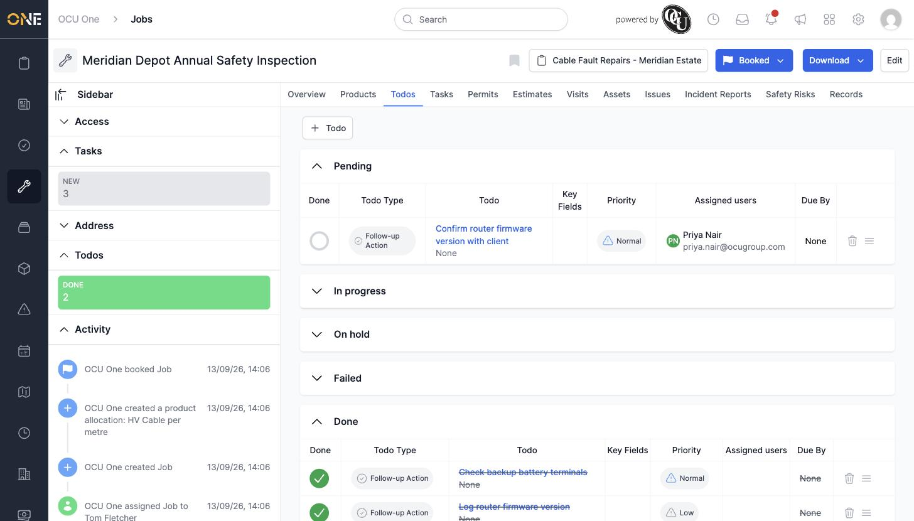

# Tracking todos on a job

A job's **Todos** tab tracks any follow-up tasks tied to that specific job, grouped by status.

## Viewing todos

Todos are grouped into **Pending**, **In progress**, **On hold**, **Failed**, and **Done** sections, each showing the todo's type, priority, assigned users, and due date. Completed todos show with a strikethrough.

*"Check backup battery terminals" still pending; "Log router firmware version" already done.*

## Marking a todo done

Click the circle in the **Done** column to mark a pending todo complete — it moves straight into the Done section.

## Adding a new todo

Click **+ Todo**, pick a todo type, then fill in the **Name**, **Description**, **Assigned users**, **Priority**, and **Due By** date.

*Filling in a new todo after picking "Follow-up Action" as its type.*

Click **Create Todo** to save it — it appears immediately in the Pending section.

*"Confirm router firmware version with client" added, assigned to Priya Nair.*
