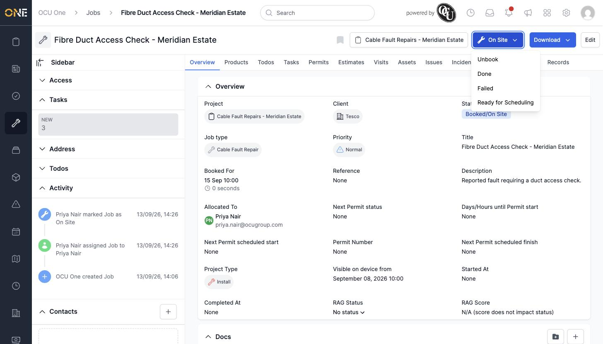
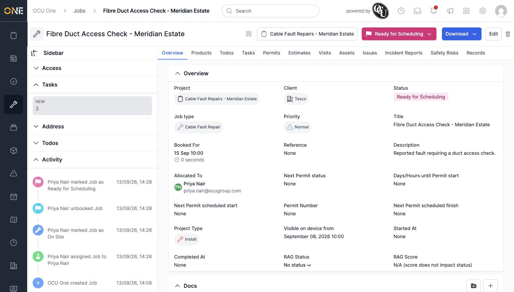

# Unbooking a job

If a job's been booked (with or without a sub-status like "On Site" or "Delayed") but needs to come off the schedule, you can unbook it from the same status dropdown you used to book it.

## Unbooking

Click the status button at the top of the job — while booked, its dropdown includes an **Unbook** option alongside the other statuses it can move to (Done, Failed, Ready for Scheduling).

*A job currently "Booked/On Site" — Unbook is the first option in its status dropdown.*

Click **Unbook**. The job moves straight back to "Ready for Scheduling" — no confirmation screen this time, since there's nothing extra to fill in.

*The Activity feed records both steps — "Priya Nair unbooked Job," then "Priya Nair marked Job as Ready for Scheduling."*

The job keeps whoever was allocated to it and its booked date/time isn't cleared — unbooking only changes its status, ready to be booked again later.
