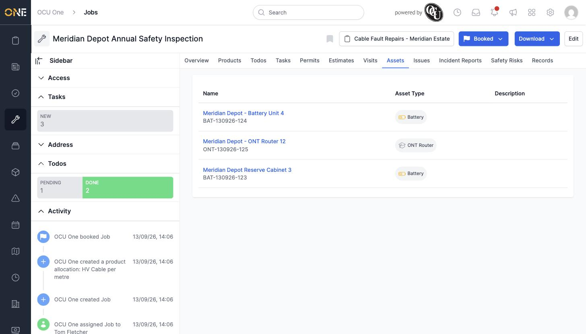

# Viewing assets linked to a job

A job's **Assets** tab is a read-only list of every asset connected to the job — pulled in through its attached visits, not set directly.

*Three assets shown — each one belongs to one of the job's three attached visits.*

Since assets come from the job's visits rather than being attached independently, there's nothing to add or remove here directly — to change which assets show up, attach or detach the relevant visit on the job's **Visits** tab instead. Clicking an asset's name takes you straight to that asset's own page.
