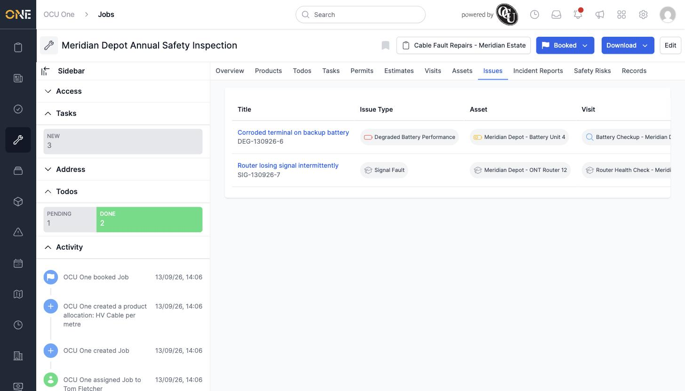

# Viewing issues linked to a job

A job's **Issues** tab shows every issue raised against any of the job's attached visits, along with the asset and visit each one came from.

*"Corroded terminal on backup battery" and "Router losing signal intermittently" — both raised against visits attached to this job, on their respective assets.*

Like the Assets tab, this list is pulled in automatically from the job's visits rather than being something you attach directly here. Click an issue's title to open it, or raise a new one from the visit or asset it belongs to.
