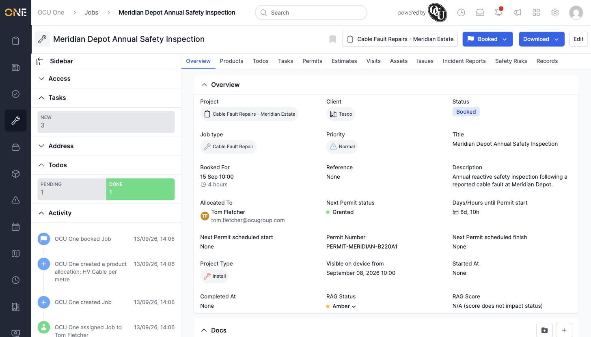

# Viewing job details

Opening a job takes you to its own page, split into a left-hand **Sidebar** and a main tabbed area. This is where you see everything about a job at a glance and jump into any of its related work.

## The sidebar

The sidebar down the left shows the job's **Access** (who owns it, its visibility, and sharing), a live count of its **Tasks** by status, its **Address**, a **Todos** breakdown by status, and an **Activity** feed recording everything that's happened to the job — created, booked, allocated, and so on.

*"Meridian Depot Annual Safety Inspection" — booked, allocated to Tom Fletcher, with 3 tasks and 2 todos (1 pending, 1 done) visible in the sidebar.*

## The Overview tab

The Overview tab itself lists the job's core fields: **Project**, **Client**, **Status**, **Job type**, **Priority**, **Title**, **Booked For** date/time and duration, **Reference**, **Description**, and who it's **Allocated To**. If the job's project has any permits attached, their status and dates show here too (Next Permit status, Permit Number, and so on), along with the job's **RAG Status**.

## The rest of the tabs

Across the top, a row of tabs takes you to everything else attached to the job: **Products**, **Todos**, **Tasks**, **Permits**, **Estimates**, **Visits**, **Assets**, **Issues**, any record types pinned to this job type (here, "Incident Reports" and "Safety Risks"), and a general **Records** tab. Each of these is covered in its own guide.
