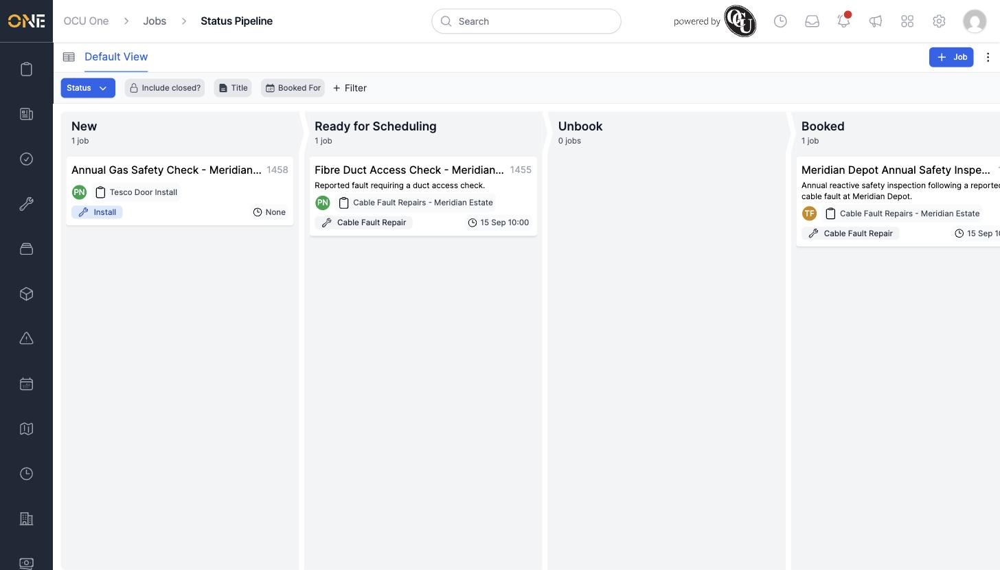

# Viewing jobs on a pipeline (kanban) board

Jobs can be viewed as a kanban board instead of a table — one column per status, scrolling horizontally through New, Ready for Scheduling, Unbook, Booked, In Progress, Failed, Cancelled, and Done.

## Opening the board

Click the board icon at the top left of the Jobs list (next to "Default View") to switch from the table into the pipeline board. The same filters from the list view — Title, Booked For, and any others you've added — apply here too.

*Each card shows the job's title, ID, description, project, allocated user, job type, and booked date — filtered here to just the matching jobs.*

## Reading a card

Each card shows enough to identify the job at a glance — its title and ID, project, allocated user, job type, and booked date if it has one — without needing to open it.

Scroll the board horizontally to see every status column, including ones further along like In Progress, Failed, Cancelled, and Done.
