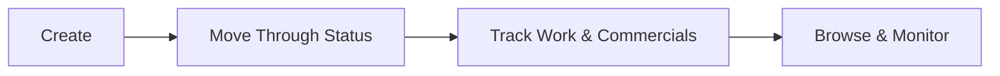

# Jobs — Overview

A **Job** is a single piece of booked work — an install, a repair, a survey — carried out for a client on a project. This guide explains how the pieces fit together, before you dive into the detailed guides for each part.

## The core pieces

Every job has a **Job Type** (set up in advance by an admin — Install, Cable Fault Repair, and so on), which controls its defaults: what fields it shows, whether secondary allocated users or product allocations are turned on, and what PDF template it prints with. A job belongs to a **Project**, can be assigned to an **Allocated User** (plus optional secondary users), and moves through a **Status** — New, Ready for Scheduling, Unbook, Booked, In Progress, Failed, Cancelled, Done — tracked alongside an optional **RAG health status** (Red/Amber/Green) once it's live.

Beyond its own details, a job can accumulate: **Tasks** (auto-created from its job type), **Todos**, **Visits** (the trips out that do the actual work), **Estimates** (priced quotes attached or detached as work is scoped), **Products** (allocated from a rate book, where enabled), and **Permits** (linked from the job's project). A job's **Assets** and **Issues** tabs aren't attached directly — they're pulled in automatically from whichever visits are attached to the job.

## Why this matters

Treating booked work as a tracked record, rather than just an entry on someone's calendar, is what makes it possible to:

- **See a job's full picture in one place** — allocation, schedule, tasks, todos, visits, estimate, products, permits, and linked assets/issues, all on the same record.
- **Control what work can start** — a job can't be booked without an allocated user, and its status and RAG health flag problems before they become missed appointments.
- **Keep pricing and work in sync** — attaching or detaching an estimate, and allocating products from a rate book, ties the commercial side of the job to the work itself.
- **Track a job from first booking through to completion** — status changes, unbooking, and the pipeline board all show where a job currently stands.

## The end-to-end flow

It starts with **creating the job** — see [Creating a job](Creating%20a%20job.md) for booking one from scratch, or [Creating a job from existing visits](Creating%20a%20job%20from%20existing%20visits.md) when the work already has pending visits lined up. Once it exists, [Viewing job details](Viewing%20job%20details.md) covers everything its own page brings together, and [Editing a job](Editing%20a%20job.md) covers changing its details afterward, with [Deleting (archiving) a job](Deleting%20%28archiving%29%20a%20job.md) for removing one that's no longer needed.

**Moving it along** covers most of what happens next: [Changing a job's status](Changing%20a%20job's%20status.md) and [Unbooking a job](Unbooking%20a%20job.md) for progressing or reversing where it stands, [Tracking a job's RAG health status](Tracking%20a%20job's%20RAG%20health%20status.md) for flagging problems once it's live, and [Managing secondary allocated users on a job](Managing%20secondary%20allocated%20users%20on%20a%20job.md) for bringing in extra crew. [Downloading or previewing a job PDF](Downloading%20or%20previewing%20a%20job%20PDF.md) covers getting a printable copy at any point.

**The commercial and scheduling side** covers [Attaching or detaching an estimate to a job](Attaching%20or%20detaching%20an%20estimate%20to%20a%20job.md) for linking priced work, [Allocating products to a job](Allocating%20products%20to%20a%20job.md) for jobs with product tracking enabled, [Tracking todos on a job](Tracking%20todos%20on%20a%20job.md) for small outstanding tasks, and [Managing visits attached to a job](Managing%20visits%20attached%20to%20a%20job.md) for the actual trips out that do the work — which in turn drive [Viewing assets linked to a job](Viewing%20assets%20linked%20to%20a%20job.md) and [Viewing issues linked to a job](Viewing%20issues%20linked%20to%20a%20job.md). [Managing records on a job](Managing%20records%20on%20a%20job.md) and [Linking permits to a job](Linking%20permits%20to%20a%20job.md) round out the supporting documentation.

Finally, **finding jobs at scale** is covered by [Browsing and filtering the jobs list](Browsing%20and%20filtering%20the%20jobs%20list.md) for the table view, and [Viewing jobs on a pipeline (kanban) board](Viewing%20jobs%20on%20a%20pipeline%20%28kanban%29%20board.md) for a status-by-status board view of the same data.

## The flow at a glance

- **Create** — book a new job from scratch or from existing visits.
- **Move Through Status** — progress, unbook, or flag RAG health as work proceeds.
- **Track Work & Commercials** — visits, tasks, todos, estimates, products, permits, and the assets/issues pulled in from visits.
- **Browse & Monitor** — find jobs via the list or pipeline board once there are many to keep track of.

Not every job needs an estimate, product allocation, or secondary users — a simple job with none of these is just a type, a status, and an allocated user. But the full flow above is there for anything with a more involved lifecycle to track.
