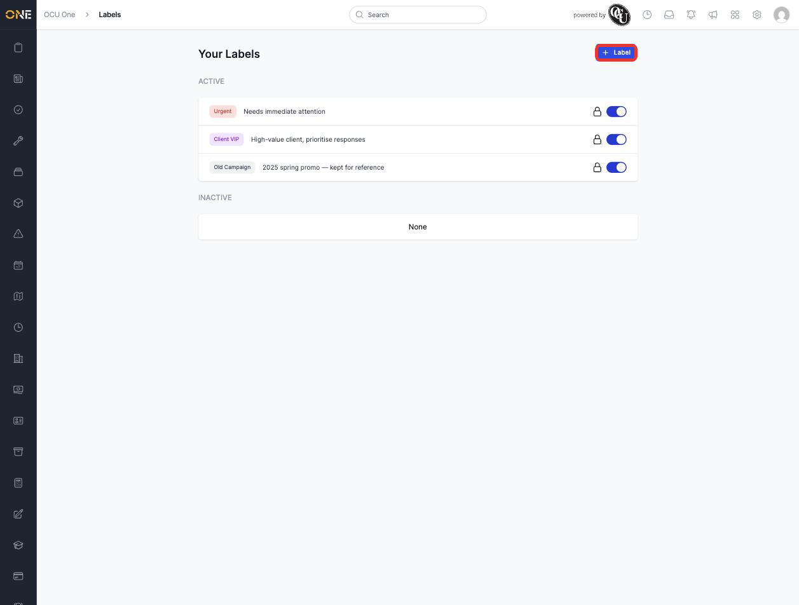
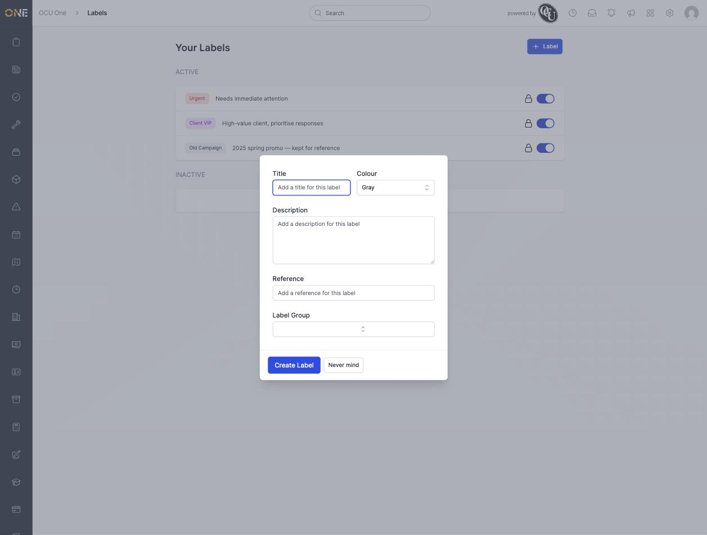
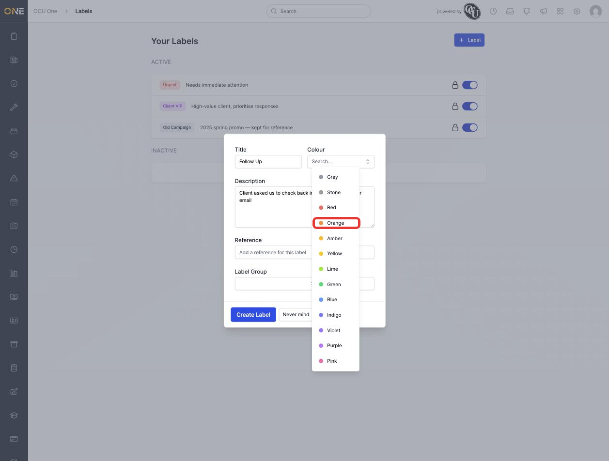
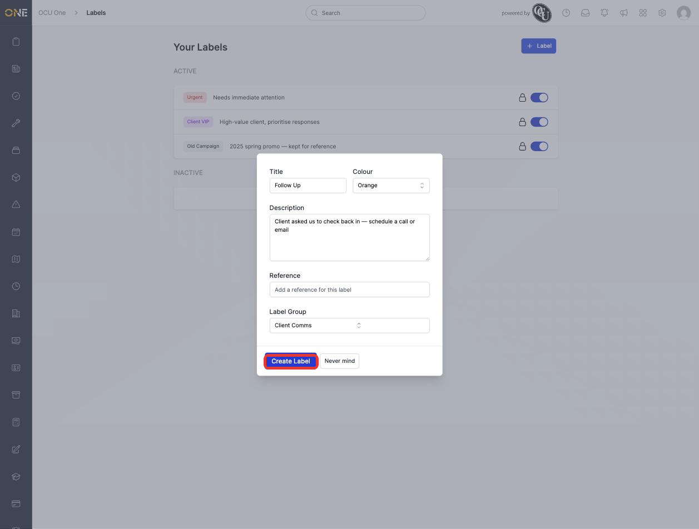
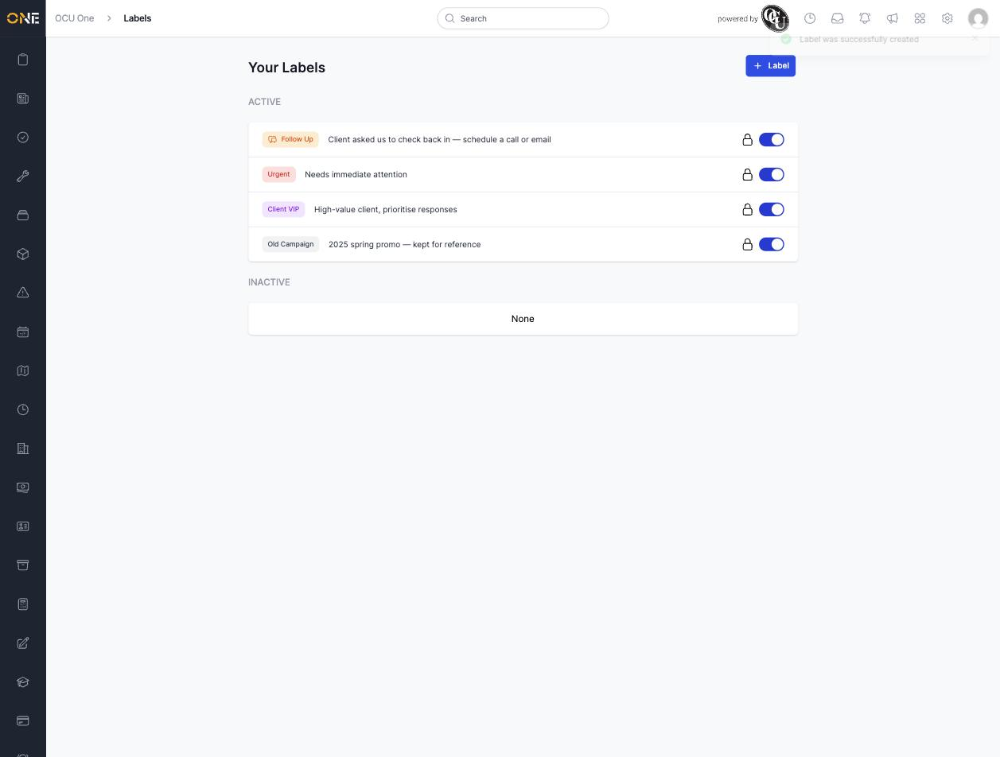

# Creating a new label

Labels let you tag records with your own personal markers — like "Urgent" or "Follow Up" — that stand out visually wherever the record appears. This guide walks through creating one from scratch.

## Starting a new label

From the **Your Labels** page (your profile picture → **My Labels**), click **+ Label** in the top-right corner.

*Click "+ Label" to open the new label form.*

A form opens with the following fields:

- **Title** — the text shown on the label itself. Required.
- **Colour** — the label's background colour.
- **Description** — optional extra detail about what the label means or when to use it.
- **Reference** — an optional free-text reference code, if you use one.
- **Label Group** — an optional group this label belongs to, if your organisation uses label groups to keep related labels together.

*The blank "New Label" form.*

## Filling in the details

Give the label a clear, short title, and add a description if it'll help you (or anyone you share it with) remember what it's for.

To choose a colour, click the **Colour** field — a dropdown of all the available colours appears.

*Picking a colour for the label. Each option shows a small coloured dot next to its name.*

If your organisation has set up label groups, you can also assign the label to one — for example, a "Client Comms" group for labels related to talking to clients. Click the **Label Group** field and pick one from the list.

*A completed form, ready to save. Click "Create Label" to finish.*

## Saving

Click **Create Label**. The modal closes and your new label appears at the top of the **Active** list on the Your Labels page, along with a confirmation message.

*The new "Follow Up" label, created and ready to use. Its label group icon appears next to the title.*

A newly created label starts out **active**, which means it's immediately available to attach to records. If you'd rather set it up first and turn it on later, you can deactivate it straight away — see [[Editing, deactivating, or deleting a label]].
