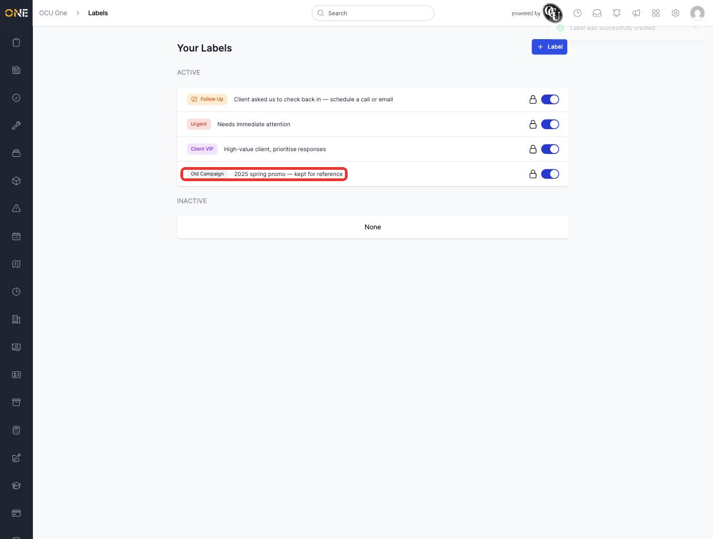
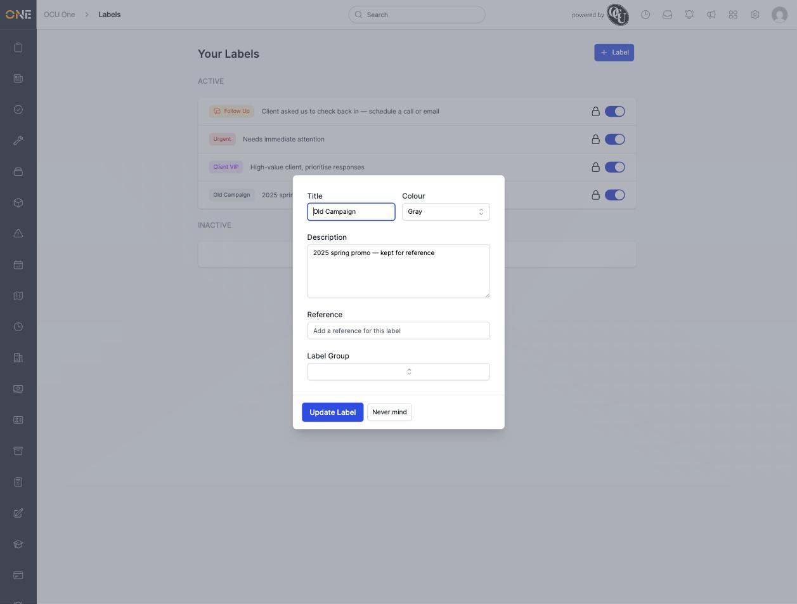
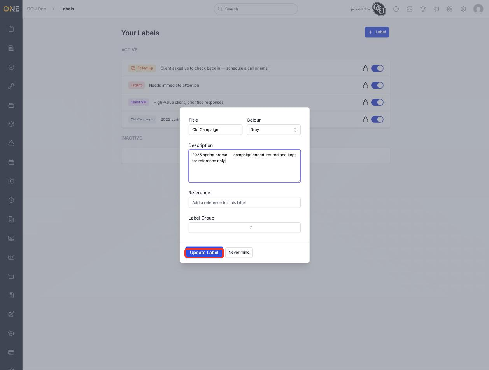
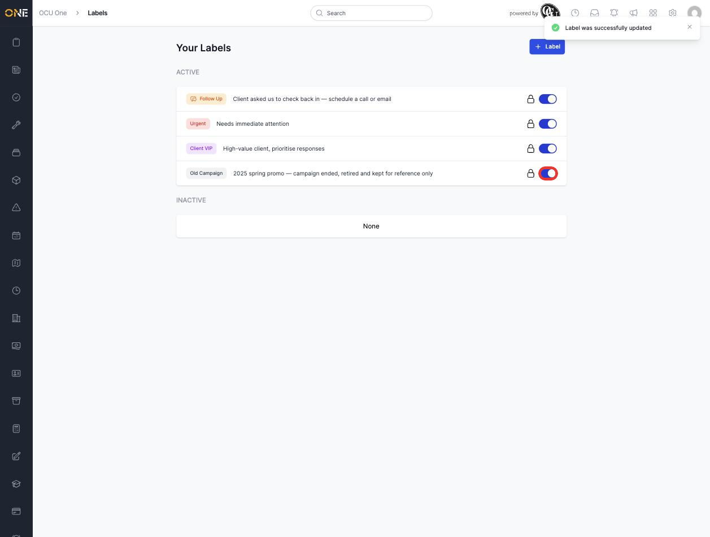
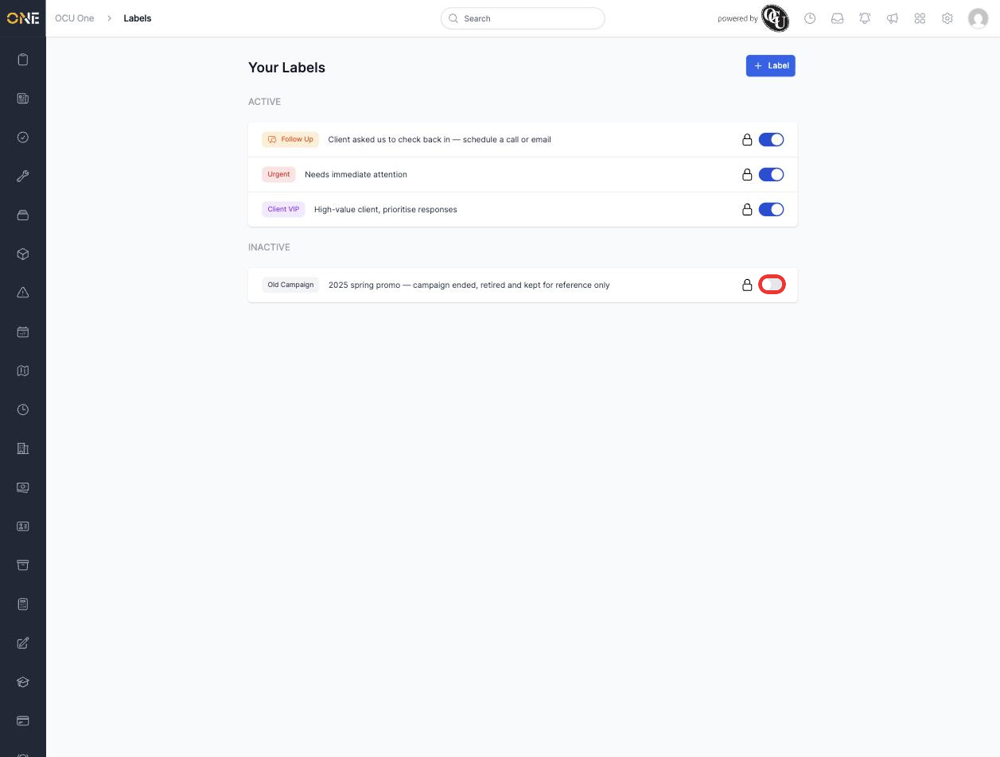

# Editing or deactivating a label

Once a label exists, you can update its details at any time, or take it out of use without deleting the history of records it's already attached to.

## Editing a label

From the **Your Labels** page, click anywhere on the label you want to change — its coloured pill, title, or description.

*Click a label's row to open it for editing.*

This opens the same form used when creating a label, pre-filled with its current details — **Title**, **Colour**, **Description**, **Reference**, and **Label Group**.

*The edit form for "Old Campaign", with its existing description.*

Make whatever changes you need — here, the description is being updated to reflect that this label's campaign has now ended.

*Updating the description before saving.*

Click **Update Label** to save. A confirmation message appears and the label's row updates immediately with the new details.

## Deactivating a label

Deactivating a label keeps it and everything it's already attached to, but hides it from the list of labels you can add to new records — it drops out of tagging autocomplete, so nobody can attach it going forward. This is the right option for a label that's no longer relevant (like a finished campaign) but that you don't want to lose the history of.

On the **Your Labels** page, use the toggle on the right of the label's row — no need to open the edit form for this.

*Click the toggle to deactivate a label directly from the list.*

The label moves down into the **Inactive** section of the page.

*"Old Campaign" is now inactive and no longer available to attach to new records.*

## Reactivating a label

To bring an inactive label back into use, find it in the **Inactive** section and click its toggle again.

*Clicking the toggle again moves the label back to Active.*

It moves back up into the **Active** section and becomes available for tagging again immediately.

## About deleting a label

There's currently no delete option for labels in the app — the toggle above is the only way to retire one. If a label was created by mistake and genuinely needs to be removed rather than just deactivated, that isn't something you can do yourself from this page; deactivating it is the closest equivalent, since it stops the label being used again without losing its history.
