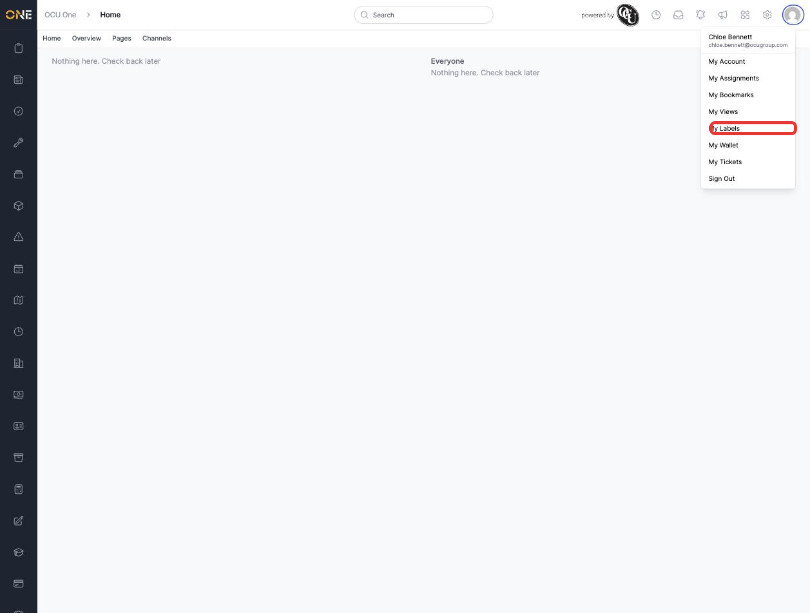
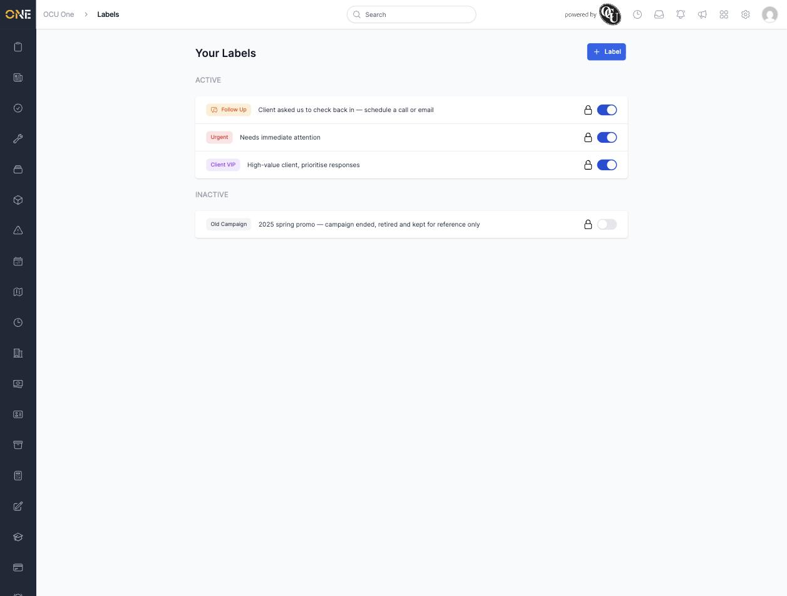

# Managing your personal labels ("My Labels")

Labels are small coloured tags you can attach to records across OCU One — things like tickets, jobs, or projects — to mark them in a way that's meaningful to you personally, separate from the app's built-in statuses and pipelines. For example, you might label something "Urgent" or "Follow Up" so it's easy to spot at a glance, no matter what list or board you're viewing it in.

**My Labels** is where you manage the labels you've created and own. Only labels you own appear here — not every label your organisation uses.

## Getting to My Labels

Click your profile picture in the top-right corner of the screen, then choose **My Labels** from the dropdown menu.

*Your account menu — "My Labels" sits alongside "My Views", "My Wallet" and the other personal sections of the app.*

## The Your Labels page

This page lists every label you own, split into two groups: **Active** at the top, and **Inactive** below.

*Three active labels and one inactive label. Each row shows the label's colour and title, its description, a lock icon, and an on/off toggle.*

For each label you'll see:

- **The label itself** — its colour and title, shown as a small coloured pill (for example, orange "Follow Up"). Clicking anywhere on the label opens it for editing.
- **A description**, if one was added, giving more context on what the label is for.
- **A lock icon** — this opens the label's sharing settings, controlling who else in your organisation is able to see it.
- **An on/off toggle** on the right — this is the quickest way to activate or deactivate a label without opening it. See [[Editing, deactivating, or deleting a label]] for more on what deactivating actually does.

If you don't own any labels yet, the page shows an empty state instead, with a shortcut to create your first one.

## Adding a label from here

Click the **+ Label** button in the top-right of the page to create a new one. See [[Creating a new label]] for the full walkthrough.
