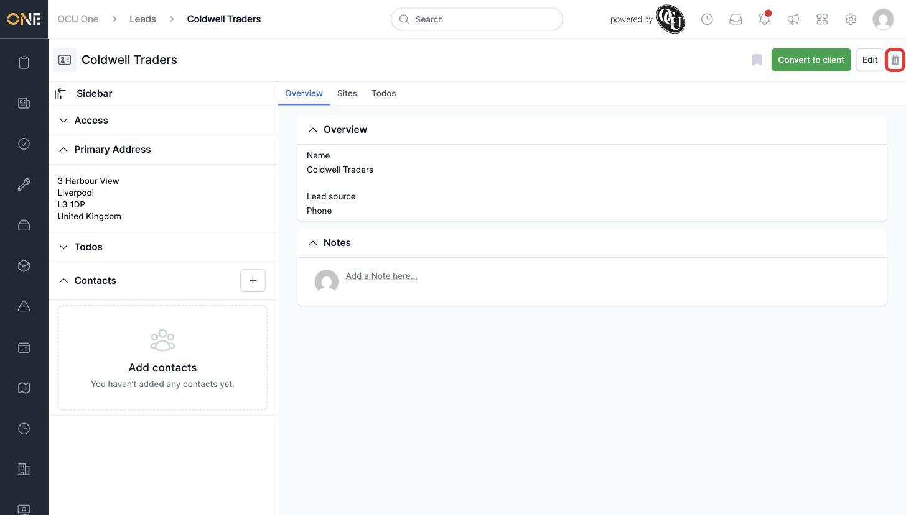
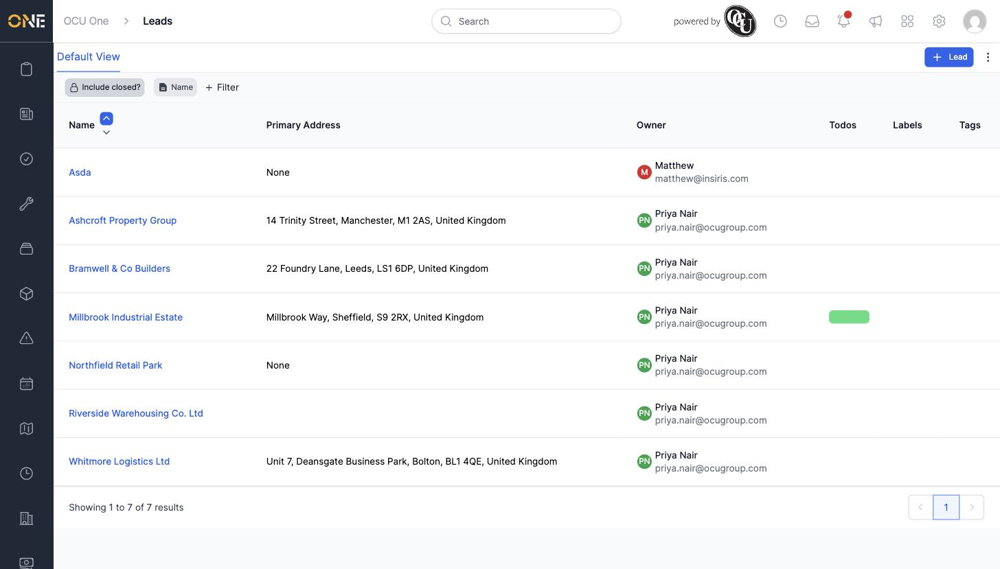

# Archiving a lead

If a lead is no longer worth pursuing — for example, one that never responded or has gone cold — you can archive it so it's removed from the active Leads list.

1. Open the lead's overview page.

2. Click the trash icon in the top right.

   

3. Confirm the prompt asking "Are you sure you want to delete this?".

4. The lead disappears from the Leads list.

   

## Things to know

- This doesn't permanently delete the lead's data — it archives it, which is why the guide (and the rest of OCU One) calls this "archiving" even though the button shows a trash icon and the confirmation says "delete".
- Once archived, a direct link to the lead's page will no longer work.
- If you archived a lead by mistake, ask an admin to restore it — there's no self-service "undo" from the Leads list itself.
