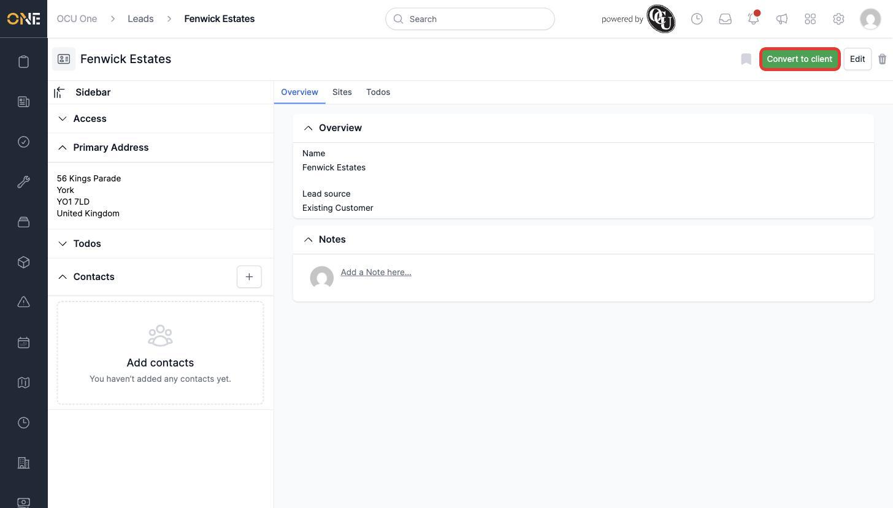
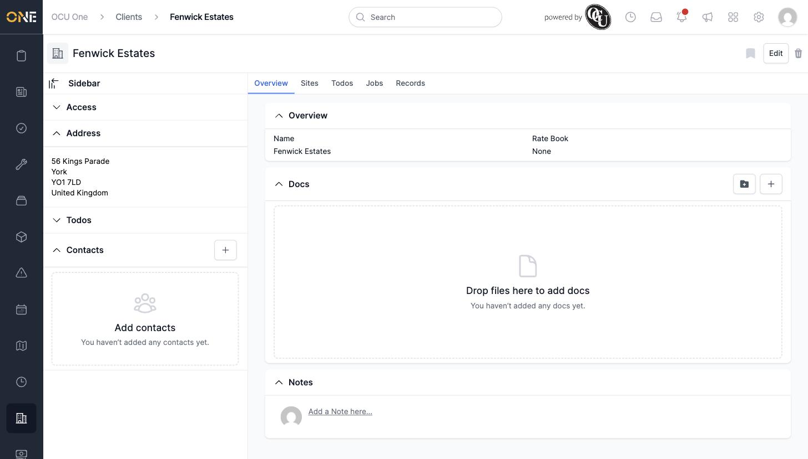

# Converting a lead into a client

Once a lead has signed on, convert it into a **client** so it shows up alongside your other clients with the full set of client features (jobs, records, and so on).

1. Open the lead's overview page.

2. Click **Convert to client** in the top right.

   

3. You're taken straight to the same record, now shown as a client — the breadcrumb changes from **Leads** to **Clients**, and a confirmation banner reads "Your lead has been converted to a client".

   

## Things to know

- Conversion carries over everything already on the lead — its name, address, contacts, sites, and todos — nothing is lost.
- Once converted, the record gains client-only tabs like **Jobs** and **Records**, and no longer appears in the Leads list.
- This can't be undone from the client's page — if a lead was converted by mistake, ask an admin for help correcting it.
