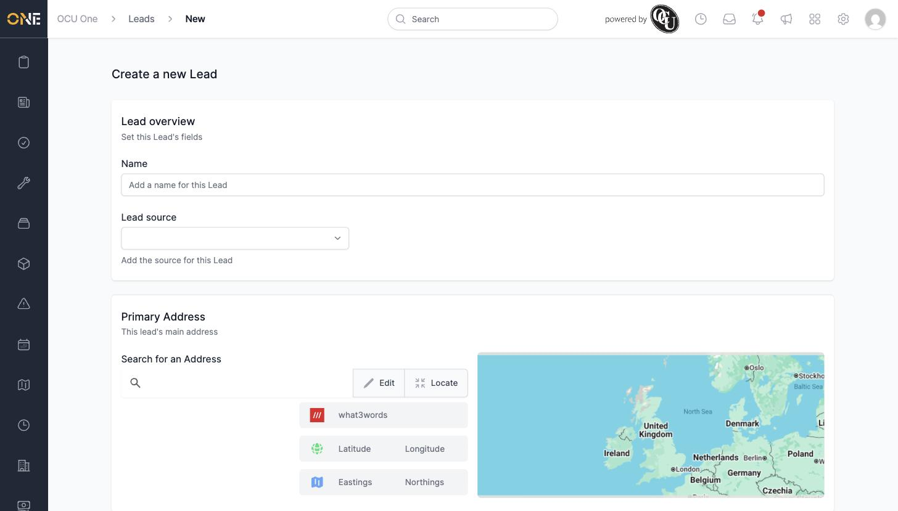
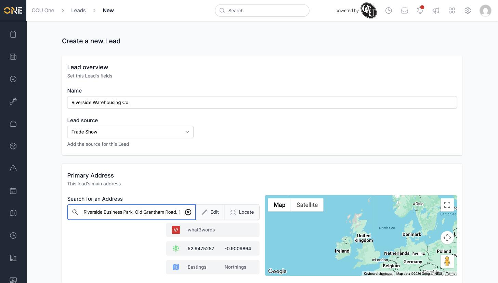
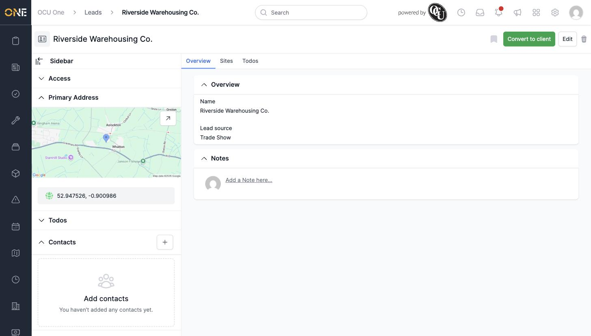
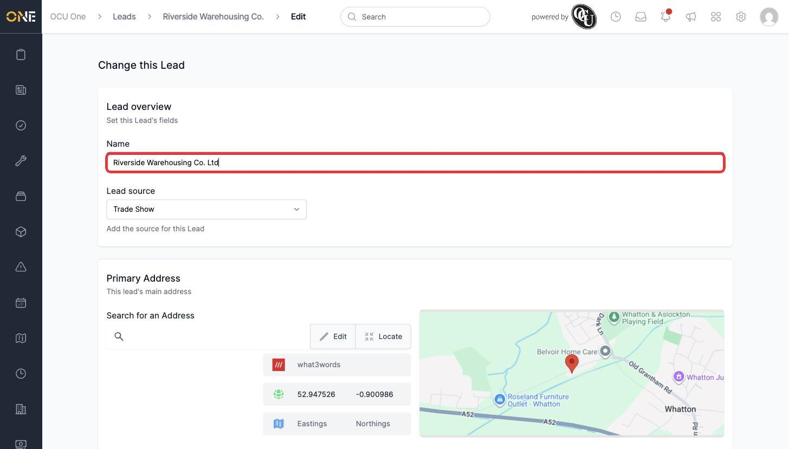
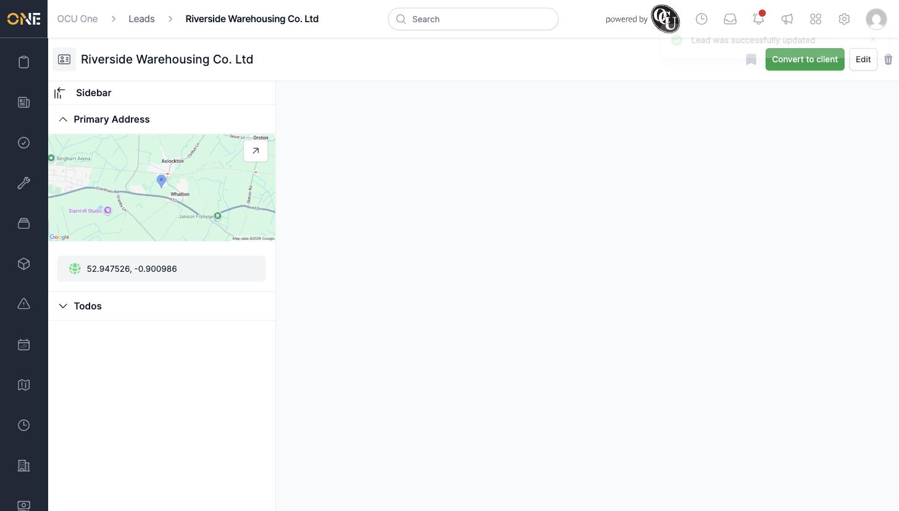

# Creating and editing a sales lead

A **lead** is a prospective client — a company you're talking to before any work is agreed. This guide covers creating a new lead and editing one afterwards.

## Creating a lead

1. From the **Leads** list, click **+ Lead** in the top right.

2. Fill in the **Lead overview** section:
   - **Name** — the company or contact's name.
   - **Lead source** — where this lead came from, chosen from your organisation's list (for example Website, Referral, or Trade Show).

   

3. Under **Primary Address**, use **Search for an Address** to find and select the lead's address — the map updates to show the pinned location. You can also open **Edit** to type the address fields in directly, or **Locate** to use your current location.

   

4. Click **Create Lead** at the bottom of the page.

5. You're taken straight to the new lead's overview page.

   

If you change your mind partway through, click **Never mind** instead to back out without creating anything.

## Editing a lead

1. From the lead's overview page, click **Edit** in the top right.

2. The same form reopens, pre-filled with the lead's current details. Change whatever needs updating — here, correcting the name to add "Ltd".

   

3. Click **Update Lead** to save your changes.

   

## Things to know

- The **Lead source** list is set up by an admin under Settings — if the source you need isn't there, ask an admin to add it.
- A lead only needs a Name to be created — the address is optional.
- Once created, a lead's overview page also lets you convert it to a client, add sites and todos, or archive it — see the other guides in this section.
