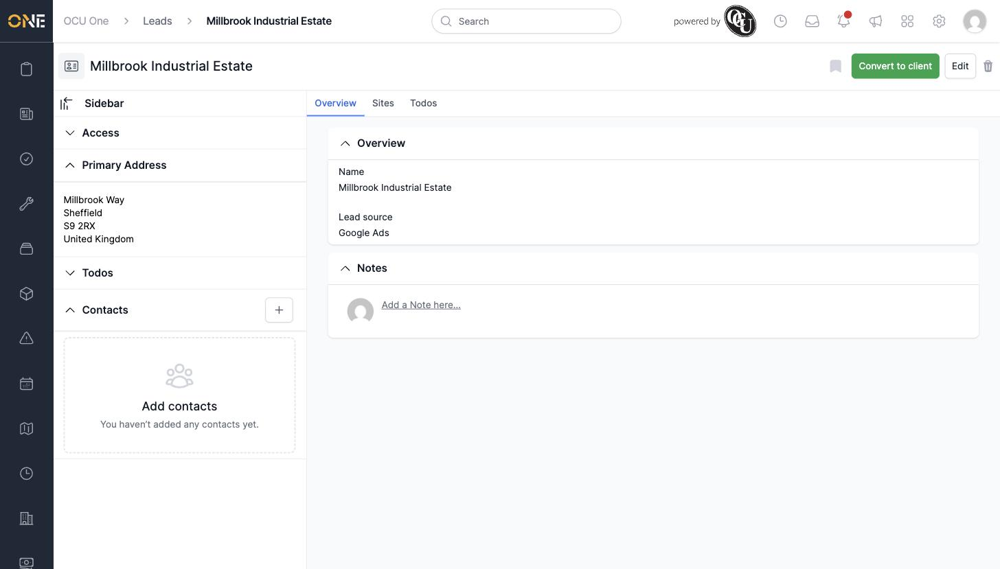
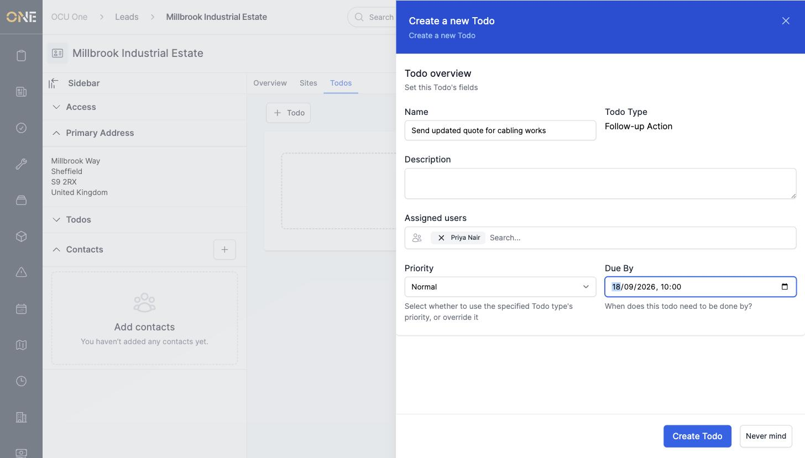
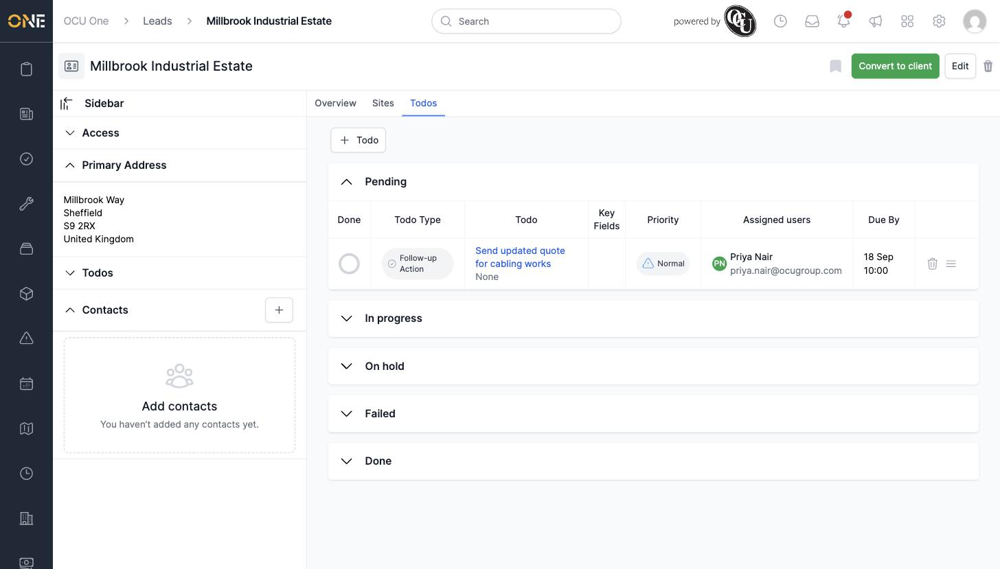
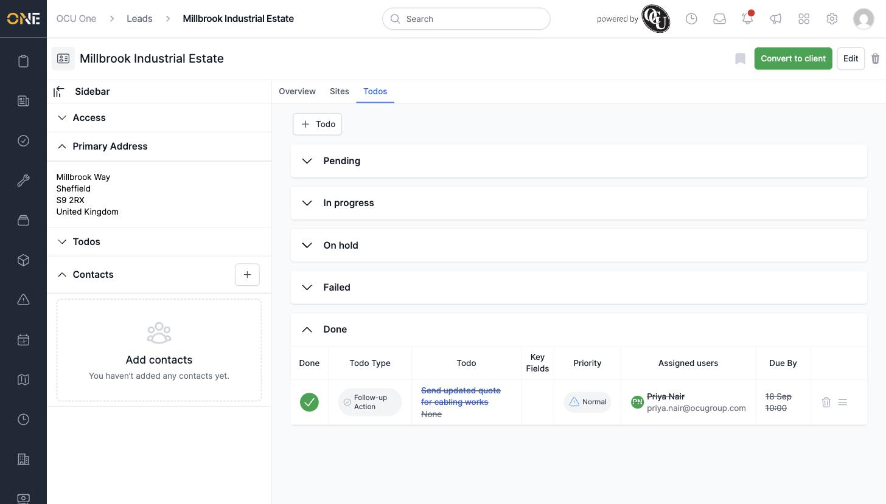
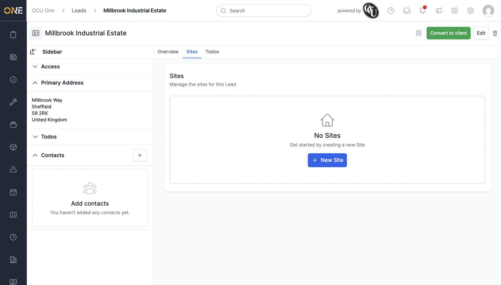
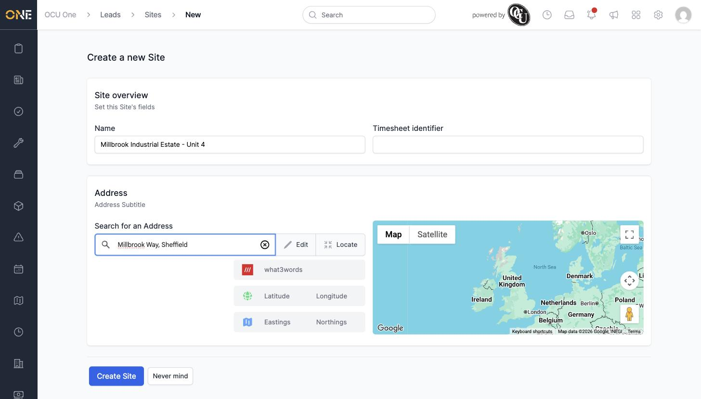
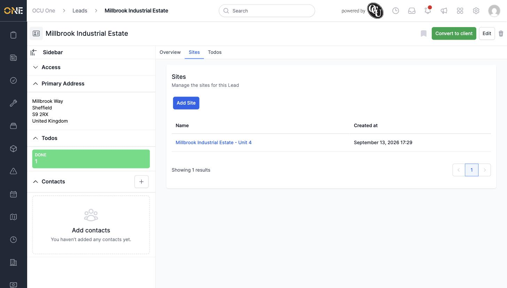

# Lead overview, todos, and sites tabs

Every lead's page has three tabs: **Overview**, **Sites**, and **Todos**. This guide walks through each.

## Overview tab

Shows the lead's name, lead source, and address, along with a **Notes** section where you or your team can leave notes on the lead.

The sidebar down the left also shows the lead's **Access** (owner and any assigned users), its full **Primary Address**, a **Todos** summary, and its **Contacts**.

## Todos tab

Lists every to-do raised against this lead, grouped by status: Pending, In progress, On hold, Failed, and Done.

To add one, click **+ Todo**, then choose a todo type (here, the only type available is **Follow-up Action**).

Fill in the todo's fields — **Name**, an optional **Description**, who it's **Assigned** to, its **Priority**, and a **Due By** date — then click **Create Todo**.

The new todo appears under **Pending**.

Click the circle in the **Done** column to mark a todo complete — it moves down into the **Done** group with a strikethrough.

## Sites tab

A lead can have one or more **Sites** — specific locations associated with it, separate from its main address (useful when a prospective client has several premises).

When there are none yet, you'll see an empty state with an **+ New Site** button.

Click **+ New Site**, fill in the site's **Name**, an optional **Timesheet identifier**, and search for its **Address**, then click **Create Site**.

The new site appears in the Sites list, with its name and creation date.

## Things to know

- The exact todo types you can choose from depend on how your organisation has set them up — some tenants offer more than one.
- Sites you add to a lead carry over if the lead is later converted to a client.
