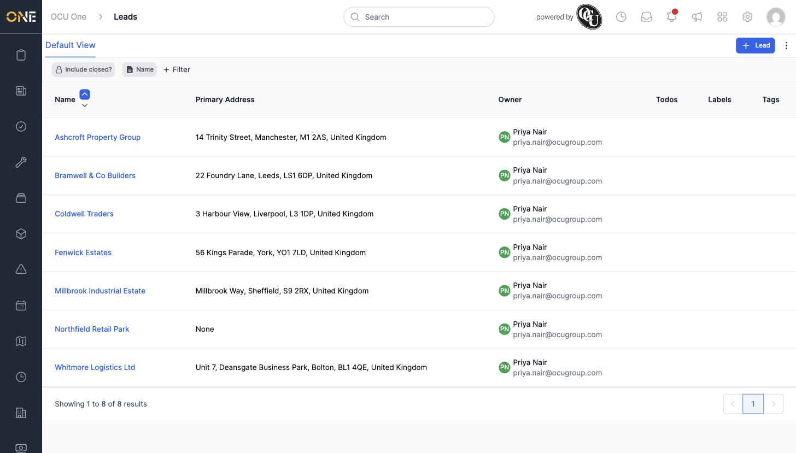
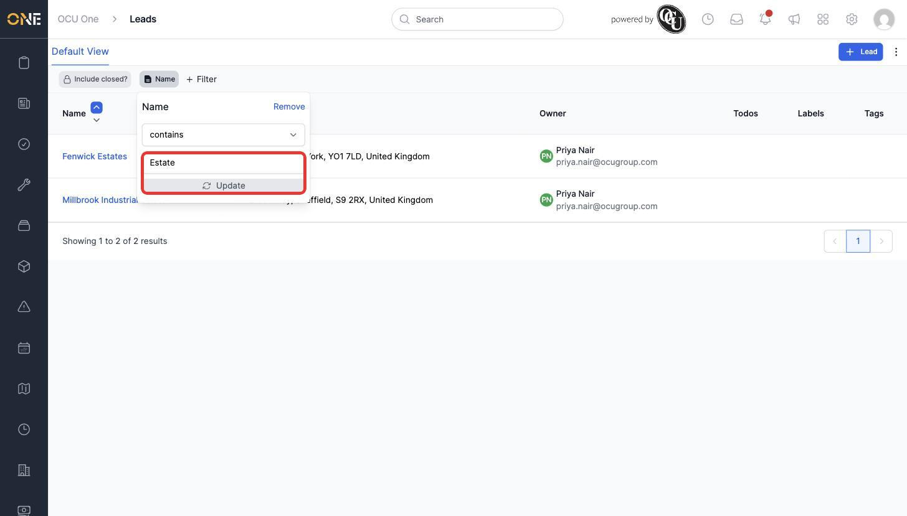
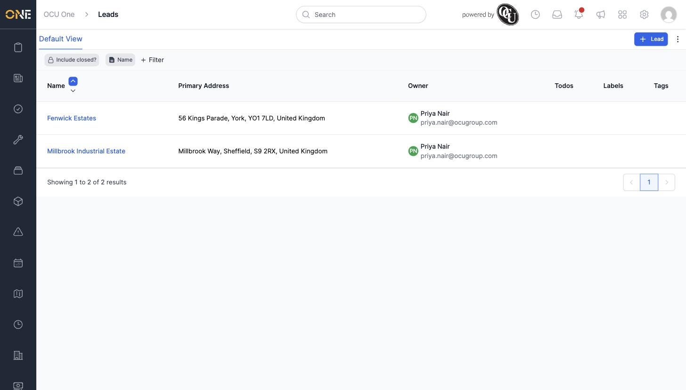
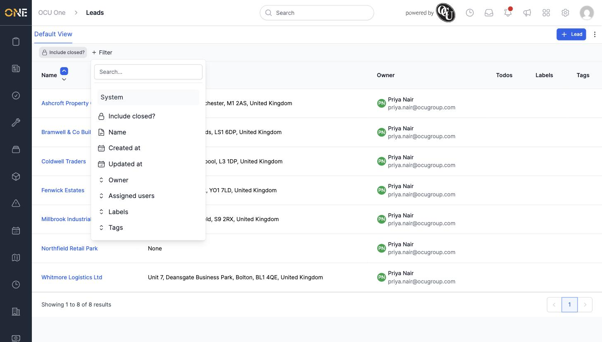

# Viewing and filtering the sales lead list

The **Leads** list shows every sales lead you have access to — companies or people who might become a client, before they've signed anything. This guide covers browsing the list and narrowing it down with filters.

## The list view

Open **Leads** from the sidebar. Each row shows the lead's name, primary address, owner, and (if set) its todos, labels, and tags.

## Filtering the list

Two filter chips sit above the list by default: **Include closed?** and **Name**.

Click the **Name** chip to open its filter panel. Choose a condition (for example "contains"), type a search term, and click **Update**.

The list narrows to only the leads matching that term.

To remove a filter, open its panel and click **Remove**.

### Adding more filters

Click **+ Filter** to see every other filter available for this list: **Created at**, **Updated at**, **Owner**, **Assigned users**, **Labels**, and **Tags**. Pick any of these to add it as another chip, then set its value the same way as the Name filter.

Multiple filters combine together — for example, Owner **and** Name narrows the list to leads matching both at once.

## Things to know

- **Include closed?** is a separate toggle, not a text filter — switch it on to also show leads that have been marked as closed, which are hidden from the list by default.
- Filters you add stay on the page while you're browsing, but aren't saved once you navigate away — you'll need to re-add them next time unless you save a custom view.
- Click a lead's name in the list to open its overview.
