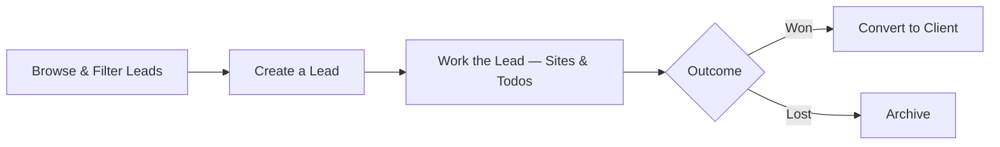

# Leads — Overview

**Leads** are prospective clients — companies or contacts you're in conversation with before any work has been agreed. This area covers browsing, creating, and working leads, and what happens once one is either won or lost.

## The core pieces

A **Lead** has a name, an optional **Lead source** (Website, Referral, Trade Show, and so on), and a primary address. Like a client, it can have **Sites** (specific locations) and **Todos** (follow-up tasks), and it's owned by a member of your team.

## The end-to-end flow

It starts with **browsing what's out there** — see [Viewing and filtering the sales lead list](Viewing%20and%20filtering%20the%20sales%20lead%20list.md) for the list view and its filters.

A new prospect is added with [Creating and editing a sales lead](Creating%20and%20editing%20a%20sales%20lead.md), which also covers updating a lead's details later.

Day to day work on a lead — its overview, sites, and todos — is covered in [Lead overview, todos, and sites tabs](Lead%20overview%2C%20todos%2C%20and%20sites%20tabs.md).

A lead only has two outcomes: it's either won or it isn't. [Converting a lead into a client](Converting%20a%20lead%20into%20a%20client.md) covers turning a signed lead into a full client record. [Archiving a lead](Archiving%20a%20lead.md) covers removing one that didn't go anywhere.

## The flow at a glance

- **Browse & Filter Leads** — find the ones relevant to you.
- **Create a Lead** — add a new prospect with a name, source, and address.
- **Work the Lead** — track sites and follow-up todos while the conversation continues.
- **Convert to Client** — once it's won, the record becomes a full client with jobs and records.
- **Archive** — if it's not going anywhere, remove it from the active list.
