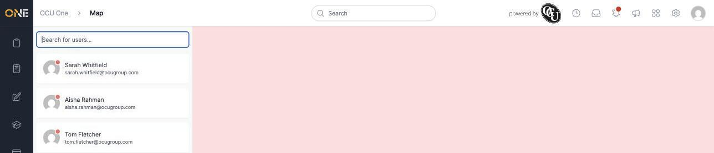

# Viewing the live user map

The Map page shows where your field-based colleagues currently are (or were last seen), alongside a searchable list of everyone in your organisation.

## Getting there

Click the map icon in the left-hand sidebar.

## What's on this page

On the left is a scrollable, searchable list of every active user in your organisation. Use **Search for users...** at the top to find someone by name or email. Next to each name is a status dot showing whether they're currently online.

Not every user has a location to show — someone who hasn't shared their location recently (for example, an office-based colleague, or someone who simply hasn't opened the mobile app that day) still appears in the list, just without a position on the map:

To the right of the list is the map itself, which plots a pin for each user who does have a current location. Use the search box to narrow the list down to a specific person or team before scanning the map, rather than trying to spot one pin among many.

## Things to know

- Only **active** users appear in the list — someone who has left the organisation or been deactivated won't show up here at all.
- A user's position updates as their device reports a new location, so what you see is their last known location, not necessarily where they are right this second.
