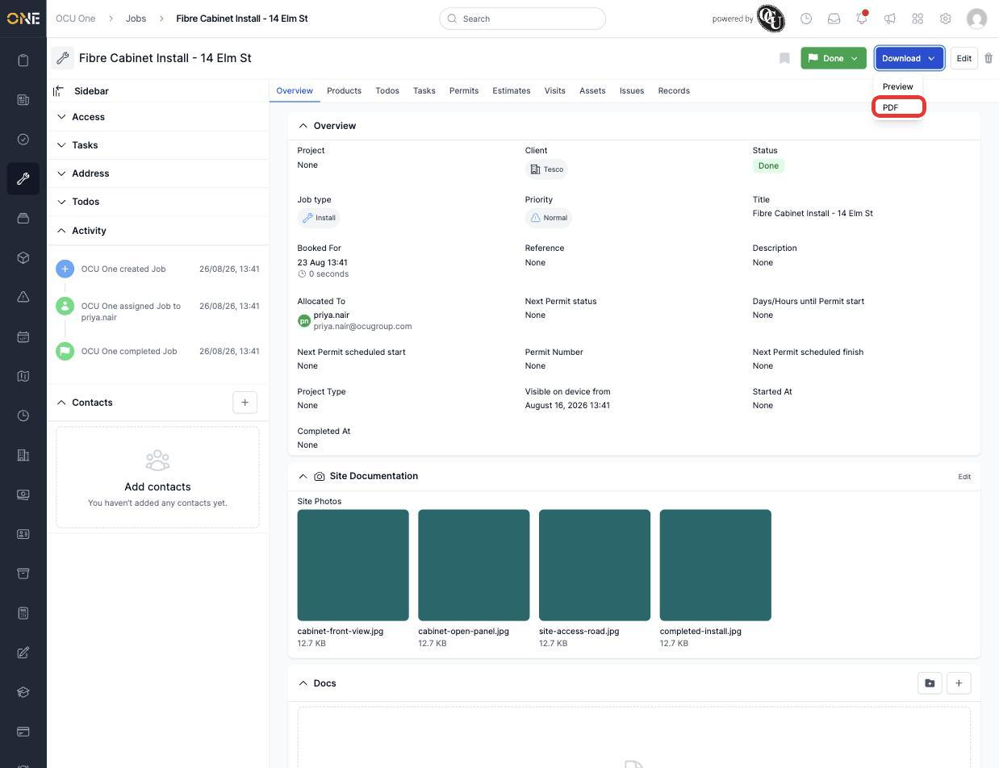
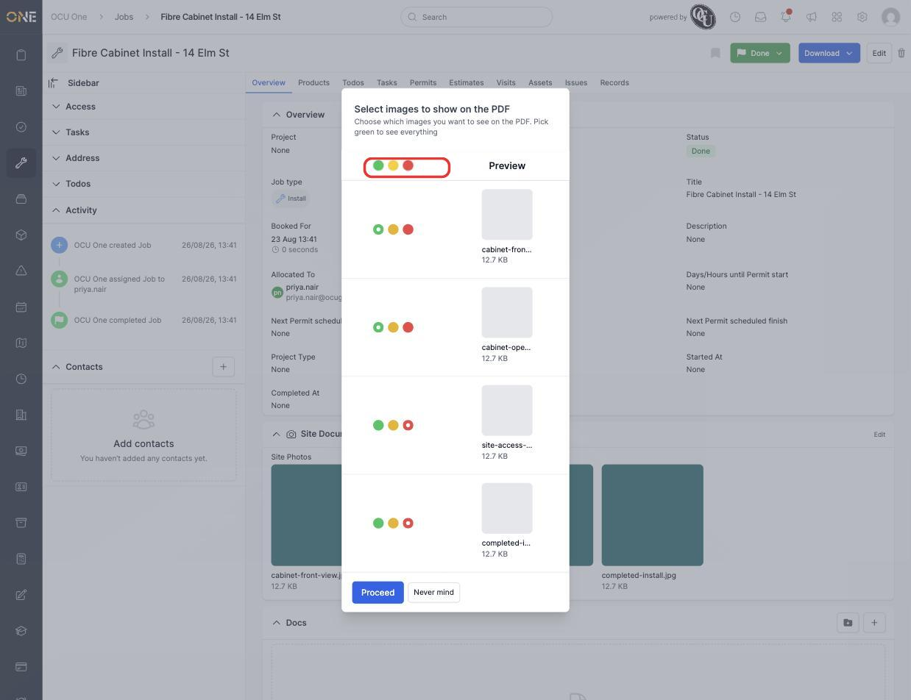
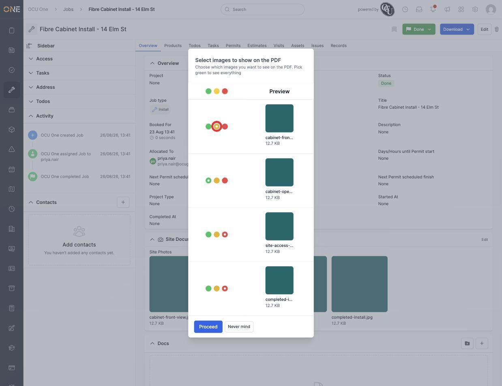
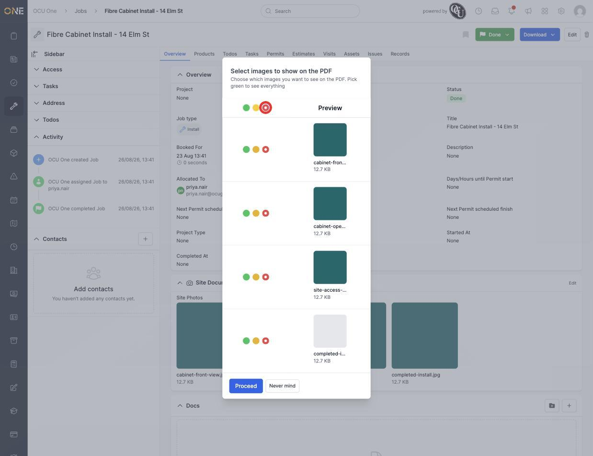

# Choosing which attachments appear on a PDF export

Many records in OCU One — jobs, projects, tickets, estimates, invoices, variations and more — let you attach photos and files. When you preview or download a PDF for one of these records, you don't have to include every photo that's attached. Before the PDF is put together, you get a chance to pick exactly which images show up in it.

This screen appears anywhere a **Download** button offers a PDF or preview option, wherever the record has photos attached. This guide walks through it using a job's attached site photos, but the same screen works the same way everywhere it appears.

## Opening the selection screen

On a job's page, click the **Download** button in the top right, then choose either **Preview** or **PDF**.

*The Download dropdown, with the PDF option highlighted.*

Instead of generating the PDF right away, you're taken to a screen titled **"Select images to show on the PDF"**, listing every photo attached to the job.

## Show, don't show, or don't show just this once

Each photo has three colored options next to it:

- 🟢 **Show** — the photo will appear on this PDF, and on every future PDF for this job, until you change it again.
- 🔴 **Don't show** — the photo will never appear on a PDF for this job, until you change it again.
- 🟡 **Don't show this time** — the photo is normally set to show, but you want to leave it out of *this particular* export only. Your permanent choice for that photo isn't changed — next time you export a PDF, it'll be back to showing by default.

Photos keep whatever choice was made for them last time, so most of the time this screen is just a final check before exporting — you'll only need to touch it when a photo's default needs to change, or when you want to leave one out just for this one export.

*Each photo's current Show / Don't show this time / Don't show choice, with a preview thumbnail and filename.*

To leave a normally-shown photo out of just this export, click its yellow **"Don't show this time"** option.

*"cabinet-front-view.jpg" is normally shown (green), but has been set to "Don't show this time" for this export only.*

## Setting all photos at once

If you want to apply the same choice to every photo in one go — for example, to start from a clean slate — use the row of three colored options at the very top of the list, above "Preview". Clicking one of these sets every photo below it to that same choice.

*Clicking the red option in the header row sets every photo to "Don't show" at once. Individual photos can still be changed afterwards.*

## Finishing up

Once you're happy with your choices, click **Proceed** to continue on to the PDF or preview. If you change your mind and don't want to export at all, click **Never mind** instead to close the screen without generating anything or saving any changes you made on it.

**A couple of things worth knowing:**

- Choosing **Don't show this time** doesn't move or delete the photo — it's only ever hidden from the one export you're doing right now.
- Choosing **Show** or **Don't show** is a permanent change to that photo's default for this job, and will still apply the next time someone exports a PDF, until it's changed again.
