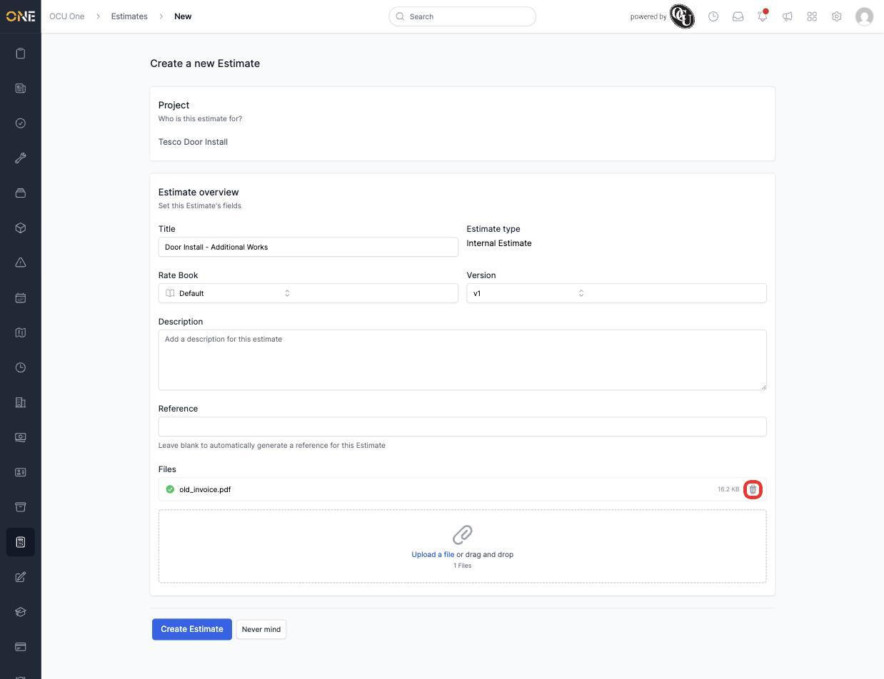
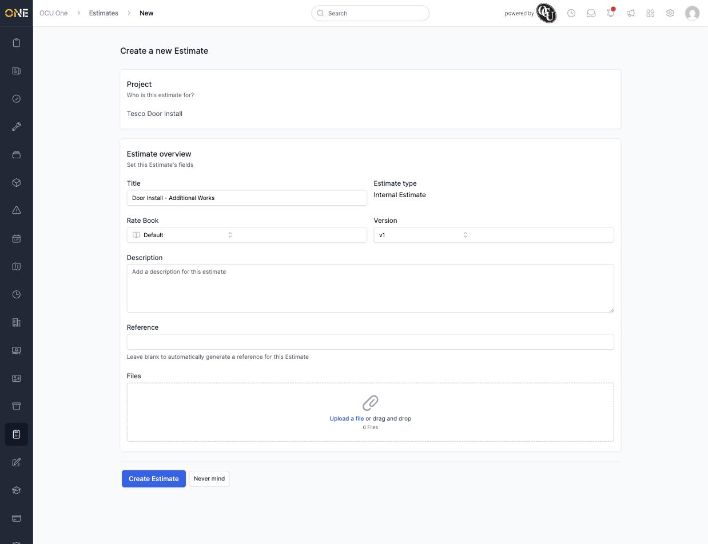

# Removing an uploaded file attachment

Several forms in OCU One let you attach files as you fill them in — for example, the **Files** field when creating an Estimate. If you attach the wrong file, or change your mind about including one, you can remove it before you finish and save, without having to start the form over.

This guide uses an Estimate's **Files** field as the example, but the same upload-and-remove behaviour works the same way anywhere you see a file upload area like this one.

## Uploading a file

On a form with a Files field, click **Upload a file** (or drag a file onto the box) to attach it.

The file uploads immediately — you don't need to save the form first. Once it's finished, it appears in a list above the upload box, with a green checkmark, its file size, and a small trash icon on the right.

*"old_invoice.pdf" has finished uploading. The trash icon on the right removes it.*

## Removing it

If you've attached the wrong file — here, an old invoice that was meant for something else — click the trash icon next to it.

The file disappears from the list right away, and the "Files" counter below the upload box drops back down. The rest of the form you've filled in isn't affected.

*The file has been removed. The upload box is back to empty, ready for a different file if needed.*

**Worth knowing:** removing a file this way deletes it straight away — it isn't just taken off the list and kept somewhere else. If you attach it again afterwards, it uploads as a fresh copy. This is different from deleting a file that's already saved on an existing record elsewhere in the app, which usually asks you to confirm first — removing a file you've *just* uploaded, before you've saved the form, doesn't ask for confirmation since nothing has been saved yet.
