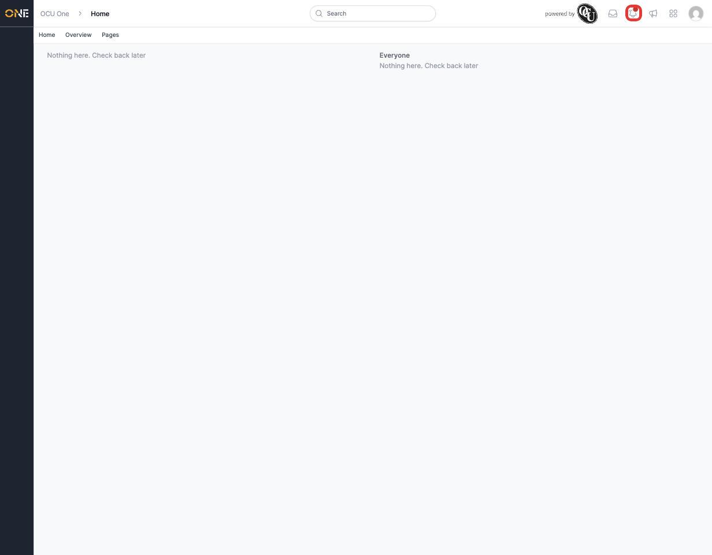
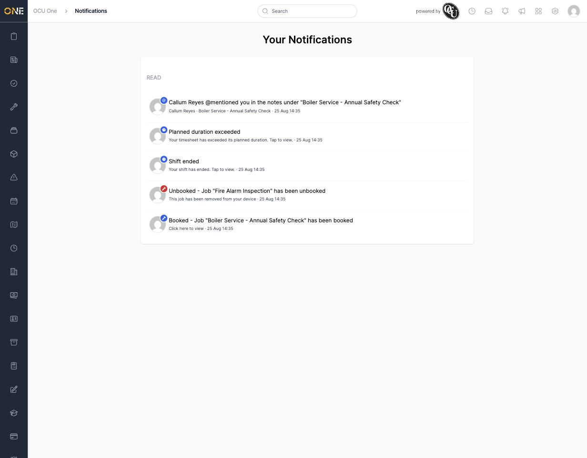
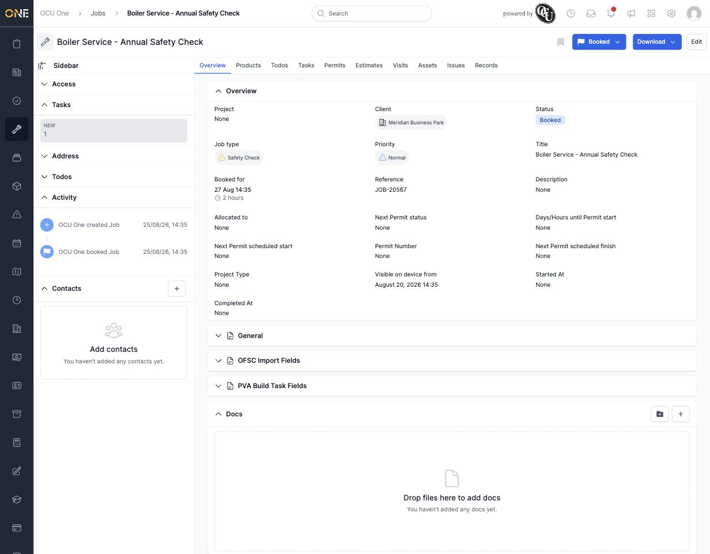
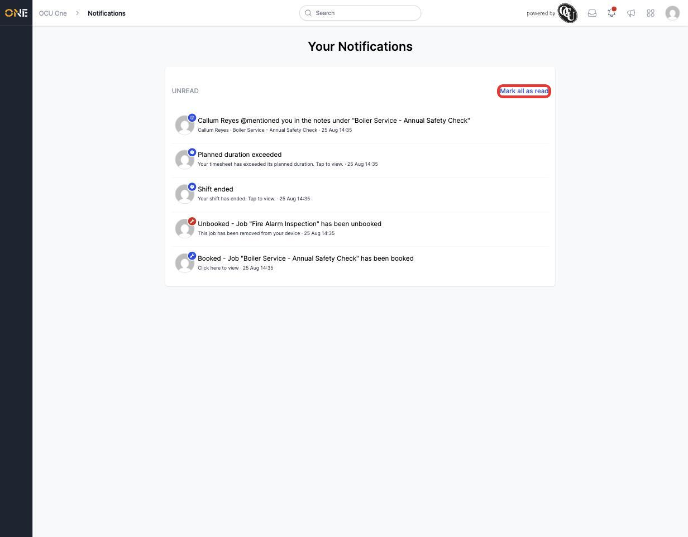

# Viewing and managing notifications

Whenever something happens that needs your attention — you're booked onto a job, a job you were on gets unbooked, your shift ends, someone mentions you in a comment, and more — you get a notification. This page is where all of those notifications live.

## Knowing when you have something new

Look for the bell icon in the top right of any page. A red dot appears on it whenever you have unread notifications waiting.

Click the bell to open **Your Notifications**.

## Reading your notifications

Notifications are split into two groups:

- **Unread** — anything you haven't opened yet, shown at the top.
- **Read** — anything you've already looked at, shown further down.

Each notification shows what happened, a short bit of extra detail, and how long ago it came in.

All notifications now grouped under "Read" after clicking "Mark all as read"](attachments/viewing-and-managing-notifications/04-notifications-marked-read.jpg

## Opening a notification

Click anywhere on a notification and you'll be taken straight to whatever it's about — a job, a timesheet, and so on. For example, clicking a "Booked" notification takes you directly to that job's page.

Opening a notification this way also moves it from **Unread** into **Read**, even if you don't take any further action once you land on the page it links to.

## Marking everything as read

If you don't want to open every notification individually, click **Mark all as read** at the top of the list. This moves everything straight into the **Read** group in one go, and clears the red dot from the bell icon.

There's currently no way to remove a notification from this list — once it arrives, it stays here (as either unread or read) rather than being deleted.
