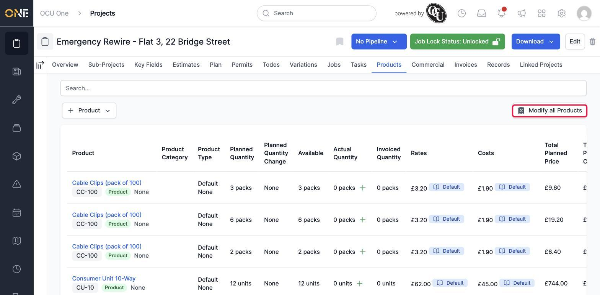
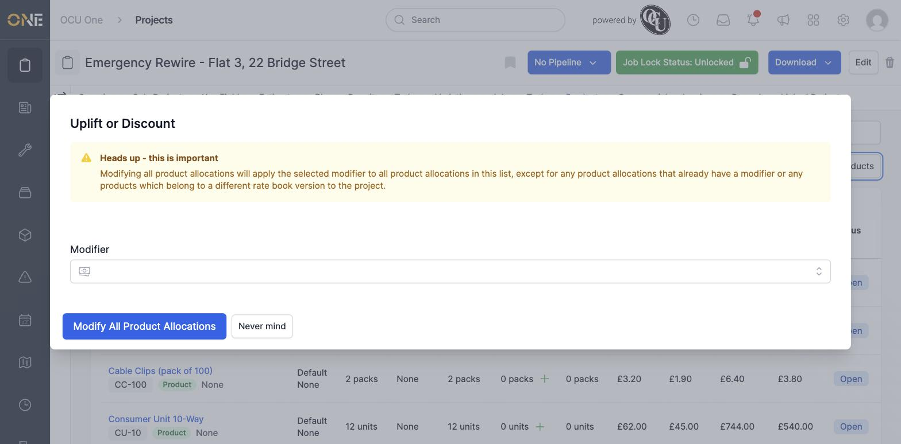
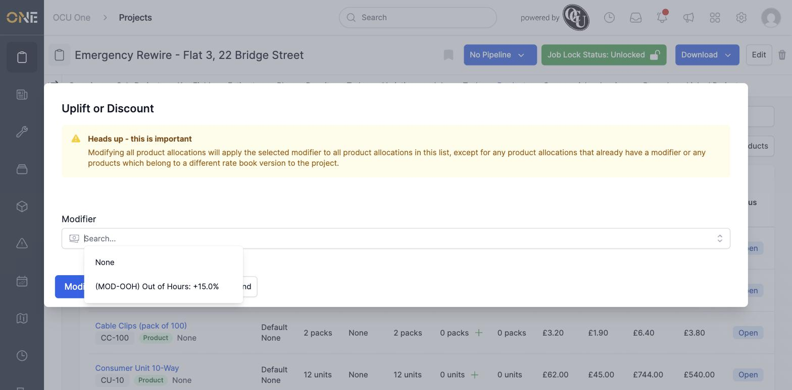
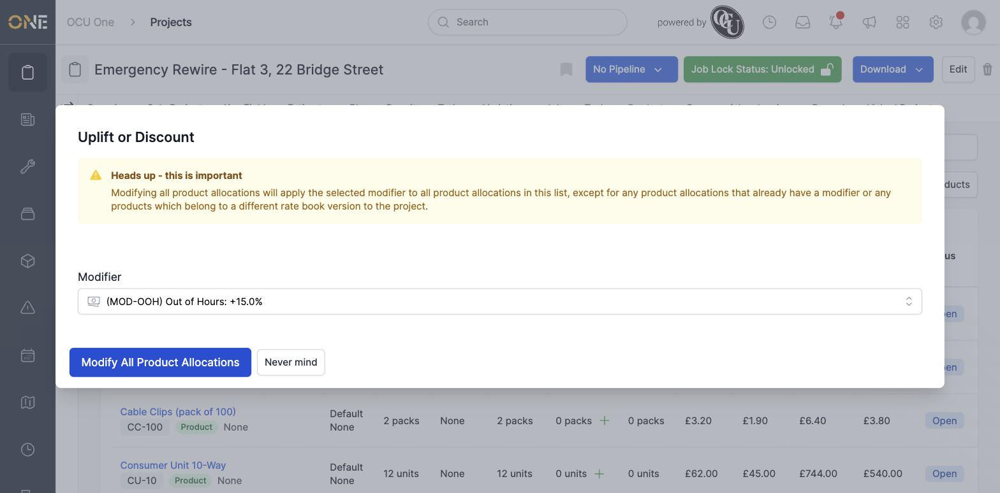
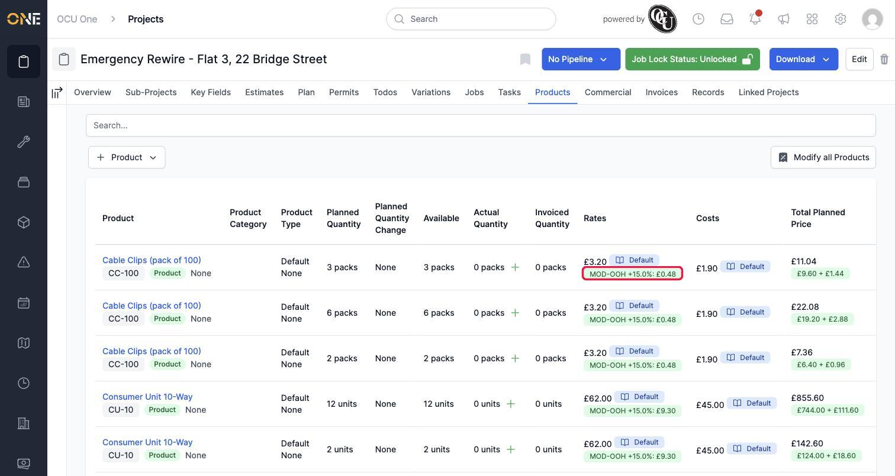

# Bulk-applying a rate modifier to all allocated products

If a job or project needs an across-the-board price adjustment — like an out-of-hours surcharge — you don't have to open every single allocated product and adjust it by hand. **Modify all Products** applies the same adjustment to everything at once.

## Where to find it

On a Products tab with several products already allocated, click **Modify all Products** in the top-right corner.

## Applying the modifier

A dialog titled **Uplift or Discount** opens, with an important warning worth reading carefully:

It explains that this will apply to *everything* in the list, with two exceptions: anything that already has a modifier on it, and anything priced from a different rate book version than this record uses, are both left untouched.

Click the **Modifier** field to see what's available — here, a ready-made **"Out of Hours"** adjustment of **+15.0%**.

Select it, and click **Modify All Product Allocations**.

## Seeing the result

Every eligible row on the Products tab now shows the modifier underneath its normal rate, along with the extra amount it adds per unit, and the **Total Planned Price** column breaks the figure down into the original amount plus the top-up:

## Other things to know

- This only works on products that already have a proper rate book price behind them. If a product's price was typed in by hand (rather than picked up from the rate book), there's nothing for the modifier to apply on top of, so it's skipped — the row will look exactly as it did before.
- If you need to remove or change the modifier on just one allocation afterwards, that's done from the allocation's own details rather than through this bulk action.
- The available modifiers here come from whatever's been set up in your rate book — if you don't see the one you need, ask whoever manages your rate books to add it.
