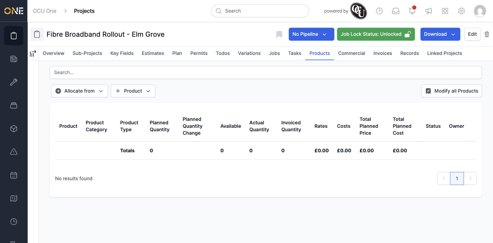
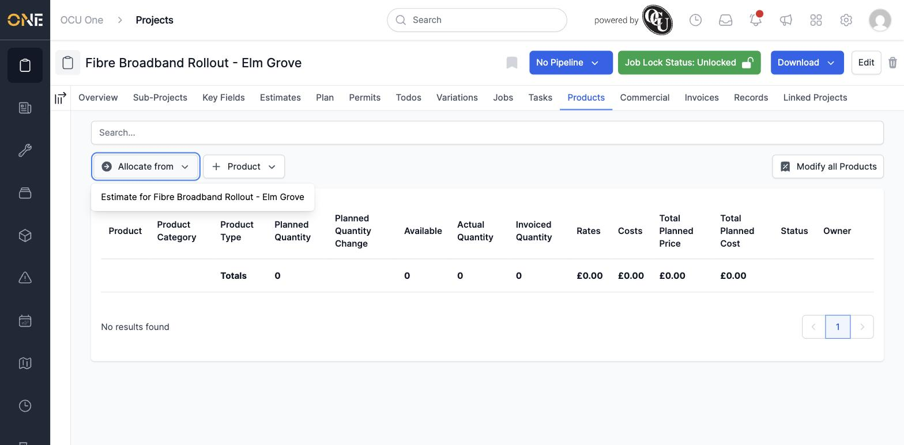
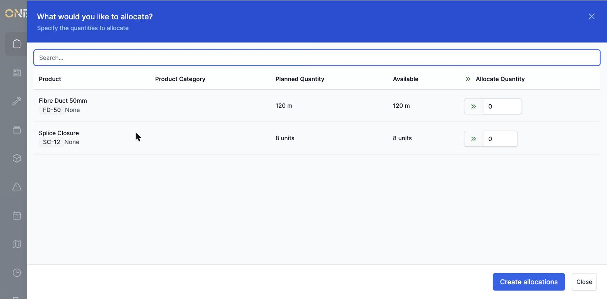
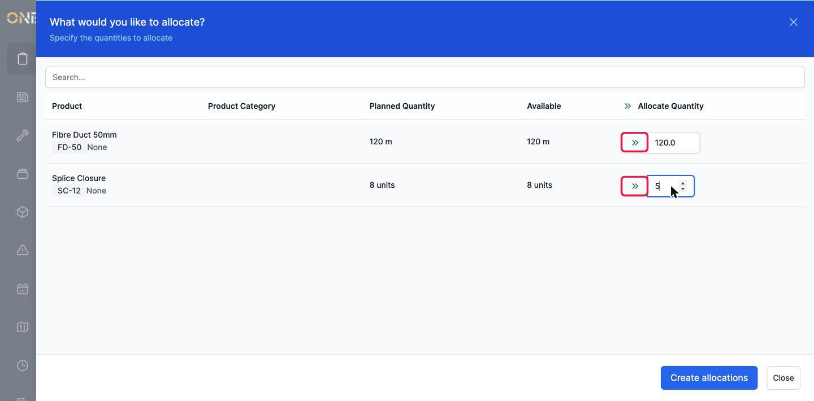
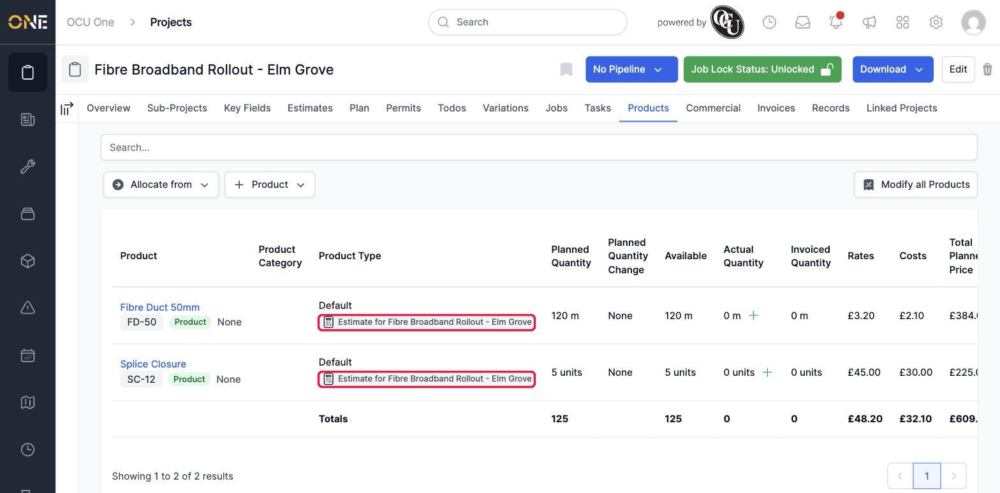
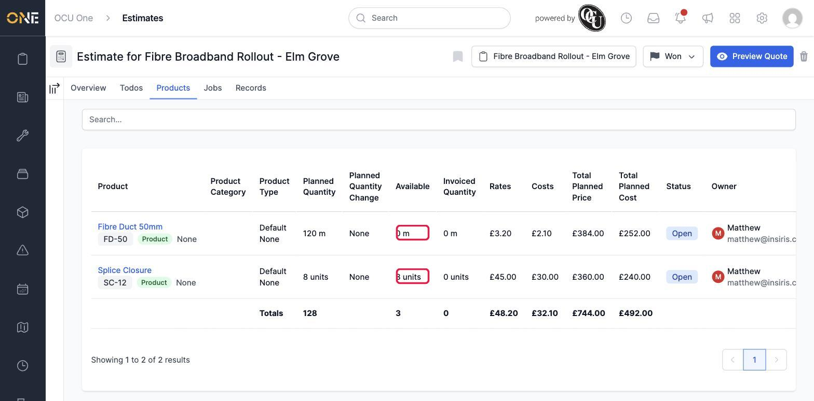

# Copying or transferring allocated products between records

Sometimes the materials you need for a job, project, or task have already been planned somewhere else — for example, on an estimate that's just been won, or on the project a job or task sits under. Rather than typing everything in again from scratch, you can pull that existing plan straight across.

## Where to find it

Open the record's **Products** tab. If there's somewhere it could pull products from, you'll see an **Allocate from** button next to **+ Product**.

**Good to know:** **Allocate from** only appears when there's actually somewhere sensible to pull from — a related project, or an estimate that hasn't been fully used up yet. A job can pull from the project it belongs to; a task can pull from the project it belongs to; and a project can pull from its parent project or from one of its own estimates. If nothing qualifies, the button won't be there at all.

## Choosing where to pull from

Click **Allocate from**. If more than one source is available, they all appear in this list — here there's just the one, the project's own estimate.

## Choosing what to bring across

Selecting a source opens a screen listing everything planned on it that still has some quantity free to give away — each row shows the product, its planned quantity, and how much of that is still **Available**.

Enter how much of each you want to bring across in the **Allocate Quantity** box. You don't have to take everything — here, all 120 metres of **Fibre Duct 50mm** are being pulled across, but only 5 of the 8 available **Splice Closure** units, leaving the rest free for something else that might need them later.

**Good to know:** the small double-arrow next to a quantity box fills it in with the full available amount in one click — handy when you want everything a row has to offer. There's also one of these at the top of the whole column, which fills in the full amount for every row at once.

Click **Create allocations** to bring them across.

## Seeing the result

The project's Products tab now shows both items as new rows of its own, each one carrying a small label showing exactly where it came from:

Meanwhile, back on the estimate itself, nothing planned there has been deleted or reduced in total — but the **Available** figure for each item has dropped by exactly what was taken, so everyone can see how much of the original plan is still up for grabs elsewhere:

## Other things to know

- Bringing something across this way creates a brand new allocation on the destination record — it isn't a live link. If you later change the quantity on the original, the copy you brought across won't update to match.
- You can only bring across a product that still has some quantity available. If a row doesn't show up in the "What would you like to allocate?" list, someone has already taken all of it, or it's already been recorded as used — in which case, there's nothing left to give away.
- This is a different action from adding a brand new product from the catalogue with **+ Product**, which is covered in its own guide.
