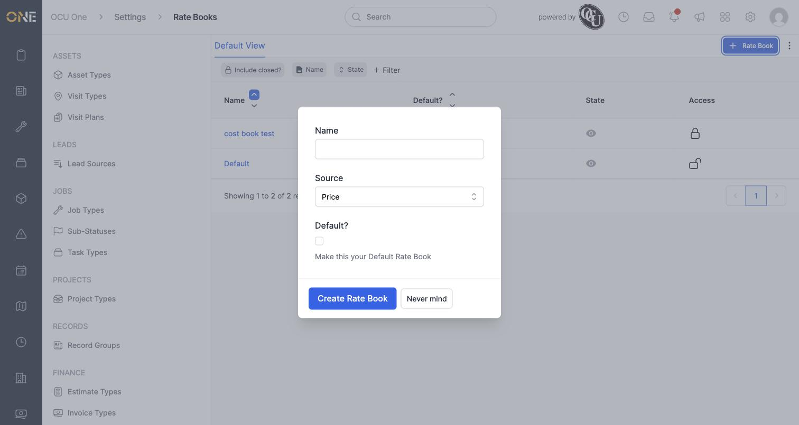
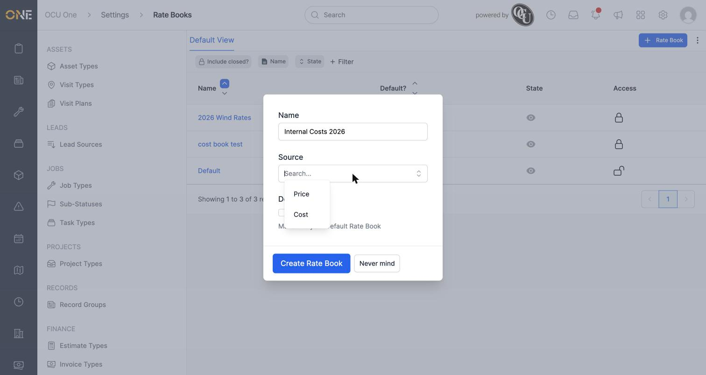
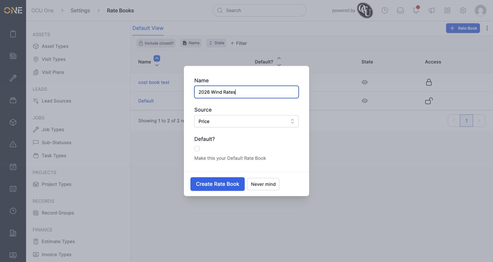
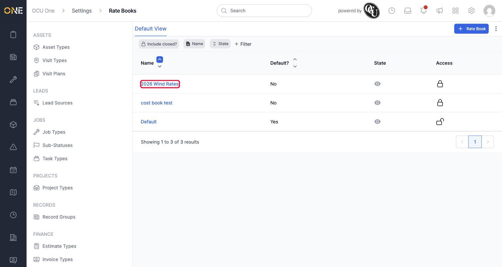
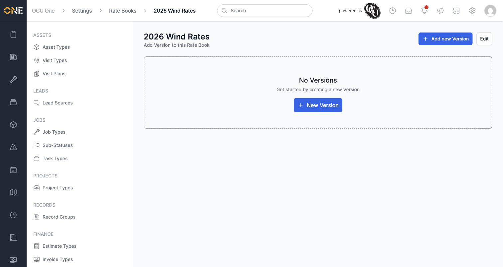
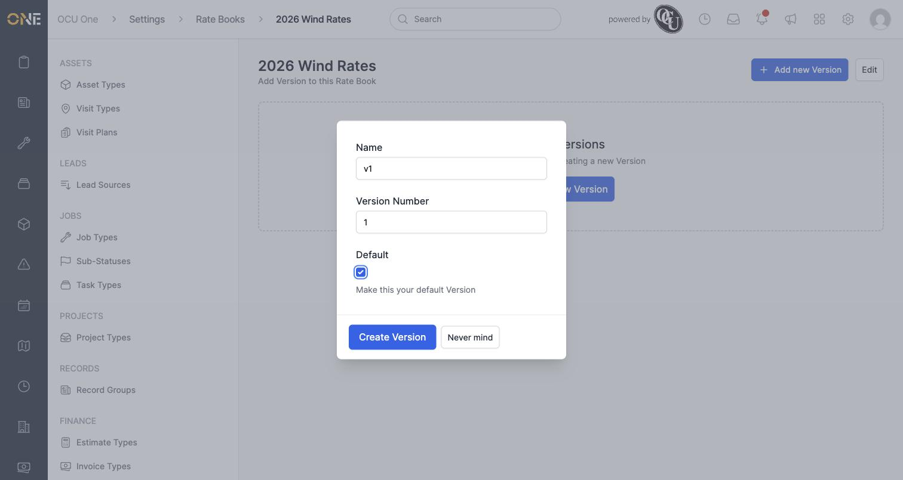
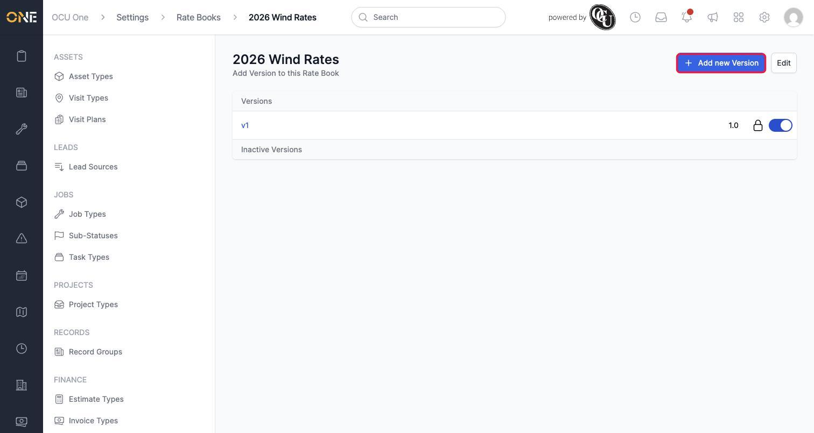
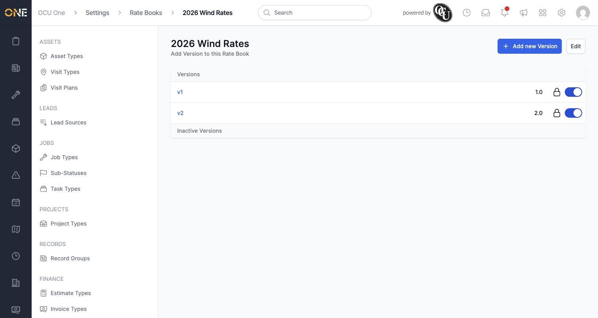
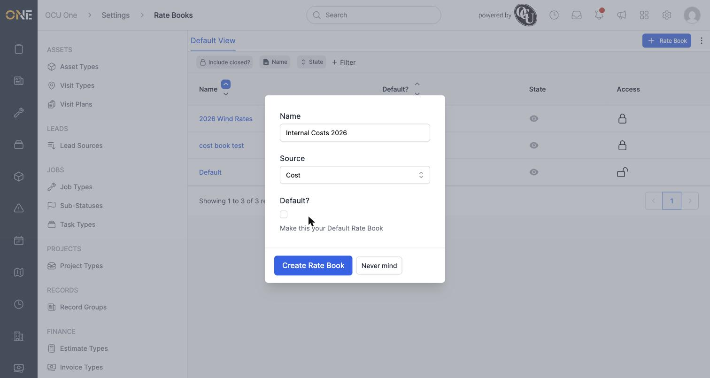
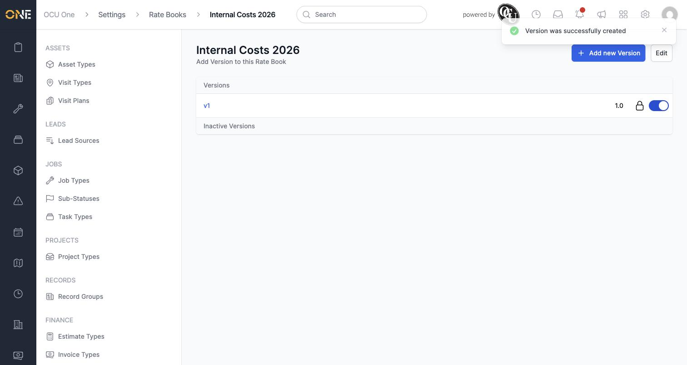

# Creating a rate book and its versions

## What rate books and cost books actually are

A **rate book** is a price list — a named collection of prices for your products, used to work out what to charge (or what something costs you) on jobs, projects, estimates, and everything else covered elsewhere in these guides.

There's no separate "cost book" feature to go and find — a cost book is just a rate book with its **Source** set to **Cost** instead of **Price**. A Price rate book holds what you sell things for; a Cost rate book holds what things cost you internally (materials, labour, whatever you're tracking). Everything in this guide — creating it, adding versions to it — works identically for both; the only difference is that single Source setting.

Each rate book can also have several **versions** — think of a version as a dated snapshot of the whole price list, so you can update prices for a new year or contract without losing the old figures. Once a version exists, prices get attached to it rather than to the rate book directly (covered in *Setting product rates within a rate book version*).

## Creating a rate book

Go to **Settings > Rate Books** and click **+ Rate Book**. A form opens for the new rate book's details:

Give it a **Name**, choose a **Source** — **Price** for a normal sell-price book, **Cost** for one that tracks internal costs — and decide whether it should be your **Default Rate Book** (the one used automatically unless something specifies otherwise).

Here's a Price rate book called "2026 Wind Rates" being created, left as not the default:

Click **Create Rate Book**, and it appears in the list alongside anything else already there:

## Adding a version

Open the new rate book — with nothing set up yet, it shows **No Versions**.

Click **New Version** (or **Add new Version** from the top of the page). Give it a **Name**, a **Version Number**, and tick **Default** if this should be the version used unless something specifies a different one — worth doing for the very first version you create.

Click **Create Version**, and it's added to the rate book:

**Good to know:** each new version's number has to be higher than the last one on that rate book — this keeps them in a clear, ascending order over time. Add a second version the same way, this time leaving Default unticked so "v1" stays the one used by default:

## Creating a cost book

The same process creates a cost book — just pick **Cost** as the Source instead:

It gets its own version in exactly the same way as any other rate book:

## Other things to know

- Only one rate book can be your tenant-wide default at a time — making a new one default automatically un-defaults whichever one held that spot before.
- Creating the rate book and its versions doesn't add any prices yet — that's the next step, covered in *Setting product rates within a rate book version* and *Managing sell rates on a product* / *Managing cost rates on a product*.
