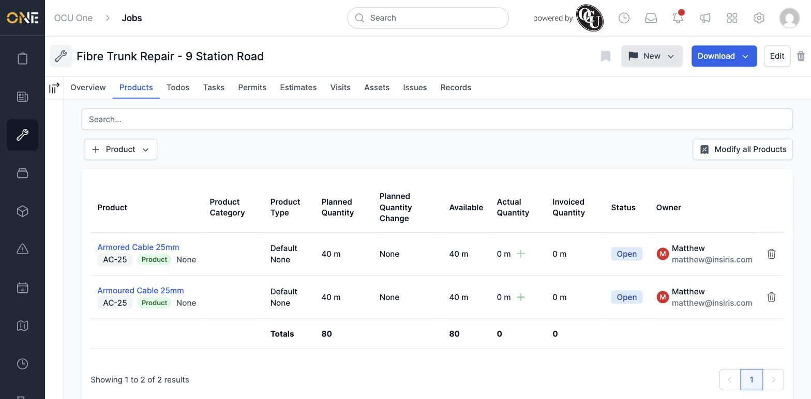
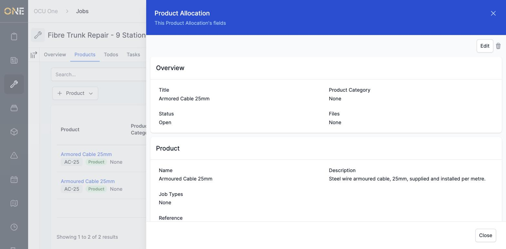
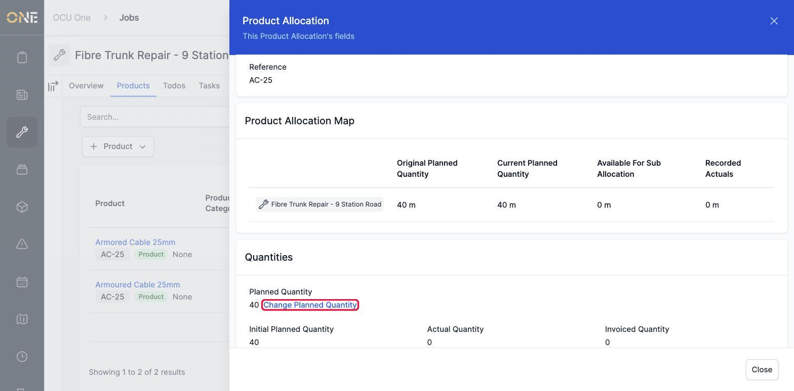
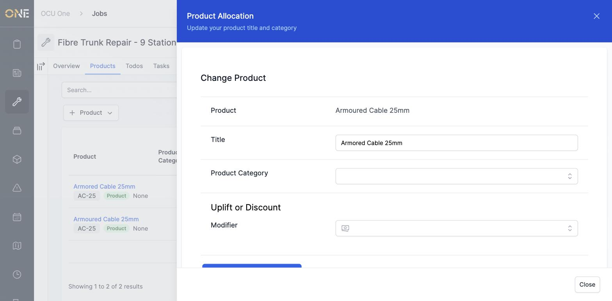
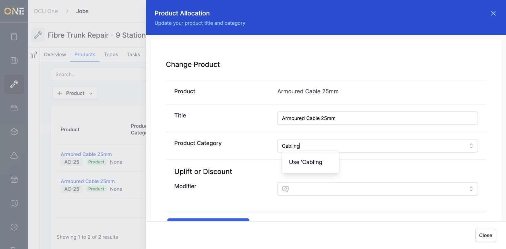
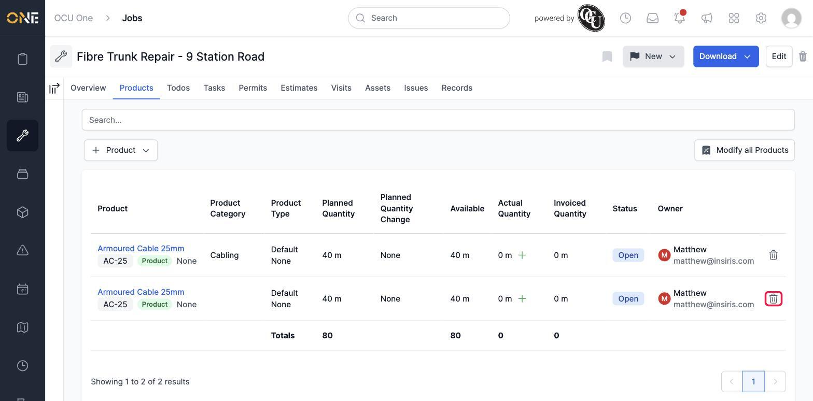
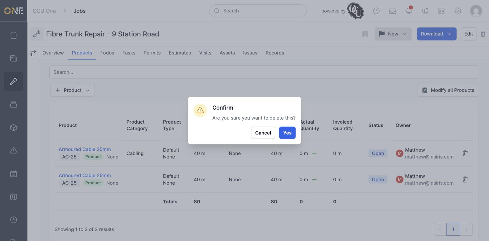
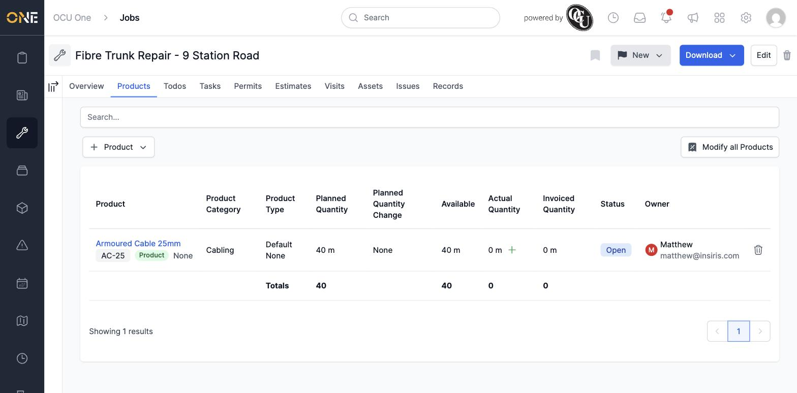

# Editing or removing a product allocation

Once something has been allocated to a job, project, task, estimate, or variation, you can still tidy up its title and category, or remove it altogether if it was added by mistake.

## Opening an allocation's details

On any Products tab, click a product's name to open its details in a panel on the right.

This shows everything about the allocation: its title, category, and status at the top, followed by details of the underlying product itself.

Further down, a **Quantities** section shows the planned amount alongside a **Change Planned Quantity** link.

**Good to know:** that link is the only way to change how much of something is planned — it's covered in its own guide, since changing a quantity keeps a record of *why* it changed. The **Edit** button described below only lets you correct the title, category, or a pricing modifier, not the quantity itself.

## Editing an allocation

Click **Edit** in the top-right of the details panel. Here, the title has a typo — "Armored" instead of "Armoured" — that's worth fixing.

Correct the **Title**, and set a **Product Category** if it doesn't have one yet — start typing and choose **Use "..."** to create a new category on the fly.

Click **Update Product Allocation** to save. The change appears immediately, both in the details panel and back on the Products tab:

## Removing an allocation

If something was added by mistake — like a genuine duplicate — click the trash icon at the end of its row on the Products tab.

You'll be asked to confirm before anything is removed:

Confirming removes it from the table straight away, and the totals at the bottom update to match:

## Other things to know

- The trash icon only appears if an allocation can still be safely removed. Once actual usage has been recorded against it, or it's been split into further allocations underneath it, it's kept as a permanent record and the trash icon disappears — there's no way to delete it at that point.
- Editing and removing work the same way wherever an allocation lives — on a job, project, task, estimate, or variation.
