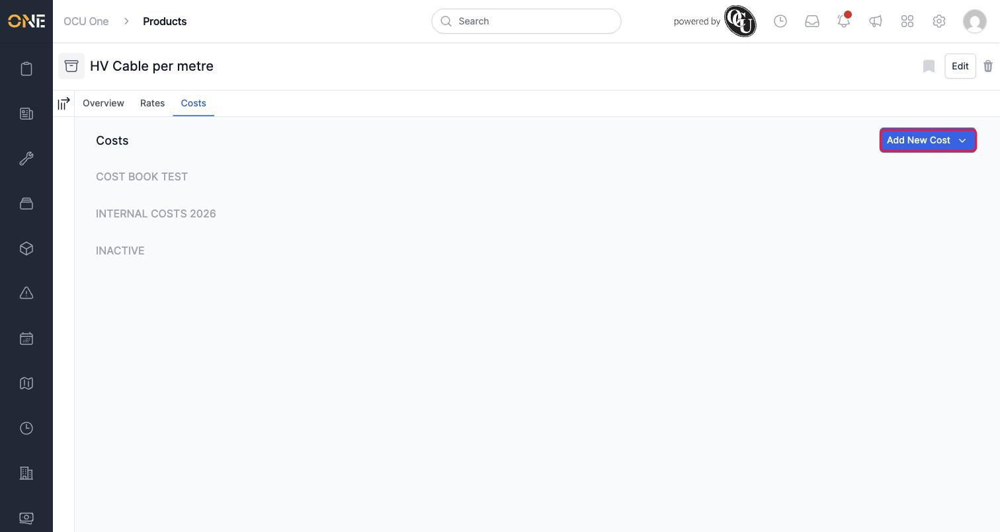
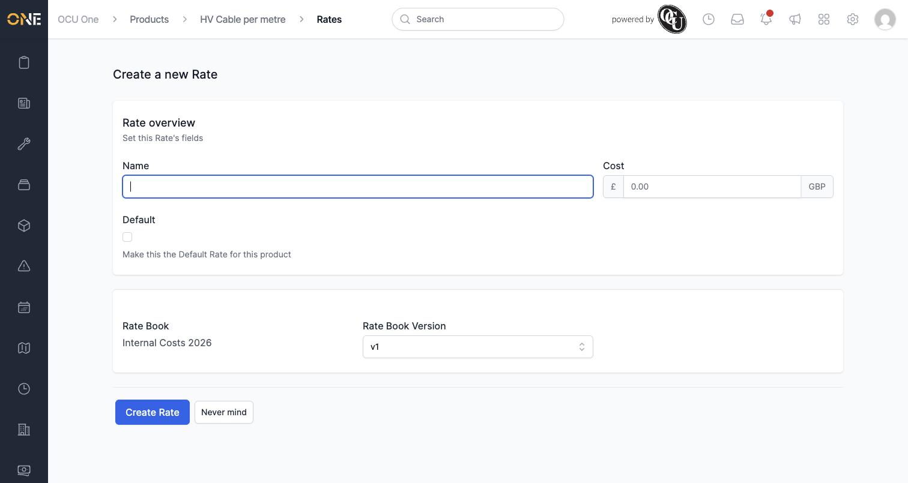
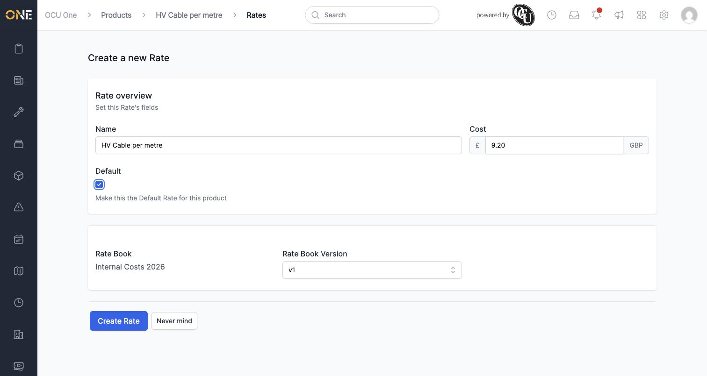
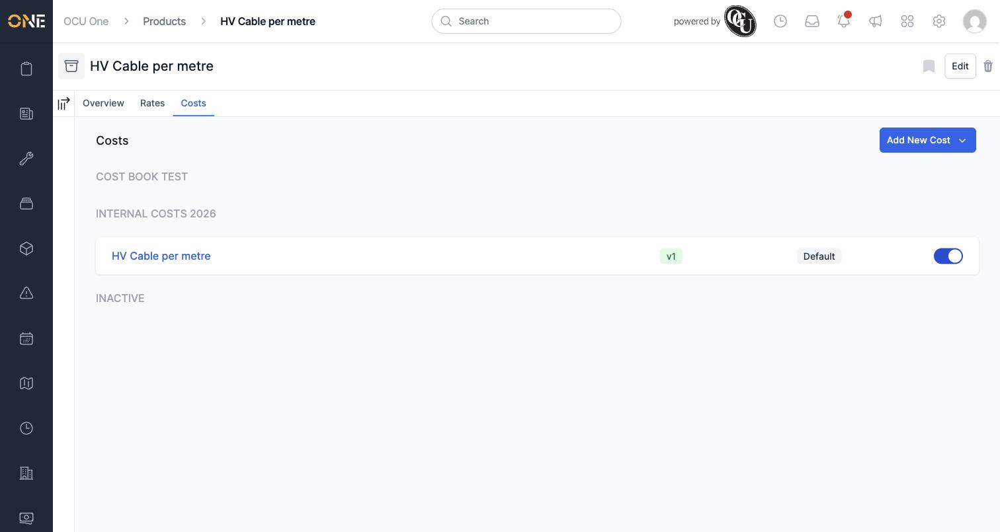

# Managing cost rates on a product

Alongside what you sell a product for, you can also record what it actually costs you — materials, internal labour, whatever's relevant. That's what the **Costs** tab is for.

## What this is, and how it differs from sell rates

A cost rate works exactly like a sell rate (see *Managing sell rates on a product*), with one difference: it belongs to a **cost book** rather than a price book. A cost book is just a rate book with its Source set to Cost — there's nothing else different about it (see *Creating a rate book and its versions* for more on that). Because a cost book only tracks what something costs, its rate form drops the Price field entirely and only asks for a **Cost**.

## Where to find it

Open a product and click its **Costs** tab. Prices are grouped by cost book, same as the Rates tab:

## Adding a cost rate

Click **Add New Cost** and choose which cost book this price belongs to.

Notice the form only has a **Cost** field — there's no Price, since a cost book isn't tracking what you charge:

Fill in a **Name** and the **Cost**, and tick **Default** if it's the main cost for this product on this cost book:

Click **Create Rate**, and it appears on the Costs tab, grouped under its cost book:

## Other things to know

- Setting a cost here doesn't change what you charge for the product — that's entirely separate, and set from the **Rates** tab instead.
- The same product can have a cost recorded under more than one cost book, if your organisation tracks costs differently for different purposes.
- Everything else about managing these entries — editing, toggling active/inactive — works exactly the same as it does for sell rates.
