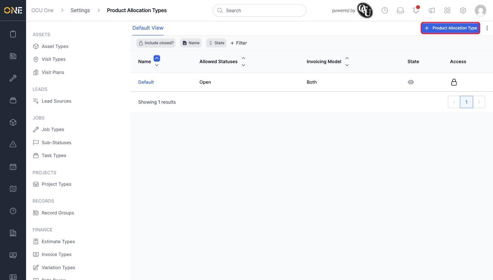
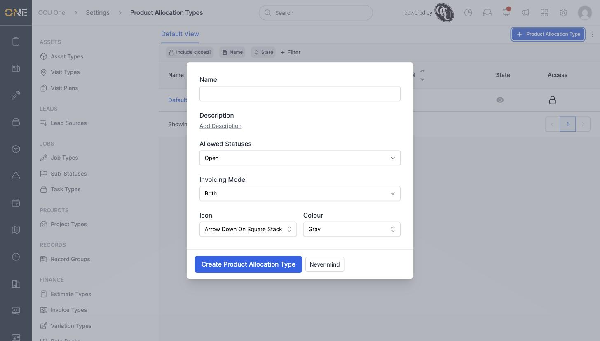
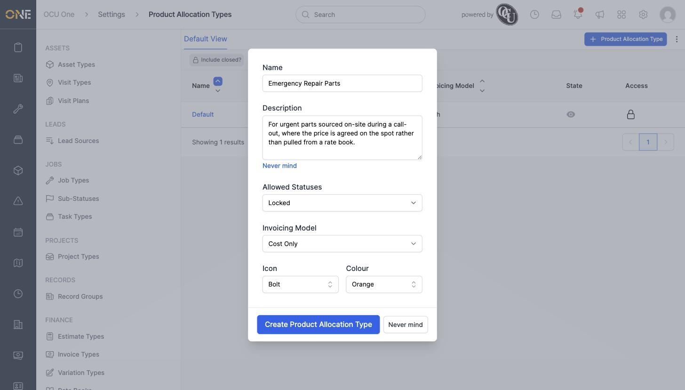

# Managing product allocation types

Every product allocation belongs to a **Product Allocation Type** — this decides which statuses that allocation can move through, and whether it counts towards revenue, cost, both, or neither. Setting these up correctly means the right options show up when someone actually allocates a product.

## What a Product Allocation Type controls

- **Allowed Statuses** — Open, Locked, or Closed. This decides which statuses an allocation of this type is allowed to sit in.
- **Invoicing Model** — Revenue Only, Cost Only, Both, or Neither. This decides whether allocations of this type are treated as something you charge for, something that costs you, both, or neither.

When someone clicks **Allocate** on a job, project, estimate, or variation, they're shown a choice of the active Product Allocation Types to allocate under — so the types you set up here are exactly what appears in that list.

## Where to find it

Go to **Settings > Product Allocation Types**. A tenant always starts with one called "Default":

## Creating a Product Allocation Type

Click **+ Product Allocation Type**. The form asks for a Name, an optional Description, the Allowed Statuses, the Invoicing Model, and an Icon and Colour to help it stand out in lists:

Here, "Emergency Repair Parts" is being set up for parts sourced on the spot during a call-out — locked as soon as it's used (so it can't be left open by mistake), and tracked as Cost Only since these are agreed on-site rather than charged from a rate book:

Click **Create Product Allocation Type**, and it appears in the list alongside "Default":

## Editing a Product Allocation Type

Click a type's name to open it for editing — every field from creation can be changed, including moving it between Allowed Statuses or Invoicing Models:

## Other things to know

- Each row also has a lock icon showing who has access to it, and a toggle for switching the type between active and inactive. An inactive type stops showing up as a choice when allocating a new product, but any existing allocations already using it are unaffected.
- Changing the Allowed Statuses or Invoicing Model on a type doesn't retroactively change allocations that already exist under it — it only affects what's allowed going forward.
- "Default" can't be deleted, but you can create as many additional types as your organisation needs — for example, separate types for warranty work, subcontracted materials, or anything else that needs its own rules around status and invoicing.
