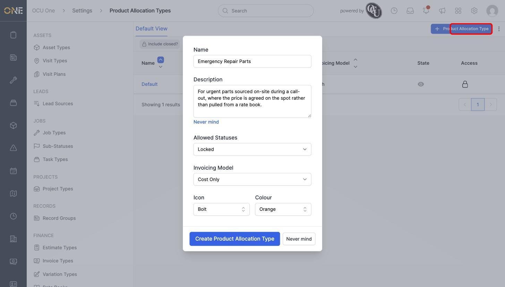

# Managing rate categories

A **Rate Category** is a simple label — Income or Expenditure — that you can attach to a product to group it for reporting. It doesn't affect pricing itself; it just tags what kind of rate the product represents.

## Where to find it

Go to **Settings > Rate Categories**. A tenant starts with two: "Labour" and "Stock", both tagged Expenditure:

## Creating a rate category

Click **+ Rate Category**. The form asks for a Name, an optional Description, an Icon and Colour, and the Type — Income or Expenditure:

Here, "Callout Charge" is being set up as an Income category, for a fixed charge billed to the customer for attending a call-out:

Click **Create Rate Category**, and it's added to the list. A second one, "Materials Waste", is set up the same way but as an Expenditure category, for materials written off rather than actually used:

Both now appear in the list alongside "Labour" and "Stock":

## Using a rate category

Open any product and its **Rate Category** field lets you pick one of your active categories. This is entirely separate from the product's rate books and prices (see *Managing sell rates on a product*) — it's just a tag for reporting on what kind of income or cost the product represents.

## Other things to know

- Each row also has a lock icon showing who has access to it, and a toggle for switching the category between active and inactive. An inactive category stops showing up as a choice on products, but any products already tagged with it keep that tag.
- A product can only have one rate category at a time.
